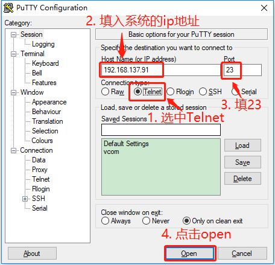
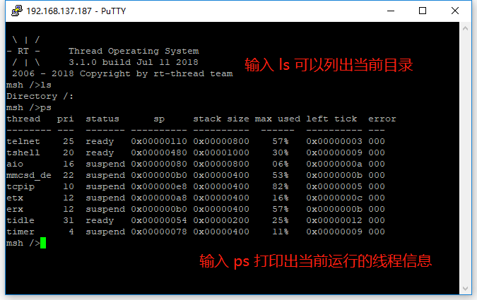

# 使用Telnet进行远程设备控制

<iframe frameborder="0" width="1005px" height="663px" src="https://v.qq.com/txp/iframe/player.html?vid=d0765mn9kiy" allowFullScreen="true"></iframe>

> 提示：<a href="../telnet.pdf" target="_blank">视频 PPT 下载</a>

## 背景介绍

[Telnet](https://baike.baidu.com/item/Telnet)  协议是一种应用层协议，使用于互联网及局域网中，使用虚拟终端机的形式，提供双向、以文字字符串为主的交互功能。属于 TCP/IP  协议族的其中之一，是 Internet 远程登录服务的标准协议和主要方式，常用于网页服务器的远程控制，可供用户在本地主机运行远程主机上的工作。

RT-Thread 目前支持的是 Telnet 服务器， Telnet 客户端连接成功后，将会远程连接到设备的 Finsh/MSH ，实现设备的远程控制。

## 准备工作

### 开启 telnet server

打开 Env 工具输入 menuconfig 按照下面的路径打开 telnet server

```
 RT-Thread online packages  --->
     IoT - internet of things  --->
         netutils: Networking utilities for RT-Thread  --->
             [*]   Enable Telnet server
```

然后，打开工程，编译并运行程序

### 查看系统的 ip 地址

系统运行起来后，在终端输入 ifconfig，查看系统的 ip 地址。

```
msh />ifconfig
network interface: e0 (Default)
MTU: 1500
MAC: 52 54 00 11 22 33
FLAGS: UP LINK_UP ETHARP BROADCAST
ip address: 192.168.137.91
gw address: 192.168.137.1
net mask  : 255.255.255.0
dns server #0: 192.168.137.1
dns server #1: 0.0.0.0
```

其中 ip address: 192.168.137.91就是系统的 ip 地址

## 在 msh shell 中运行示例代码

系统运行起来后，在 msh 命令行下输入 telnet_server 命令即可让示例代码运行。

```
msh /> telnet_server
Telnet server start successfully
telnet: waiting for connection
```

然后，用 putty 远程登陆系统



## 预期结果 ##

这样就已经远程登陆到系统了，打印出了系统的信息。



> [!NOTE]
> 注：* 与 Telnet 服务器连接成功后，设备本地的 Finsh/MSH 将无法使用。如果需要使用，断开已连接的 Telnet 客户端即可；
    * Telnet 不支持 `TAB` 自动补全快捷键、`Up`/`Down` 查阅历史等快捷键；
    * 目前 Telnet 服务器只支持连接到 **1** 个客户端。

## 参考资料

* [RT-Thread 网络小工具集](https://github.com/RT-Thread-packages/netutils)
* [《Env 用户手册》](../../../programming-manual/env/env.md)

## 常见问题

* [常见问题及解决方法](../faq/faq.md)。
