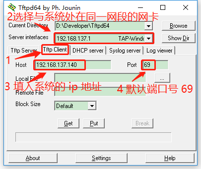
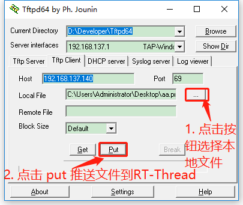
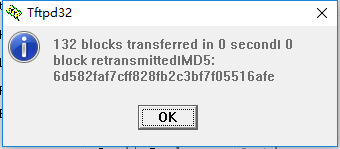
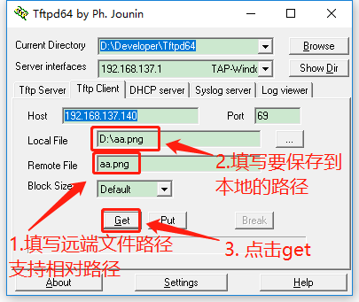

# 使用TFTP实现网络文件传输

<iframe frameborder="0" width="1005px" height="663px" src="https://v.qq.com/txp/iframe/player.html?vid=s0765n7a18x" allowFullScreen="true"></iframe>

> 提示：<a href="../tftp.pdf" target="_blank">视频 PPT 下载</a>

## 背景介绍

[TFTP](https://baike.baidu.com/item/TFTP) （Trivial File Transfer Protocol, 简单文件传输协议）是 TCP/IP 协议族中的一个用来在客户机与服务器之间进行简单文件传输的协议，提供不复杂、开销不大的文件传输服务，端口号为 **69** ，比传统的 FTP 协议要轻量级很多，适用于小型的嵌入式产品上。

RT-Thread 目前支持的是 TFTP 服务器。

## 准备工作

### 安装 TFTP 客户端 ###

下载安装 [Tftpd64-4.60-setup.exe](https://github.com/RT-Thread-packages/netutils/blob/master/tools/Tftpd64-4.60-setup.exe)，使用 TFTP 前，请先安装该软件。

### 开启 TFTP server ###

打开 Env 工具输入 menuconfig 按照下面的路径打开 tftp server

```
 RT-Thread online packages  --->
     IoT - internet of things  --->
         netutils: Networking utilities for RT-Thread  --->
             [*]   Enable TFTP(Trivial File Transfer Protocol) server
```

### 调大 lwIP 线程的堆栈大小 ###

按下面路径找到 lwIP 的 tcpip 默认配置，将原来默认的 1024 改为 2048

```
RT-Thread Components  --->
    Network  --->
        light weight TCP/IP stack  --->
            (2048) the stack size of lwIP thread
```

编译运行

### 查看系统的 ip 地址

在系统运行起来后，在 msh 命令行下输入 ifconfig，运行结果如下

```
msh />ifconfig
network interface: e0 (Default)
MTU: 1500
MAC: 52 54 00 11 22 33
FLAGS: UP LINK_UP ETHARP BROADCAST
ip address: 192.168.137.140
gw address: 192.168.137.1
net mask  : 255.255.255.0
dns server #0: 192.168.137.1
dns server #1: 0.0.0.0
```

其中 ip address: 192.168.137.140 就是系统的 ip 地址

## 在 msh shell 中运行 TFTP 服务器

在 msh 命令行下输入下面的命令即可运行 tftp 服务器，运行结果如下，等待客户端连接。

```c
msh> tftp_server
TFTP server start successfully.
```

## 运行 TFTP 客户端 ##

打开 TFTP 客户端，按照下图所示方法配置



### 发送文件到 RT-Thread ###

我们先传输一个文件到 RT-Thread 上，操作如下图所示



提示发送完成



在终端输入命令 ls，发现文件已经传输到当前目录下了

```
msh />ls
Directory /:
aa.png              67288
msh />
```

### 从 RT-Thread 获取文件 ###

我们再将刚才传输到 RT-Thread 中的文件获取到本地



同样会提示传输完成，打开本地文件路径，发现文件已经从 RT-Thread 获取到本地了。


> [!NOTE]
> 注：* 如出现连接失败的情况，可以尝试关闭防火墙
    * 相对路径是基于 Finsh/MSH 当前进入的目录。使用相对路径时，务必提前切换好目录

## 参考资料

* 源码 [tftp](https://github.com/RT-Thread-packages/netutils/tree/master/tftp)
* [RT-Thread 网络小工具集](https://github.com/RT-Thread-packages/netutils)
* [《Env 用户手册》](../../../programming-manual/env/env.md)

## 常见问题

* [常见问题及解决方法](../faq/faq.md)。
