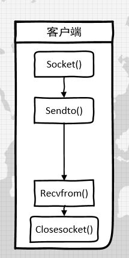
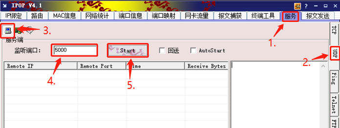
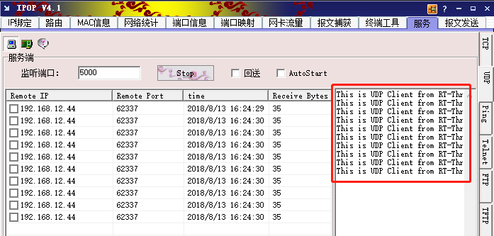

# 使用Socket实现UDP客户端

<iframe frameborder="0" width="1005px" height="663px" src="https://v.qq.com/txp/iframe/player.html?vid=k07654rckgl" allowFullScreen="true"></iframe>

> 提示：<a href="../udpclient.pdf" target="_blank">视频 PPT 下载</a>

## 背景介绍

UDP 协议是用于客户端-服务器模式的一种传输协议，如今的很多通信软件都是利用这个协议实现的，如腾讯 QQ 发送消息用的就是 UDP 协议。

本教程介绍了如何利用  socket 编程来实现一个 UDP 客户端，与服务器进行通信。与开发 TCP 客户端一样，我们先将 socket 编程的流程列出来，然后给出具体的实例。

UDP 与 TCP 的不同之处是，他的通信不需要建立连接的过程。

UDP 客户端的 socket 编程流程
1. 创建 socket
2. 通信
3. 关闭 socket

如下图所示：



## 准备工作

### 获取示例代码

RT-Thread samples 软件包中中已有一份该示例代码 [udpclient.c](https://github.com/RT-Thread-packages/network-sample/blob/master/udpclient_sample.c)，可以通过 Env 配置将示例代码加入到项目中。

```
 RT-Thread online packages  --->
     miscellaneous packages  --->
         samples: RT-Thread kernel and components samples  --->
             [*] a network_samples package for rt-thread  --->
                 [*] [network] udp client
```

### 示例代码文件

```c
/*
 * 程序清单：udp 客户端
 *
 * 这是一个 udp 客户端的例程
 * 导出 udpclient 命令到控制终端
 * 命令调用格式：udpclient URL PORT [COUNT = 10]
 * URL：服务器地址  PORT：端口号  COUNT：可选参数 默认为 10
 * 程序功能：发送 COUNT 条数据到服务远端
*/
#include <rtthread.h>
#include <sys/socket.h> /* 使用BSD socket，需要包含sockets.h头文件 */
#include "netdb.h"

const char send_data[] = "This is UDP Client from RT-Thread.\n"; /* 发送用到的数据 */
void udpclient(int argc, char **argv)
{
    int sock, port, count;
    struct hostent *host;
    struct sockaddr_in server_addr;
    const char *url;

    if (argc < 3)
    {
        rt_kprintf("Usage: udpclient URL PORT [COUNT = 10]\n");
        rt_kprintf("Like: tcpclient 192.168.12.44 5000\n");
        return ;
    }

    url = argv[1];
    port = strtoul(argv[2], 0, 10);

    if (argc > 3)
        count = strtoul(argv[3], 0, 10);
    else
        count = 10;

    /* 通过函数入口参数url获得host地址（如果是域名，会做域名解析） */
    host = (struct hostent *) gethostbyname(url);

    /* 创建一个socket，类型是SOCK_DGRAM，UDP类型 */
    if ((sock = socket(AF_INET, SOCK_DGRAM, 0)) == -1)
    {
        rt_kprintf("Socket error\n");
        return;
    }

    /* 初始化预连接的服务端地址 */
    server_addr.sin_family = AF_INET;
    server_addr.sin_port = htons(port);
    server_addr.sin_addr = *((struct in_addr *)host->h_addr);
    rt_memset(&(server_addr.sin_zero), 0, sizeof(server_addr.sin_zero));

    /* 总计发送count次数据 */
    while (count)
    {
        /* 发送数据到服务远端 */
        sendto(sock, send_data, strlen(send_data), 0,
               (struct sockaddr *)&server_addr, sizeof(struct sockaddr));

        /* 线程休眠一段时间 */
        rt_thread_delay(50);

        /* 计数值减一 */
        count --;
    }

    /* 关闭这个socket */
    closesocket(sock);
}
MSH_CMD_EXPORT(udpclient, a udp client sample);
```

## 在 msh shell 中运行示例代码

在运行示例代码之前需要先在电脑上开启一个 UDP 服务器，这里以网络调试助手 IPOP 为例。



查看本机 ip 地址

在 windows 系统中打开命令提示符，输入 ipconfig 即可查看本机 ip


在系统运行起来后，在 msh 命令行下输入下面的命令即可让示例代码运行。

```
msh> udpclient 192.168.12.44 5000
```

这个示例代码的功能是向输入的 IP 地址发送 10 条消息，发送完毕即退出，具体的参数如下。

udpclient 有两个固定参数和一个可选参数 URL PORT [COUNT = 10]，其中：

- URL 是目标服务器的网址或 IP 地址，这个对应刚才搭建的服务器中的本机地址
- PORT 是目标服务器的端口号，这个对应刚才输出的端口号
- [COUNT = 10] 是向服务器发送数据的条数 默认是10


## 预期结果 ##

从服务端能接收到客户端发来的数据



> [!NOTE]
> 注：请关闭防火墙之后再运行这个例程。

## 参考资料

* 源码 [udpclient.c](https://github.com/RT-Thread-packages/network-sample/blob/master/udpclient_sample.c)
* [《Env 用户手册》](../../../programming-manual/env/env.md)

## 常见问题

* [常见问题及解决方法](../faq/faq.md)。
