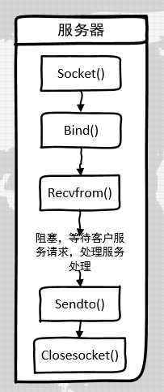
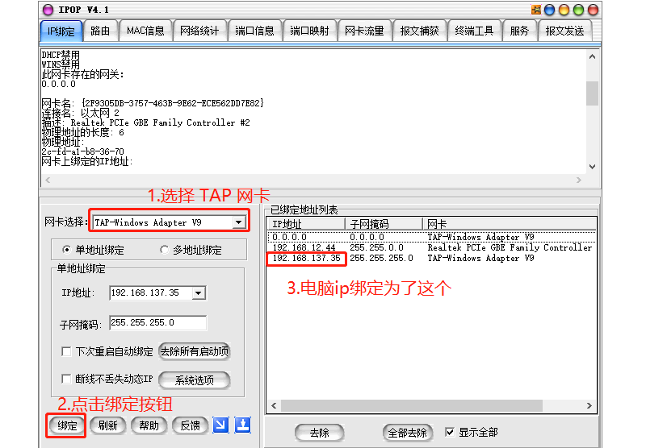
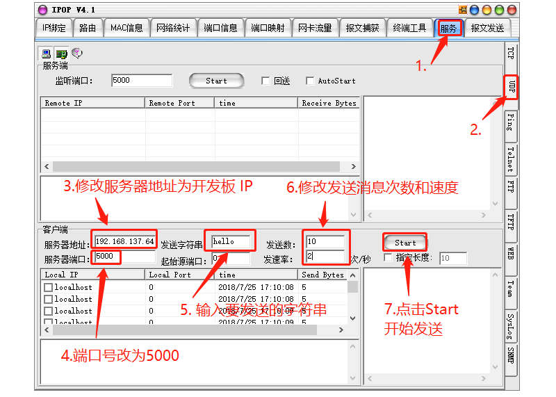
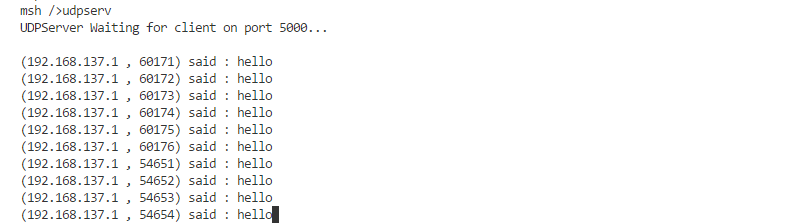

# 使用Socket实现UDP服务器

<iframe frameborder="0" width="1005px" height="663px" src="https://v.qq.com/txp/iframe/player.html?vid=g0765g2mdnn" allowFullScreen="true"></iframe>

> 提示：<a href="../udpserver.pdf" target="_blank">视频 PPT 下载</a>

## 背景介绍

UDP 协议是用于客户端-服务器模式的一种传输协议，如今的很多通信软件都是利用这个协议实现的，如腾讯 QQ 发送消息用的就是 UDP 协议。

本教程介绍了如何利用  socket 编程来实现一个 UDP 服务器，与客户端进行通信。

UDP 服务器的 socket 编程流程
1. 创建 socket
2. 将创建的 socket 绑定到一个 IP 地址和端口号上
3. 等待接收数据报，处理完成后将结果返回到客户端
4. 关闭 socket

如下图所示：



## 准备工作

### 获取示例代码

RT-Thread samples 软件包中已有一份该示例代码 [udpserver.c](https://github.com/RT-Thread-packages/network-sample/blob/master/udpserver_sample.c)，可以通过 Env 配置将示例代码加入到项目中。

```
 RT-Thread online packages  --->
     miscellaneous packages  --->
         samples: RT-Thread kernel and components samples  --->
             network sample options  --->
                 [*] [network] udp server
```

### 示例代码文件

```c
/*
* 程序清单：udp 服务端
 *
 * 这是一个 udp 服务端的例程
 * 导出 udpserv 命令到控制终端
 * 命令调用格式：udpserv
 * 无参数
 * 程序功能：作为一个服务端，接收并显示客户端发来的数据 ，接收到 exit 退出程序
*/
#include <rtthread.h>
#include <sys/socket.h> /* 使用BSD socket，需要包含socket.h头文件 */
#include "netdb.h"

#define BUFSZ   1024

static void udpserv(int argc, char **argv)
{
    int sock;
    int bytes_read;
    char *recv_data;
    socklen_t addr_len;
    struct sockaddr_in server_addr, client_addr;

    /* 分配接收用的数据缓冲 */
    recv_data = rt_malloc(BUFSZ);
    if (recv_data == RT_NULL)
    {
        /* 分配内存失败，返回 */
        rt_kprintf("No memory\n");
        return;
    }

    /* 创建一个socket，类型是SOCK_DGRAM，UDP类型 */
    if ((sock = socket(AF_INET, SOCK_DGRAM, 0)) == -1)
    {
        rt_kprintf("Socket error\n");

        /* 释放接收用的数据缓冲 */
        rt_free(recv_data);
        return;
    }

    /* 初始化服务端地址 */
    server_addr.sin_family = AF_INET;
    server_addr.sin_port = htons(5000);
    server_addr.sin_addr.s_addr = INADDR_ANY;
    rt_memset(&(server_addr.sin_zero), 0, sizeof(server_addr.sin_zero));

    /* 绑定socket到服务端地址 */
    if (bind(sock, (struct sockaddr *)&server_addr,
             sizeof(struct sockaddr)) == -1)
    {
        /* 绑定地址失败 */
        rt_kprintf("Bind error\n");

        /* 释放接收用的数据缓冲 */
        rt_free(recv_data);
        return;
    }

    addr_len = sizeof(struct sockaddr);
    rt_kprintf("UDPServer Waiting for client on port 5000...\n");

    while (1)
    {
        /* 从sock中收取最大BUFSZ - 1字节数据 */
        bytes_read = recvfrom(sock, recv_data, BUFSZ - 1, 0,
                              (struct sockaddr *)&client_addr, &addr_len);
        /* UDP不同于TCP，它基本不会出现收取的数据失败的情况，除非设置了超时等待 */

        recv_data[bytes_read] = '\0'; /* 把末端清零 */

        /* 输出接收的数据 */
        rt_kprintf("\n(%s , %d) said : ", inet_ntoa(client_addr.sin_addr),
                   ntohs(client_addr.sin_port));
        rt_kprintf("%s", recv_data);

        /* 如果接收数据是exit，退出 */
        if (strcmp(recv_data, "exit") == 0)
        {
            closesocket(sock);

            /* 释放接收用的数据缓冲 */
            rt_free(recv_data);
            break;
        }
    }

    return;
}
MSH_CMD_EXPORT(udpserv, a udp server sample);
```

## 在 msh shell 中运行示例代码

在系统运行起来后，在 msh 命令行下输入命令 `udpserv` 即可让示例代码运行。

```c
msh />udpserv
UDPServer Waiting for client on port 5000...
```

然后在电脑上开启一个 UDP 客户端，这里以网络调试助手为例。

 1. 如果 是 QEMU 平台的话要先绑定网卡和 IP 地址。

    

 2. 给服务器发送消息

    

## 预期结果

从服务器能接收到客户端发来的数据



发送 exit 到服务器，即可停止服务器的运行。

> [!NOTE]
> 注：请关闭防火墙之后，再运行此例程。

## 参考资料

* 源码 [udpserver.c](https://github.com/RT-Thread-packages/network-sample/blob/master/udpserver_sample.c)
* [《Env 用户手册》](../../../programming-manual/env/env.md)

## 常见问题

* [常见问题及解决方法](../faq/faq.md)。
