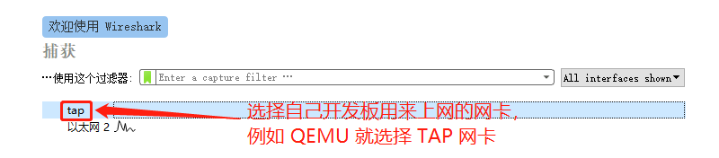
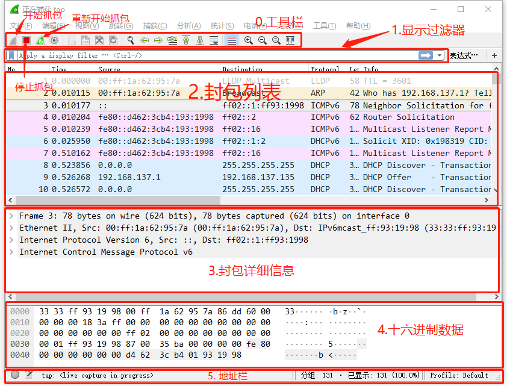
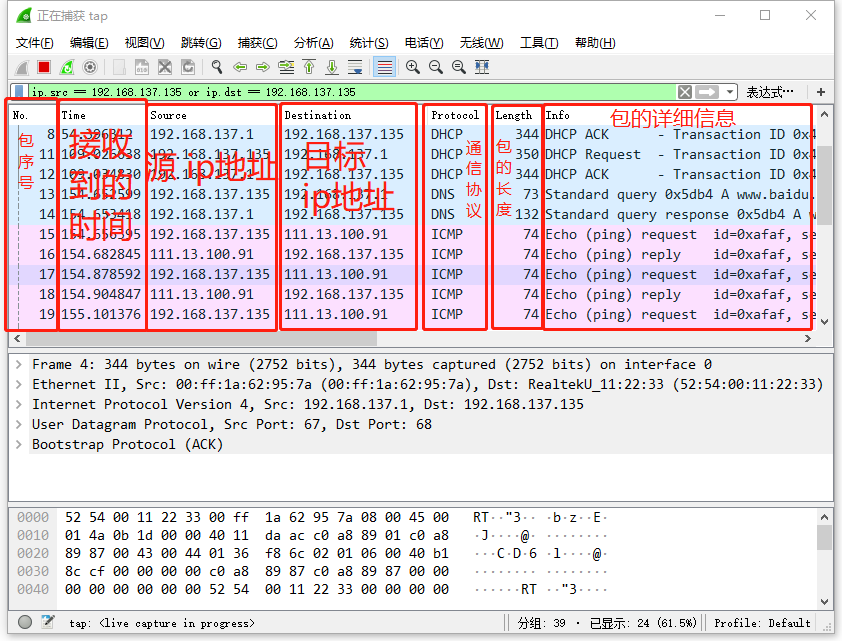
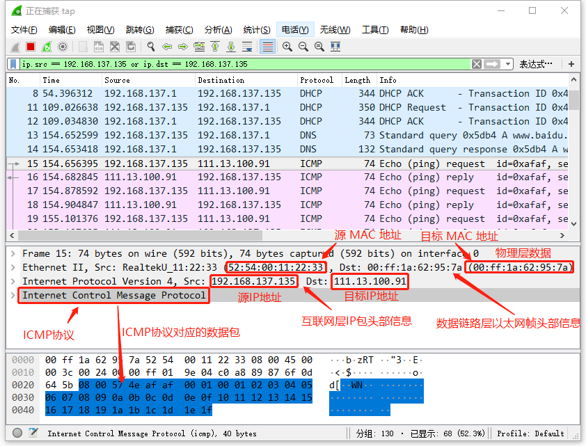

# 使用WireShark进行网络抓包

<iframe frameborder="0" width="1005px" height="663px" src="https://v.qq.com/txp/iframe/player.html?vid=a075978zj4p" allowFullScreen="true"></iframe>

> 提示：<a href="../wireshark.pdf" target="_blank">视频 PPT 下载</a>

## 背景介绍

在网络编程的过程中，经常需要利用抓包工具对开发板发出或接收到的数据包进行抓包分析。wireshark 是一个非常好用的抓包工具，使用 wireshark 工具抓包分析，是学习网络编程必不可少的一项技能。

## 准备工作

### 安装 wireshark

安装 [wireshark](https://www.wireshark.org/)，一路默认安装就行。程序安装完之后，打开 wireshark 软件。

### 选择与开发板相对应的网卡

打开 wireshark 之后，会给出你的网卡信息，让你选择一个要抓包的网卡如下图所示，选择自己开发板用来上网的网卡，双击就开始抓包了。

## wireshark 主界面介绍

wireshark 的主界面和一般的 Windows 软件很像，也有菜单栏，工具栏，地址栏等。还有一些它自己的像，显示过滤器、封包列表、封包详细信息、十六进制数据显示区等。如下图所示，选择完网卡之后其实就已经开始抓包了。

## 显示过滤器的使用

合理的使用显示过滤器，有助于我们从下面的封包列表里快速找到我们要关注网络包。假如我们的开发板获取到的 IP 地址为 192.168.137.135 ，这样在显示过滤器里输入 `ip.src == 192.168.137.135 or ip.dst == 192.168.137.135` 然后点击右边的那个小箭头就会执行这个过滤条件。

过滤之后剩下的都是和我们限定的 IP 相关的包。

当然也有一些其他的过滤条件，比如：
- 按 mac 地址过滤 `eth.addr == 52:54:00:11:22:33`
- 只显示 TCP 协议的数据包 `tcp`
- 只显示 UDP 协议的数据包 `udp`

## 封包列表介绍

从封包列表里我们也可以看到一些跟封包相关的信息，例如：来源的 ip，还有用到的通信协议等。

## 封包详细信息介绍

下面介绍一下封包详细信息那一栏和底下的十六进制数据是相通的。封包的详细信息就是从底下的实际数据解包显示出来的。下面这张图展示了封包的一些详细信息。

只要学会了使用 wireshark 抓包工具，在进行网络编程的时候就会事半功倍了。

## 常见问题

* [常见问题及解决方法](../faq/faq.md)。
