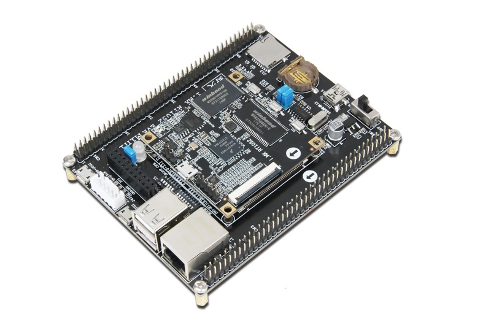
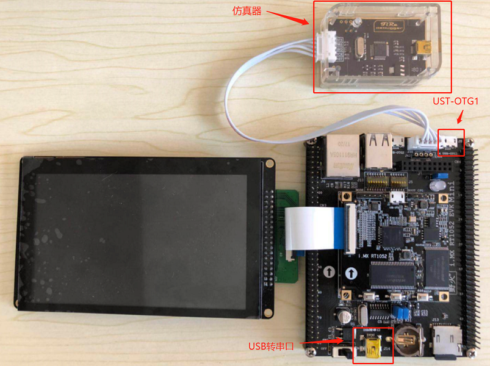
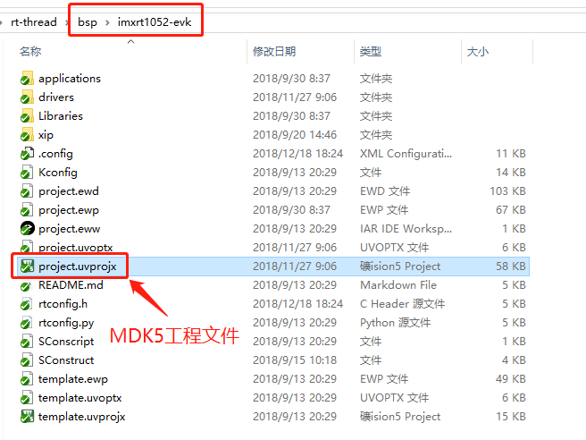
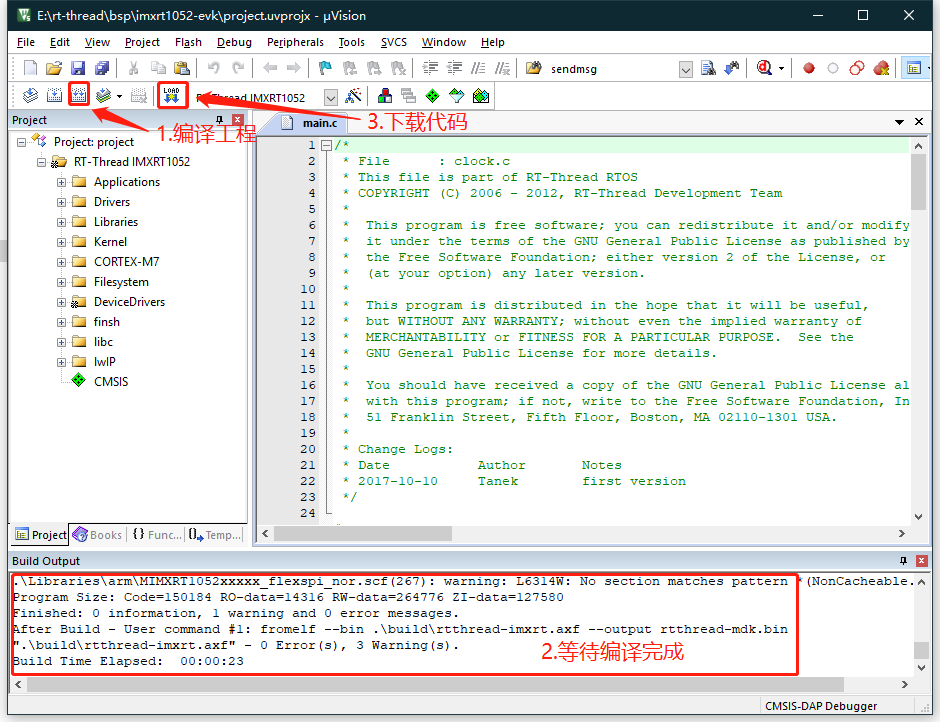

# 野火 I.MX RT1052 上手指南

## 简介

I.MX RT1052 是野火推出的一款高性能开发板，主控芯片是 NXP 推出的基于 ARM Cortex-M7 内核的跨界处理器，最高主频为 600Mhz，该开发板具有丰富的板载资源，可以充分发挥 I.MX RT1052 的芯片性能。

开发板外观如下图所示：



该开发板常用 **板载资源** 如下：

- MCU：I.MX RT1025DVL6A，主频 600MHz，512KB SRAM
- 外部 RAM：W9825G6KH（SDRAM，32MB）
- 外部 FLASH：W25Q256（SPI，32MB，存代码）、W29N01GVSIAA（NAND，128MB）、EEPROM（24c02）
- 常用外设： 1 个 RGB、2 个按键
- 常用接口：USB 转串口、DHT11 接口、LCD 接口、USB SLAVE、USB HOST
- 调试接口，SWD 接口

开发板更多详细信息请参考 [野火官方淘宝店铺宝贝介绍](https://fire-stm32.taobao.com/)。

## 准备工作

野火 I.MX RT1052 板级支持包提供 MDK5 和 IAR 工程，并且支持 GCC 开发环境，下面以 MDK5 开发环境为例，介绍如何将示例程序运行起来。运行示例程序前需要做如下准备工作：

 1. MDK 开发环境

     需要安装 MDK-ARM 5.24 (正式版或评估版，5.14 版本及以上版本均可)，这个版本也是当前比较新的版本，它能够提供相对比较完善的调试功能。安装方法可以参考 [Keil MDK安装](../keil/keil.md)。

 2. 拷贝下载算法

     野火的 I.MX RT1052 有自己的下载算法，点击[这里](http://www.firebbs.cn/thread-22513-1-4.html)获取。下载下来之后解压，将 `下载算法` 拷贝到 `Keil_v5/ARM/Flash` 目录下。

 3. 源码获取

     <https://github.com/RT-Thread/rt-thread/>

     [源码目录说明](../src_code_introduction/rtthread_dir.md)

 4. 使用 USB 线连接开发板的 USB 转串口 到 PC 机。

     

## 运行第一个示例程序

### 配置工程

进入到 `rt-thread\bsp\imxrt1052-evk` 文件夹中，然后按照下面的步骤配置工程

- 在bsp下打开env工具
- 输入 `menuconfig` 命令，RT1052 Board select (***)-->选择 `RT1050_FIRE` 开发板。
- 输入 `scons --target=mdk5 -s` 生成需要的工程

### 编译下载

双击 project.uvprojx 文件，打开 MDK5 工程。



执行编译，编译完成后，点击下载按钮将固件下载至开发板，下载完成后，程序会自动开始运行，观察程序运行状况。

> 提示：工程默认配置使用 DAP 下载程序，在通过 DAP 仿真器连接开发板的基础上，点击下载按钮即可下载程序到开发板



### 运行

使用串口工具（如：PuTTY）打开板子对应的串口(115200-8-1-N) ，复位设备后，可以看到 RT-Thread 的输出信息:

```bash
 \ | /
- RT -     Thread Operating System
 / | \     3.1.1 build Nov 19 2018
 2006 - 2018 Copyright by rt-thread team
msh >
```

## 继续学习

已完成 RT-Thread 快速上手！点击这里进行 [内核学习](../../kernel/kernel-video.md) 。
