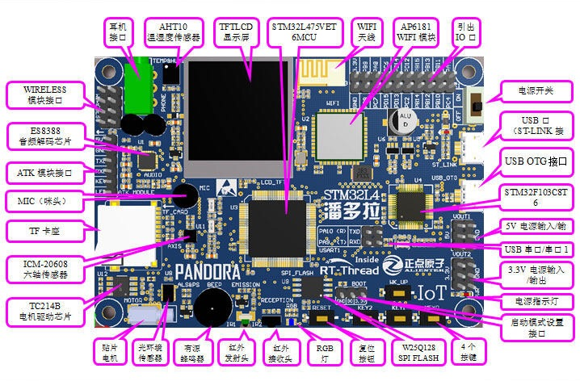
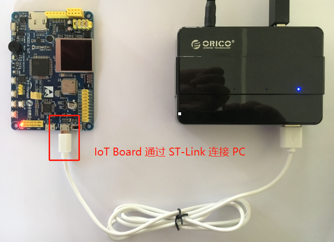
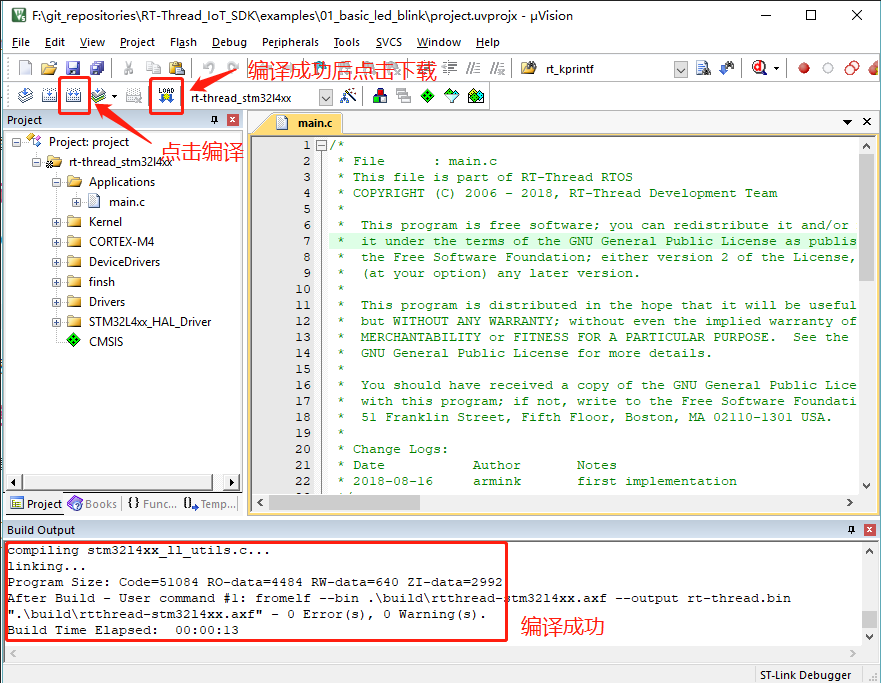
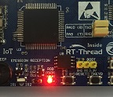

# RT-Thread 潘多拉 STM32L475 上手指南

本文档将介绍潘多拉（即 IoT Board）开发板和 IoT Board SDK 的基本情况。使开发者熟悉 IoT Board SDK 的目录结构，并且可以将 SDK 提供的示例程序运行起来。

## IoT Board 开发板简介

IoT Board 是正点原子、 RT-Thread 联合推出的一款基于 ARM Cortex-M4 内核的开发板，最高主频为 80Mhz，该开发板具有丰富的板载资源，可以充分发挥 STM32L475 的芯片性能。

开发板外观及资源如下图：

该开发板常用 **板载资源** 如下：

- MCU：STM32L475，主频 80MHz，512KB FLASH ，128KB SRAM
- 外部 FLASH：W25Q128（SPI，128Mbit）
- 常用外设
    * RGBLED：1个，（R接PE7 , G接PE8 , B接PE9）
    * 按键：4个，WK_UP（兼具唤醒功能，PC13），KEY0（PD8），KEY1（PD9），KEY2（PD10）
- 常用接口：WIRELESS 模块接口 、TF 卡接口 、USB 串口 、USB OTG 接口 、耳机接口
- 调试接口，板载的 ST-LINK 下载

开发板更多详细信息请参考 [正点原子官方品牌店宝贝介绍](https://eboard.taobao.com/index.htm)。

## IoT Board SDK 说明

IoT Board SDK 获取方式：[从 Github 获取](https://github.com/RT-Thread/IoT_Board) 或 [从 Gitee 获取](https://gitee.com/Armink/IoT_Board)。 SDK 的目录结构如下所示：

| 名称 | 说明 |
| ---- | ---- |
| docs  | 说明文档 |
| drivers | 开发板驱动文件 |
| examples | 示例程序 |
| libraries | 库文件 |
| rt-thread | rt-thread 源代码 |
| tools | 工具目录 |

为开发板提供的示例程序存放在 examples 文件夹中，后面将以第一个示例程序为例，介绍如何将 SDK 提供的示例程序运行起来。

## 准备工作

IoT Board SDK 中的示例程序均提供 MDK 和 IAR 工程，并且支持 GCC 开发环境，下面以 MDK 开发环境为例，介绍如何将示例程序运行起来。运行示例程序前需要做如下准备工作：

1. MDK 开发环境

    我们需要安装 MDK-ARM 5.24 (正式版或评估版，5.14 版本及以上版本均可)，这个版本也是当前比较新的版本，它能够提供相对比较完善的调试功能。安装方法可以参考 [Keil MDK安装](../keil/keil.md)。

2. 连接开发板的 ST-Link USB 口到 PC 机

## 运行第一个示例程序

进入到 `examples\01_basic_led_blink` 文件夹中，双击 project.uvprojx 文件，打开 MDK5 工程，执行编译。编译完成后，点击下载按钮将固件下载至开发板，观察程序运行状况。

按下复位按键重启开发板，观察开发板上 RBG-LED 的实际效果。正常运行后，红色 LED 会周期性闪烁，如下图所示：

IoT Board SDK 中其余例程的使用方法也是相同的，了解了运行例程的方法之后，就可以进行后面例程的运行和学习了。

## 继续学习

已完成 RT-Thread 快速上手！点击这里进行 [内核学习](../../kernel/kernel-video.md) 。

内核学习完成后，继续学习 IoT Board SDK 中的例程，教程参考 [《IoT Board 开发手册》](../../iot_board_tutorial.pdf) 。
