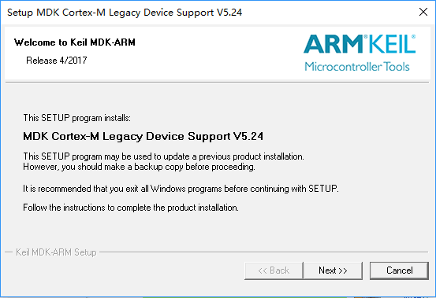
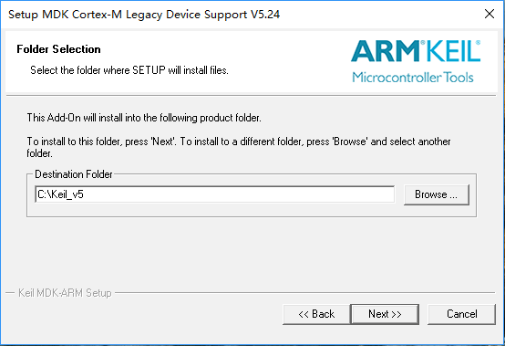
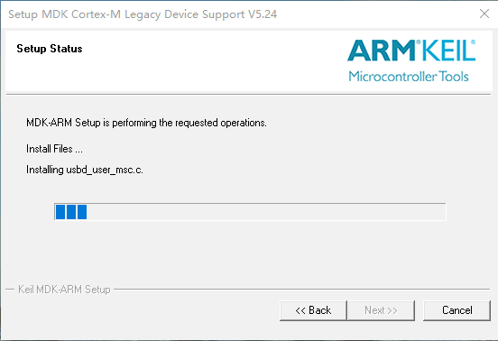

# Keil MDK 安装

在运行 RT-Thread 操作系统前，我们需要安装 MDK-ARM 5.24(正式版或评估版，5.14 版本及以上版本均可)，这个版本也是当前比较新的版本，它能够提供相对比较完善的调试功能。这里采用了 16K 编译代码限制的评估版 5.24 版本，如果要解除 16K 编译代码限制，请购买 MDK-ARM 正式版。

先从 www.keil.com 官方网站下载 MDK-ARM 评估版：
[http://www.keil.com/download/](http://www.keil.com/download/)

在下载时，需要填一些个人基本信息，请填写相应的完整信息，然后开始下载。下载完成后，鼠标双击运行，会出现如图所示的软件安装画面：

这是 MDK-ARM 的安装说明，点击 “Next>>” 进入下一画面，如图所示。

在 “I agree to all the terms of the preceding License Agreement” 前的选择框中点击选择 “√”，并点击”Next >>” 进入下一步安装，如图所示：

点击 “Browse…” 选择 MDK-ARM 的安装目录或者直接在 “Destination Folder” 下的文本框中输入安装路径，这里我们这里我们默认 “C:/Keil” 即可，然后点击”“Next>>”进入下一步安装，如图所示：

在 “First Name” 后输入您的名字，“Last Name”后输入您的姓，“Company Name”后输入您的公司名称，“E-mail”后输入您的邮箱地址，然后点击 “Next>>” 进行安装，等待一段时间后，安装结束，出现如图所示画面：

图中的默认选择不需改动，直接点击 “Next” 进入如图所示画面。

在这里可以点击 “Finish” 完成整个 MDK-ARM 软件的安装。

有了 MDK-ARM 利器，就可以轻松开始 RT-Thread 操作系统之旅，一起探索实时操作系统的奥秘。

> 提示：注：MDK-ARM 正式版是收费的，如果您希望能够编译出更大体积的二进制文件，请购买 MDK-ARM 正式版。RT-Thread 操作系统也支持自由软件基金会的 GNU GCC 编译器，这是一款开源的编译器，想要了解如何使用 GNU 的相关工具请参考 RT-Thread 网站上的相关文档。
