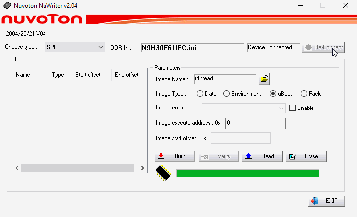
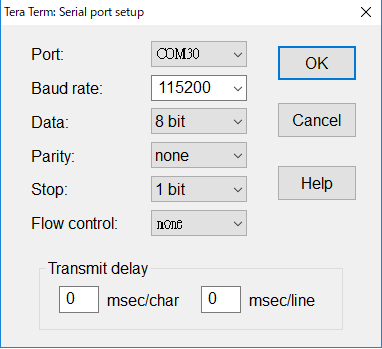

# NK-N9H30 上手指南

## 简介

新唐科技提供 HMI 开发平台其采用新唐的 N9H 微处理器系列，此为一套完整的人机显示接口解决平台，支持最高分辨率为 1024x768 像素显示器，因 N9H 系列采用 ARM926EJ-S 为内核，运行速度达 300 MHz，最高可驱动彩色 1024x768 像素并行端口（Parallel Port），内建 TFT LCD 控制器与 2D 图形加速器，彩度可达 160 万色（24 位）LCD 屏幕输出，高分辨率与高彩度可为用户人机显示接口提供更顺畅与华丽的显示效果。

开发板外观如下图所示：


该开发板常用 **板载资源** 如下：

- MPU：N9H30F61IEC (or N9H30F63IEC)
- 工作频率最高可达 300 MHz
- 内建 64MB DDR-II 内存
- 外部装置：32MB SPI-NOR Flash、NAU8822 Audio Codec、NAND flash
- 常用外设
  - LED：2 个
  - 按键：6 个
- 常用接口：串口、Dual RJ-45 接口、1xUSB Dual-role 2.0、Micro SD。
- 调试接口：外挂 J-link 调试 或 使用 NuWriter 烧录软件、SDRAM 下载。
- 7” (800x480) 24-bit RGB LCD

开发板更多详细信息请参考 [Nuvoton Direct](https://direct.nuvoton.com/en/numaker-hmi-n9h30)。

## 软硬件需求

### 软件需求

- Window 10 操作系统。
- Env RT-Thread 开发辅助工具。
- Arm MDK v5 – 工程编译软件。(Optional)
- 终端联机工具，如 Tera Term。
- RT-Thread 源码。

### 硬件需求

- NK-N9H30 开发板。
- USB Micro 数据传输线 1 条。

## 准备工作

NK-N9H30 板级支持包提供 MDK5 及 GCC 开发环境，介绍如何将示例程序运行起来。运行示例程序前需要做如下准备工作：

- 源码获取
在 env 窗口内运行 git clone 将程序拷贝到本地端。[源码目录说明](../src_code_introduction/rtthread_dir.md)

```bash
git clone https://github.com/RT-Thread/rt-thread
```

- 开发环境
支持 GCC, MDK 开发环境.

| IDE/Compiler  | Tested version            |
| ---------- | ---------------------------- |
| MDK        | uVision 5.25.2               |
| GCC        | GCC 5.4.1 20160919 (release) |

- PC 机连接

使用 1 条 USB 线连接开发板的 USB0 Device port 到 PC 机。 使用 1 条 USB2TTL 线连接开发板的 CON2 port 到 PC 机

## 运行板载功能演示

- 下载项目相应套件
执行下列命令下载项目相关文件。

```bash
# cd rt-thread
# cd bsp/nuvoton/nk-n9h30
# menuconfig --generate
# pkgs --update
Cloning into '<Path-to-rt-thread>\bsp\nuvoton\nk-n9h30\packages\wavplayer-latest'...
remote: Enumerating objects: 52, done.
remote: Counting objects: 100% (5/5), done.
remote: Compressing objects: 100% (5/5), done.
remote: Total 52 (delta 0), reused 4 (delta 0), pack-reused 47
Unpacking objects: 100% (52/52), 25.63 KiB | 144.00 KiB/s, done.
==============================>  WAVPLAYER latest is downloaded successfully.
Cloning into '<Path-to-rt-thread>\bsp\nuvoton\nk-n9h30\packages\NUemWin-latest'...
remote: Enumerating objects: 359, done.
remote: Counting objects: 100% (359/359), done.
remote: Compressing objects: 100% (123/123), done.
remote: Total 359 (delta 255), reused 338 (delta 236), pack-reused 0
Receiving objects: 100% (359/359), 23.79 MiB | 2.13 MiB/s, done.
Resolving deltas: 100% (255/255), done.
==============================>  NUEMWIN latest is downloaded successfully.
......
```

- GCC 编译项目
执行下列指令进行 gcc 编译工程，生成的文件为 rtthread.bin。

```bash
# cd rt-thread
# cd bsp/nuvoton/nk-n9h30
# scons
…
…
LINK rtthread.elf
arm-none-eabi-objcopy -O binary rtthread.elf rtthread.bin
arm-none-eabi-size rtthread.elf
   text    data     bss     dec     hex filename
2705416   36721 4797111 7539248  730a30 rtthread.elf
scons: done building targets.

<Path-to-rt-thread>\bsp\nuvoton\nk-n9h30\rtthread.bin
```

- MDK4 编译项目
通过下列指令选译生成 MDK4 项目工程文件。MDK 项目工程产生在这个目录内，文件名为 project.uvproj。

```bash
# cd rt-thread
# cd bsp/nuvoton/nk-n9h30
# scons --target=mdk4 –s

<Path-to-rt-thread>\bsp\nuvoton\nk-n9h30\project.uvproj
```

注意: 开发前，请先安装[NuMicro_ARM9_Device_Database_Keil](https://www.nuvoton.com/resource-download.jsp?tp_GUID=SW1820201207155701)。

## 使用 NuWriter 工具

進行下列操作之前，需先设定 **Power-on setting to USB booting**。
 [Download NuWriter](https://github.com/OpenNuvoton/NUC970_NuWriter)

- 下载固件至 SDRAM 地址

    

    Step 1: 选择下载类型 **Choose type: DDR/SRAM** 。

    Step 2: 按下 **Re-Connect**。

    Step 3: 选择 **Choose file: Specify path of your rtthread.bin file.**。

    Step 4: 输入 **Execute Address: 0x0**。

    Step 5: 按下 **Option: Download and run**。

    Step 6: 按下 **Download**。

    Step 7: 查看 **RT-Thread 是否运行**。

- 烧录固件至 SPI NOR Flash

    

    Step 1: 选择下载类型 **Choose type: SPI** 。

    Step 2: 按下 **Re-Connect**。

    Step 3: 选择 **Choose file: Specify path of your rtthread.bin file.**。

    Step 4: 点选 **Image Type: uBoot**

    Step 5: 输入 **Execute Address: 0x0**。

    Step 6: 按下 **Program** 并等待结束。

    Step 7: 设定 **Power-on setting to SPI NOR booting**

    Step 8: 按下 **Reset 按键**。

    Step 9: 查看 **RT-Thread 是否运行**。

## 演示

**使用 Tera Term 终端软件操作 rt-thread finsh/msh 命令行功能。串口的配置如图所示。**


### Run LVGLv81 RTT Music on NK-N9H30

**Please check out modified version with GE2D accelerating from [Here](https://github.com/wosayttn/lvgl/tree/release/v8.1)**

```bash
 \ | /
- RT -     Thread Operating System
 / | \     4.0.4 build Dec 17 2021 17:29:14
 2006 - 2021 Copyright by rt-thread team

<Enjoy LvGL with H/W 2D Graphics Accelerating>

msh /> nu_touch_start
msh />
```


### Run NUemWin on NK-N9H30

```bash
 \ | /
- RT -     Thread Operating System
 / | \     4.0.4 build Dec 17 2021 17:29:14
 2006 - 2021 Copyright by rt-thread team

msh /> nu_touch_start
msh /> nuemwin_start

<Enjoy NuemWin with H/W 2D Graphics Accelerating>

msh /> nuemwin_stop
```


## 继续学习

已完成 RT-Thread 快速上手！点击这里进行 [内核学习](../../kernel/kernel-video.md) 。
