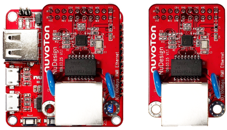
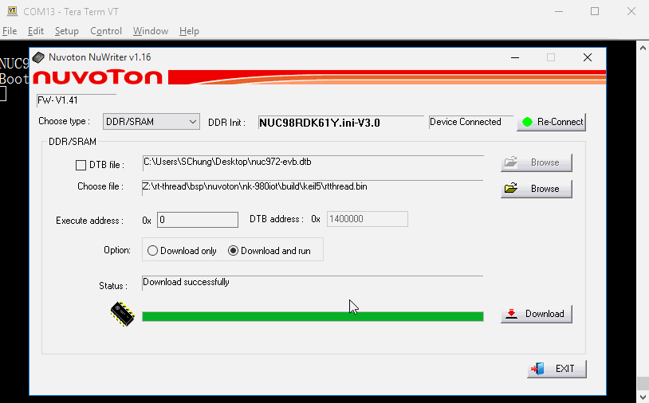
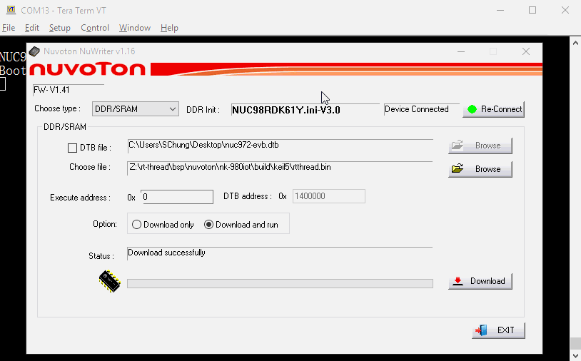

# NK-RTU980 上手指南

## 简介

新唐科技除提供的 NuMaker-RTU-NUC980，又名 Chili Board，Chili Board 面积仅 5 cm x 5 cm，除完整开发环境外，亦提供了高规格的硬件配备，内建 Arm9 为核心的 NUC980DR61YC 微处理器，堆栈 64 MB DRAM，周边接口包含 1 颗 32 MB SPI NOR Flash、1 组 10 / 100 以太网络口、1 组 USB 高速 Host / Device 接口、1 组 CAN 总线、RS-485 界面及最高 5 组 GPIO、具有 RSA2048、AES256、ECC、SHA512 与 PRNG 的硬件加解密引擎可用于网络数据加密传输。

开发板外观如下图所示：



该开发板常用 **板载资源** 如下：

- MPU：NUC980DR61YC，主频 300MHz，embedded 64MB DDR SDRAM
- 外部装置：32 MB SPI-NOR Flash
- 常用外设
  - LED：2 个
  - 按键：2 个
- 常用接口：USB 转串口、RJ-45 接口、1xUSB host 2.0、1xUSB Dual-role 2.0。
- 调试接口：外挂 J-link 调试 或 使用 NuWriter 烧录软件、SDRAM 下载。

开发板更多详细信息请参考 [Nuvoton Direct](https://direct.nuvoton.com/tw/numaker-rtu-nuc980)。

## 软硬件需求

### 软件需求

- Window 10 操作系统。
- Env RT-Thread 开发辅助工具。
- Arm MDK v5 – 工程编译软件。(Optional)
- 终端联机工具，如 Tera Term。
- RT-Thread 源码。

### 硬件需求

- NK-RTU980 开发板。
- USB Micro 数据传输线 2 条。

## 准备工作

NK-RTU980 板级支持包提供 MDK5 及 GCC 开发环境，介绍如何将示例程序运行起来。运行示例程序前需要做如下准备工作：

- 源码获取
在 env 窗口内运行 git clone 将程序拷贝到本地端。[源码目录说明](../src_code_introduction/rtthread_dir.md)

```bash
git clone https://github.com/RT-Thread/rt-thread
```

- 开发环境
支持 GCC, MDK 开发环境.

| IDE/Compiler  | Tested version            |
| ---------- | ---------------------------- |
| MDK        | uVision 5.25.2               |
| GCC        | GCC 5.4.1 20160919 (release) |

- PC 机连接
使用两条 USB 线连接开发板的 VCOM 及 USB0 Device/HOST port 到 PC 机。

## 运行板载功能演示

- 下载项目相应套件
执行下列命令下载项目相关文件。

```bash
# cd rt-thread
# cd bsp/nuvoton/nk-rtu980
# menuconfig --generate
# pkgs --update
Cloning into 'C:\rt-thread\bsp\nuvoton\nk-rtu980\packages\netutils-latest'...
remote: Enumerating objects: 442, done.
remote: Total 442 (delta 0), reused 0 (delta 0), pack-reused 442R
Receiving objects: 100% (442/442), 8.15 MiB | 36.00 KiB/s, done.
Resolving deltas: 100% (237/237), done.
==============================>  FAL v0.4.0 is downloaded successfully.
==============================>  netutils update done
Operation completed successfully.
```

- GCC 编译项目
执行下列指令进行 gcc 编译工程，生成的文件为 rtthread.bin。

```bash
# cd rt-thread
# cd bsp/nuvoton/nk-rtu980
# scons
…
…
LINK rtthread.elf
arm-none-eabi-objcopy -O binary rtthread.elf rtthread.bin
arm-none-eabi-size rtthread.elf
   text    data     bss     dec     hex filename
 245020    4556   10260  259836   3f6fc rtthread.elf
scons: done building targets.

<Path-to-rt-thread>\bsp\nuvoton\nk-rtu980\rtthread.bin
```

- MDK4 编译项目
通过下列指令选译生成 MDK4 项目工程文件。MDK 项目工程产生在这个目录内，文件名为 project.uvproj。

```bash
# cd rt-thread
# cd bsp/nuvoton/nk-rtu980
# scons --target=mdk4 –s

<Path-to-rt-thread>\bsp\nuvoton\nk-rtu980\project.uvproj
```

注意: 开发前，请先安装[NuMicro_ARM9_Device_Database_Keil](https://www.nuvoton.com/resource-download.jsp?tp_GUID=SW1820201207155701)。

## 使用 NuWriter 工具

进行下列操作之前，需先设定 **Power-on setting to USB booting**。
 [Download NuWriter](https://github.com/OpenNuvoton/NUC980_NuWriter)

- 下载固件至 SDRAM 地址

    

    Step 1: 选择下载类型 **Choose type: DDR/SRAM** 。

    Step 2: 按下 **Re-Connect**。

    Step 3: 选择 **Choose file: Specify path of your rtthread.bin file.**。

    Step 4: 输入 **Execute Address: 0x0**。

    Step 5: 按下 **Option: Download and run**。

    Step 6: 按下 **Download**。

    Step 7: 查看 **RT-Thread 是否运行**。

- 烧录固件至 SPI NOR Flash

    

    Step 1: 选择下载类型 **Choose type: SPI** 。

    Step 2: 按下 **Re-Connect**。

    Step 3: 选择 **Choose file: Specify path of your rtthread.bin file.**。

    Step 4: 点选 **Image Type: Loader**

    Step 5: 输入 **Execute Address: 0x0**。

    Step 6: 按下 **Program** 并等待结束。

    Step 7: 设定 **Power-on setting to SPI NOR booting**

    Step 8: 按下 **Reset 按键**。

    Step 9: 查看 **rtthread** 是否运行。

- 运行

    使用 Tera Term 终端软件操作 rt-thread finsh/msh 命令行功能。串口的配置如图所示。(注意: Nuvoton Virtual Com Port 对应的串口编号可在设备管理器内找到。例如: 串口编号为 COM30, 115200N81。)

    

    在 console 操作 ifconfig 指令打印取得的 IP 地址, 并使用 ping 指令，进行测试网关连接。

    

## 继续学习

已完成 RT-Thread 快速上手！点击这里进行 [内核学习](../../kernel/kernel-video.md) 。
