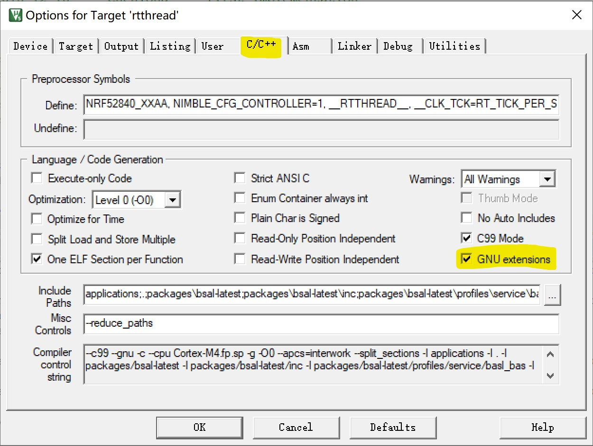

# Nordic BSP 上手指南

##  简介

Nordic nRF5x 系列 MCU 应用广泛，且功能齐全、灵活性高，非常适用于 Bluetooth 低功耗蓝牙和 2.4 GHz 超低功耗无线应用。

本 [BSP](https://github.com/RT-Thread/rt-thread/tree/master/bsp/nrf5x) 基于官方 [nrfx](https://github.com/NordicSemiconductor/nrfx) 的 Nordic 通用外设驱动的基础上，该 BSP 将官方的 SDK 和 RT-Thread 生态结合，让开发者既可以基于官方的 sdk 开发自己的应用，也可以使用 RT-Thread 生态的软件包。

目前支持硬件平台：`nrf52832`(pca10040)、`nrf52840`（pca10056）、`nrf51822`（microbit）

在搭建 bsp 的时候，通过参考 STM32 的架构，预留出支持多种 Nordic 芯片的框架，理论上可以支持更多的 Nordic 的平台，限于目前社区小伙伴手上的开发板有限，如果您手上有相关 Nordic 的开发板，欢迎添加对应的 Nordic 的芯片的 bsp。可以参考 [Nordic 系列 BSP 制作教程](https://github.com/RT-Thread/rt-thread/blob/master/bsp/nrf5x/docs/nRF5x%E7%B3%BB%E5%88%97BSP%E5%88%B6%E4%BD%9C%E6%95%99%E7%A8%8B.md) 制作自己的开发板的 bsp。

Nordic nRF5x 系列 BSP 目前支持情况如下：

| Nordic 主芯片 | 开发板名称                                                   | bsp 所在文件夹                                                | 备注                        |
| ------------ | ------------------------------------------------------------ | ------------------------------------------------------------ | --------------------------- |
| nRF51822     | [Micro:bitV1.5](https://tech.microbit.org/hardware/1-5-revision/) | [nrf51822](https://github.com/RT-Thread/rt-thread/tree/master/bsp/nrf5x/nrf51822) |                             |
| nrf52832     | [pca10040](https://www.nordicsemi.com/Products/Development-hardware/nRF52-DK) | [nrf52832](https://github.com/RT-Thread/rt-thread/tree/master/bsp/nrf5x/nrf52832) |                             |
| nrf52840     | [PCA10056](https://www.nordicsemi.com/Software-and-tools/Development-Kits/nRF52840-DK) | [nrf52840](https://github.com/RT-Thread/rt-thread/tree/master/bsp/nrf5x/nrf52840) |                             |
| nrf52840     | [ARDUINO NANO 33 BLE](https://store.arduino.cc/usa/nano-33-ble-sense-with-headers) | [nrf52840](https://github.com/RT-Thread/rt-thread/tree/master/bsp/nrf5x/nrf52840) | menuconfig 中选择对应的 board |

### 主要支持功能

- 支持官方 softdevice 的 sample： ble_app_uart_c(主机)、ble_app_uart（从机）、ble_app_blinky、ble_app_hrs（softdevice 是官方 Nordic 的蓝牙协议栈名称）
- 支持 nimble 的软件包及对应的 sample
- 支持 RT-Thread 下面的外设驱动。

### Nrf5x BSP 目录结构

该 bsp 位于 RT-Thread  master 目录下面的 bsp/nrf5x 目录下面

```
nrf5x
├───docs
│   └───images                      // nrf5x 文档使用图片
│   └───nRF5x 系列 BSP 制作教程. md
├───libraries                       // nrf5x 系列支持 BSP libraries
│   └───drivers                     // nRF5x 系列设备通用驱动文件
│   └───templates                   // 通用设备 BSP 工程模板
│   │   └───nrf52x                  // nrf52x 系列 BSP 工程模板
│   │   └───nrf5x_board_kconfig     // 通用 BSP 工程配置文件
├───nrf51822                        // nrf51822 BSP 工程
├───nrf52832                        // nrf52832 BSP 工程
│   └───application                 // 应用代码
│   │   board                       // 链接脚本文件，开发板硬件初始化和配置文件
│   │   package                     // 软件包目录
│   │   └───nRF5_SDK                // Nordic 官方 nRF5x SDK
│   │   kconfig                     // 工程 kconfig 配置文件
│   └───rtconfig.h                  // 工程 rtconfig 配置文件
├───nrf52840                        // nrf52840 BSP 工程
├───tools                           // nrf52840 tools 工具
└───README.md                       // Nordic 工程整体介绍
```

##  BSP 使用方法

### RT-Thread 的使用方法

默认的 RT-Thread 工程是不带有蓝牙协议栈功能的，方便客户先搭建对应的 RTOS 平台，后续可以根据项目需要选择合适的协议栈运行蓝牙。默认的 BSP 都是支持 UART 和 GPIO 的，烧入即可亮灯和在 console 口打印对应的信息。

运行该 BSP 需要对 RT-Thread 使用比较熟悉即可，如果不熟悉可以参考文档中心的说明学习一下。

- 首先下载代码，`git clone https://github.com/RT-Thread/rt-thread.git`
- 进入到目录 `rt-thread/bsp/nrf5x/nrf52840`
- 右击进入 env 命令行模式
- menuconfig 选择需要加载的 BSP BOARD 配置并且保存


- 执行 `pkgs --update` 下载 nrfx 的软件包（这里的 HAL 库采用软件包的方式，需要客户自行下载）。
- 执行 `scons --target=mdk5`  生成 keil 工程，烧入即可看到 LED 小灯闪烁，串口连上会有 log 打出来。
- 需要注意的是，如果之前板子上已经烧入 softdevice 的话，用 keil 烧入可能会出现烧不进的情况，需要参考下面的 FAQ 将整颗芯片擦除之后再运行 rt-thread 裸工程

### 官方 Softdevice 的使用方法

首先可以熟悉 BSP 工程的运行，在此基础上，可以运行 蓝牙相关的 sample，例如 ble_app_beacon。

- menuconfig 进入 Hardware Drivers Config， BLE STACK 选择 Nordic softdevice


- menuconfig 进入 peripheral libraries and drivers 目录中选中 nrf5x_sdk


- 进入目录选择对应的 sample


- 保存配置，然后 `pkgs --update`, 执行 `scons --target=mdk5`
- 打开 keil 工程，如果开发板上还没有烧入 softdevice，需要先烧入官方的协议栈，所以先要烧入 softdevice(如果之前已经烧入 SDK16.0 的 softdevice，可以不用执行这一步)，如下图点击 softdevice 工程，烧入即可


- 重新选择 RT-Thread 工程，进行编译，烧入，通过串口看到如下的输出即代表成功


- 这个时候我们执行命令 `ble_app_beacon` 不同的 sample 对应命令不同，看到如下 log 代表 beacon 已经跑起来了


- 这个时候通过手机用 [nrf connect](https://play.google.com/store/apps/details?id=no.nordicsemi.android.mcp) 来测试，可以搜索到对应的 beacon 设备


### 开源协议栈 nimble 的使用

如果使用 nimble 就不能选择 softdevice 了，所以要清空之前的配置，为了防止误操作，可以选择将 nrf52840 的目录下面的内容全部执行 `git reset --hard`  之后重复上述操作，然后执行 `git clean -xfd` 清理掉无效的文件。

- menuconfig 进入 BLE STACK 选择 nimble

- menuconfig 选择 nimble


- 进入 Controller Configuration 选择 nrf52840
- 进入 Bluetooth Samples 选择 ble beacon sample
- 执行 `pkgs --update` 下载需要的软件包
- 执行 `scons --target=mdk5`
- 打开 keil 工程，勾选 GNU extensions



- 打开 keil 工程烧入代码，这个时候需要注意的是，如果之前有 softdevice 存在 flash 中，需要擦除芯片中的 softdevice。
- 烧入之后执行 cmd `ble_ibeacon`。
- 之后用 nrf connect 软件可以搜索到对应的 beacon 设备。


