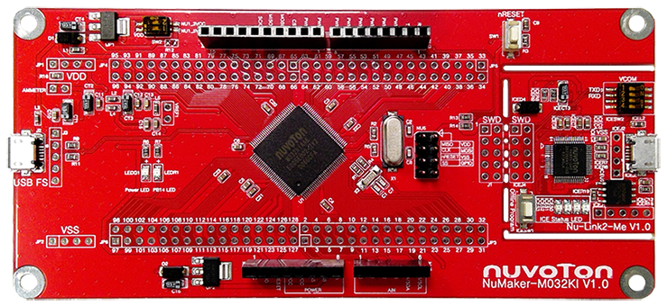

# NuMaker-M032KI 上手指�

## 简介

NuMaker-M032KI 由两部分组�，采用 NuMicro® M032KIAAE 微�制器的主��，� Nu-Link2-Me 除错刻录器。使用者�需使用此开��就�以开��刻录并验�应用程�。

NuMaker-M032KI 的主��带有 M032KIAAE 所有脚�的扩展��，并�供兼容� Arduino UNO 的��，还有�活的电�供应设计，方便������设备或 Arduino 模�，进行开�。主��并带有一电��测��，用户在开�过程中�轻��测微�制器的功耗。

Nu-Link2-Me 刻录�除错器��过SWD��进行刻录�除错，还带有一 16 Mbit 大�的 SPI Flash 供脱机刻录使用。Nu-Link2-Me 也是一个 USB 存储装置，支�拖拉�刻录，将档案拖拉至 Nu-Link2-Me ��刻录目标芯片。Nu-Link2-Me 支�虚拟串�功能，�输出讯�至终端机窗�。Nu-Link2-Me ��开��上拆下，作为�产刻录工具使用。

开��外观如下图所示：



该开��常用 **�载资�** 如下：

- MCU：M032KIAAE，主频 72 MHz，512KB Dual Bank FLASH ，96kB RAM
- 外部装置：N/A
- 常用外设
    * LED：2 个
    * 按键：1 个
- 常用��：USB 转串��USB 1.1 Device
- 调试��，�载的 Nu-Link2-Me 下载

开��更多详细信�请�考 [Nuvoton Direct](https://direct.nuvoton.com/tw/numaker-m032ki)。

## 软硬件需求

### 软件需求
- Window 10 �作系统。
- Env RT-Thread 开�辅助工具。
- IAR-8.3 以上版本或是 Arm MDK v5 – 工程编译软件。(Optional)
- Nu-Link Driver for Keil MDK。(Optional)
- Nu-Link Driver for IAR。(Optional)
- 终端�机工具，如 Tera Term。
- RT-Thread ��。

### 硬件需求
- NuMaker-M032KI 开��。
- USB Micro 数�传输线 1 �。

## 准备工作

NuMaker-M032KI �级支�包�供 MDK5 和 IAR 工程，并且支� GCC 开��境，介�如何将示例程��行起�。�行示例程��需��如下准备工作：

 1. ����

在 env 窗�内�行 git clone 将程�拷�到本地端。[��目录说�](../src_code_introduction/rtthread_dir.md)

```bash
git clone https://github.com/RT-Thread/rt-thread
```

 2. 开��境
支� GCC, MDK5, IAR 开��境.

| IDE/Compiler  | Tested version            |
| ---------- | ---------------------------- |
| MDK5       | 5.28                         |
| IAR        | 8.32                          |
| GCC        | GCC 6.3.1 20170620 (Need update env) |

注�: 开��，请先安装 [Nu-Link_Keil](https://www.nuvoton.com/resource-download.jsp?tp_GUID=SW1120200221180521) 或是 [Nu-Link_IAR](https://www.nuvoton.com/resource-download.jsp?tp_GUID=SW1120200221180914) 驱动。

 3. 使用 USB 线��开��的 USB ICE Connector 到 PC 机。

## �行�载功能演示

- 下载项目相应套件

    执行下列命令下载项目相关文件。

```bash
# cd rt-thread
# cd bsp/nuvoton/numaker-m032ki
# menuconfig --generate
```

- GCC 编译项目
执行下列指令进行 gcc 编译工程，生�的文件为 rtthread.bin。

```bash
# cd rt-thread
# cd bsp/nuvoton/numaker-m032ki
# scons
…
…
LINK rtthread.elf
arm-none-eabi-objcopy -O binary rtthread.elf rtthread.bin
arm-none-eabi-size rtthread.elf
   text    data     bss     dec     hex filename
 176328    3696   22840  202864   31870 rtthread.elf
scons: done building targets.

<Path-to-rt-thread>\bsp\nuvoton\numaker-m032ki\rtthread.bin
```

- MDK5 编译项目

通过下列指令选译生� MDK5 项目工程文件。MDK 项目工程产生在这个目录内，文件�为 project.uvprojx。

```bash
# cd rt-thread
# cd bsp/nuvoton/numaker-m032ki
# scons --target=mdk5 –s

<Path-to-rt-thread>\bsp\nuvoton\numaker-m032ki\project.uvprojx
```

- IAR 编译项目
�以通过下列指令生� IAR 项目工程文件。IAR 项目工程产生在这个目录内，文件�为 project.ewp 和 project.eww。(注�: 编译 IAR 项目工程需使用 8.3 以上的版本。)

```bash
# cd rt-thread
# cd bsp/nuvoton/numaker-m032ki
# scons --target=iar –s

<Path-to-rt-thread>\bsp\nuvoton\numaker-m032ki\project.eww
<Path-to-rt-thread>\bsp\nuvoton\numaker-m032ki\project.ewp
```

- 固件下载

简易的下载方法: 通过拖拉文档到 NuMicro MCU 虚拟�盘或是使用传�到 NuMicro MCU 虚拟�盘的方�，��完�固件下载。

首先，�置 Nu-Link2-Me 上的指拨开关，将四个开关拨到 ‘ON’ 的�置。

�置完��，将开��使用 Micro USB ��线��计算机，我的计算机将出�一个 NuMicro MCU 虚拟�盘。�下�，我们将使用这个虚拟�盘�进行固件下载。

- �行
使用 Tera Term 终端软件�作 rt-thread finsh/msh 命令行功能。串�的�置如图所示。(注�: Nuvoton Virtual Com Port 对应的串�编��在设备管�器内找到。例如: 串�编�为 COM30, 115200N81。)


## 继续学习
已完� RT-Thread 快速上手�点击这里进行 [内核学习](../../kernel/kernel-video.md) 。
‚
