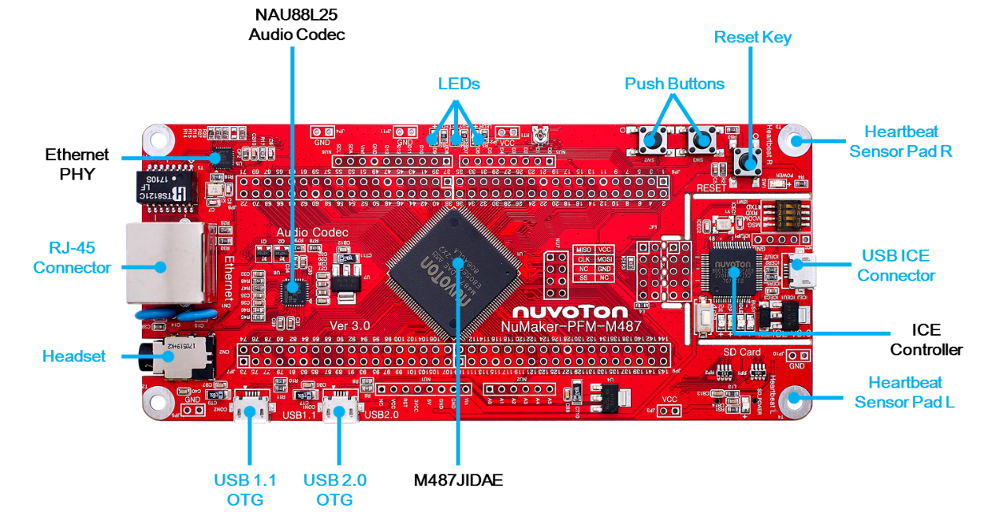
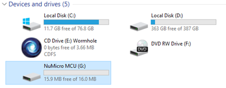
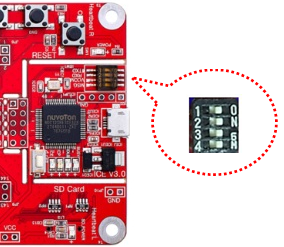

# NuMaker-PFM-M487 上手指�

## 简介

NuMaker-PFM-M487 的主��采用通用��设计，�供兼容� Arduino UNO 的��，用户���任何 Arduino 模�进行开�。除了扩展��外�主��本身亦内建丰富的��设备，如�三色 LED�按键�麦克��耳机�USB 1.1/2.0 OTG�心�感测等完整的传感器群。模拟周边部分�有 1 个 12 �，多达 16 通� 5 MSPS SAR ADC�2 个 12 � 1 MSPS DAC，通讯��包� 2 个 CAN 2.0B ���2 个 SD ��制器等。

开��外观如下图所示：



该开��常用 **�载资�** 如下：

- MCU：M487JIDAE，主频 192MHz，512KB FLASH ，160KB RAM
- 外部 FLASH：W25Q32（SPI，4MB）�NAU88L25 Audio Codec
- 常用外设
    * LED：3 个
    * 按键：3 个
- 常用��：USB 转串��RJ-45 ���USB 1.1 OTG�USB 2.0 OTG
- 调试��，�载的 NuLinkMe 下载

开��更多详细信�请�考 [Nuvoton Direct](https://direct.nuvoton.com/tw/numaker-pfm-m487)。

## 软硬件需求
### 软件需求
- Window 10 �作系统。
- Env RT-Thread 开�辅助工具。
- IAR-8.2 以上版本或是 Arm MDK v5(或是 v4) – 工程编译软件。(Optional)
- Nu-Link Driver for Keil MDK。(Optional)
- Nu-Link Driver for IAR。(Optional)
- 终端�机工具，如 Tera Term。
- RT-Thread ��。

### 硬件需求
- NuMaker-PFM-M487 开��。
- USB Micro 数�传输线 1 �。

## 准备工作

NuMaker-PFM-M487 �级支�包�供 MDK5 和 IAR 工程，并且支� GCC 开��境，介�如何将示例程��行起�。�行示例程��需��如下准备工作：

 1. ����

在 env 窗�内�行 git clone 将程�拷�到本地端。[��目录说�](../src_code_introduction/rtthread_dir.md)

```bash
git clone https://github.com/RT-Thread/rt-thread
```

 2. 开��境

支� GCC, MDK5, IAR 开��境.

| IDE/Compiler  | Tested version            |
| ---------- | ---------------------------- |
| MDK5       | 5.26.2                       |
| IAR        | 8.2                          |
| GCC        | GCC 5.4.1 20160919 (release) |

注�: 开��，请先安装 [Nu-Link_Keil](https://www.nuvoton.com/resource-download.jsp?tp_GUID=SW1120200221180521) 或是 [Nu-Link_IAR](https://www.nuvoton.com/resource-download.jsp?tp_GUID=SW1120200221180914) 驱动。

 3. 使用 USB 线��开��的 USB ICE Connector 到 PC 机。

## �行�载功能演示

- 下载项目相应套件

执行下列命令下载项目相关文件。

```bash
# cd rt-thread
# cd bsp/nuvoton/numaker-pfm-m487
# menuconfig --generate
# pkgs --update
Cloning into 'C:\rt-thread\bsp\nuvoton\numaker-pfm-m487\packages\netutils-latest'...
remote: Enumerating objects: 442, done.
remote: Total 442 (delta 0), reused 0 (delta 0), pack-reused 442R
Receiving objects: 100% (442/442), 8.15 MiB | 36.00 KiB/s, done.
Resolving deltas: 100% (237/237), done.
==============================>  FAL v0.4.0 is downloaded successfully.
==============================>  netutils update done
Operation completed successfully.
```

- GCC 编译项目

执行下列指令进行 gcc 编译工程，生�的文件为 rtthread.bin。

```bash
# cd rt-thread
# cd bsp/nuvoton/numaker-pfm-m487
# scons
…
…
LINK rtthread.elf
arm-none-eabi-objcopy -O binary rtthread.elf rtthread.bin
arm-none-eabi-size rtthread.elf
   text    data     bss     dec     hex filename
 245020    4556   10260  259836   3f6fc rtthread.elf
scons: done building targets.

<Path-to-rt-thread>\bsp\nuvoton\numaker-pfm-m487\rtthread.bin
```

- MDK5 编译项目

通过下列指令选译生� MDK4 或是 MDK5 项目工程文件。MDK 项目工程产生在这个目录内，文件�为 project.uvprojx。

```bash
# cd rt-thread
# cd bsp/nuvoton/numaker-pfm-m487
# scons --target=mdk5 –s

<Path-to-rt-thread>\bsp\nuvoton\numaker-pfm-m487\project.uvprojx
```

- IAR 编译项目

�以通过下列指令生� IAR 项目工程文件。IAR 项目工程产生在这个目录内，文件�为 project.ewp 和 project.eww。(注�: 编译 IAR 项目工程需使用 8.2 以上的版本。)

```bash
# cd rt-thread
# cd bsp/nuvoton/numaker-pfm-m487
# scons --target=iar –s

<Path-to-rt-thread>\bsp\nuvoton\numaker-pfm-m487\project.eww
<Path-to-rt-thread>\bsp\nuvoton\numaker-pfm-m487\project.ewp
```

- 固件下载
简易的下载方法: 通过拖拉文档到 NuMicro MCU 虚拟�盘或是使用传�到 NuMicro MCU 虚拟�盘的方�，��完�固件下载。

首先，�置 NuMaker-PFM-M487 上的 ISW1，将四个开关拨到 ‘ON’ 的�置。

�置完��，将开��使用 Micro USB ��线��计算机，我的计算机将出�一个 NuMicro MCU 虚拟�盘。�下�，我们将使用这个虚拟�盘�进行固件下载。(注�：若需�进行 IAR/MDK ��除错功能，需�将第 4 个指拨开关切��到 OFF 的�置。)
- �行
使用 Tera Term 终端软件�作 rt-thread finsh/msh 命令行功能。串�的�置如图所示。(注�: Nuvoton Virtual Com Port 对应的串�编��在设备管�器内找到。例如: 串�编�为 COM30, 115200N81。)

在 console �作 ifconfig 指令打��得的 IP 地�, 并使用 ping 指令，进行测试网关��。


## 更多
- [Nuvoton NuMaker-IoT-M487 快速上手](../numaker-iot-m487/quick-start.md)
- [Nuvoton NK-980IOT 快速上手](../nk-980iot/quick-start.md)
- [Nuvoton NuMaker-M2354 快速上手](../numaker-m2354/quick-start.md)
- [Nuvoton NK-RTU980 快速上手](../nk-rtu980/quick-start.md)

## 继续学习

已完� RT-Thread 快速上手�点击这里进行 [内核学习](../../kernel/kernel-video.md) 。
‚
