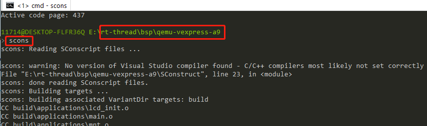
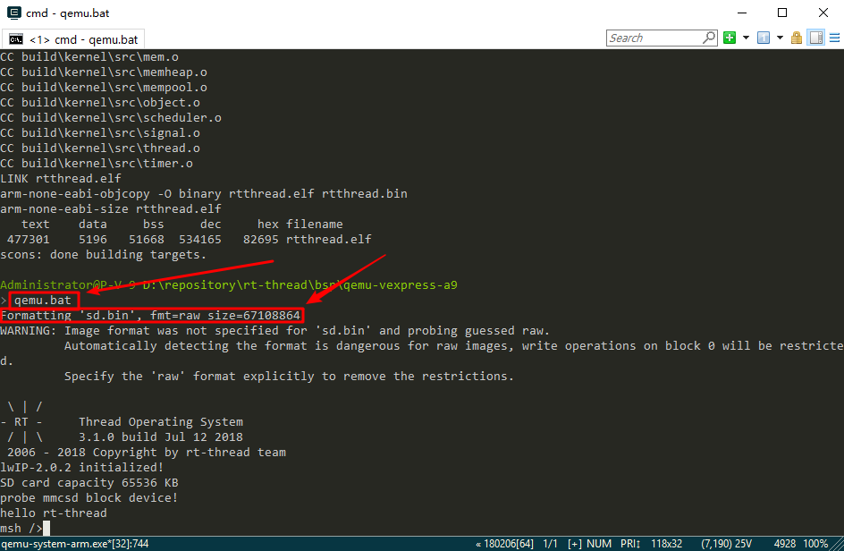
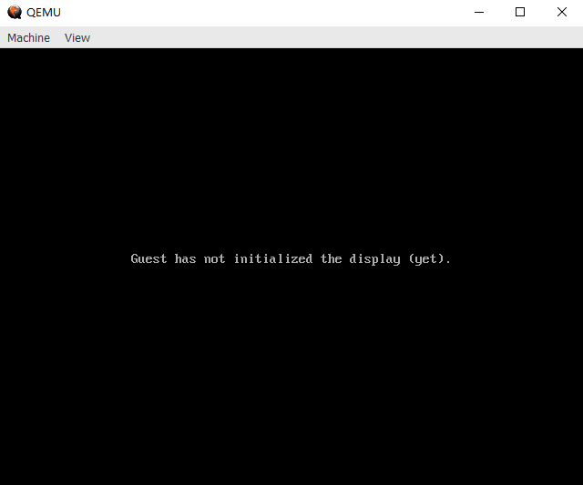
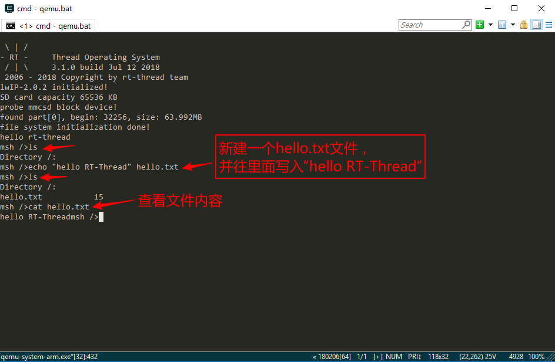

# 使用 QEMU 运行 RT-Thread

## 简介

嵌入式软件开发离不开开发板，在没有物理开发板的情况下，可以使用 QEMU 等类似的虚拟机来模拟开发板。QEMU 是一个支持跨平台虚拟化的虚拟机，它可以虚拟很多开发板。为了方便大家在没有开发板的情况下体验 RT-Thread，RT-Thread 提供了 QEMU 模拟的 ARM vexpress A9 开发板的板级支持包 (BSP)。本文主要介绍在 Window 平台上使用 QEMU 运行 RT-Thread 工程

## 准备工作

 1. 获取 ENV 工具

     [官网下载](https://www.rt-thread.org/page/download.html)，下载完成后，按照 Add_Env_To_Right-click_Menu 图片中的步骤将 Env 添加到右键启动菜单

 2. 源码获取

    <https://github.com/RT-Thread/rt-thread/>

     [源码目录说明](../src_code_introduction/rtthread_dir.md)

> 提示：注意：ENV 工具和源码都不能放在中文或者有空格的路径下，并且 win7 第一次打开 ENV 工具推荐使用管理员权限打开。

## 运行第一个示例程序

### 编译运行

进入到 `rt-thread\bsp\qemu-vexpress-a9` 文件夹中，然后右键打开 ENV 工具，输入 `scons` 命令执行编译

编译完成后，输入 `qemu.bat` 运行程序。

### 体验 RT-Thread Finsh 控制台

RT-Thread 支持 Finsh，用户可以在命令行模式使用命令操作。输入 `help` 或按 `Tab` 键可以查看所有支持的命令。如下图所示，左边为命令，右边为命令描述。

如下图所示，输入 `list_thread` 命令可以查看当前运行的线程，以及线程状态和堆栈大小等信息。输入`list_timer`可以查看定时器的状态。

### 体验 RT-Thread 文件系统

输入 `list_device` 可以查看注册到系统的所有设备。如下面图片所示可以看到虚拟的 sd 卡 “sd0” 设备，接下来我们可以使用 `mkfs sd0` 命令格式化 sd 卡，执行该命令会将 sd 卡格式化成 [FatFS 文件系统](http://elm-chan.org/fsw/ff/00index_e.html)。

第一次格式化 sd 卡后文件系统不会马上装载上，第二次启动才会被正确装载。我们关闭 qemu 窗口退出虚拟机，然后在 Env 命令行界面输入 `qemu.bat` 重新启动虚拟机及工程，输入 `ls` 命令可以看到新增了 Directory 目录，文件系统已经装载上，然后可以使用 RT-Thread 提供的其他命令体验文件系统。

## 参考资料

* [《Env 用户手册》](https://www.rt-thread.org/document/site/development-guide/rtthread-tool-manual/env/env-user-manual/)

## 继续学习

已完成 RT-Thread 快速上手！点击这里进行 [内核学习](../../kernel/kernel-video.md) 。

