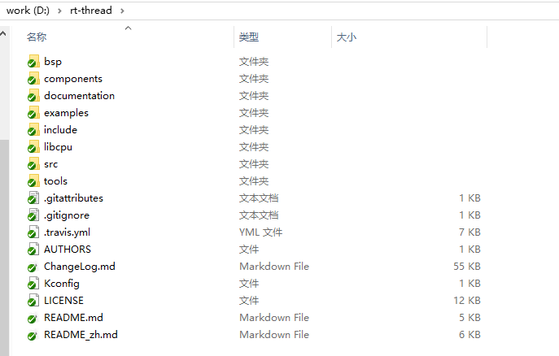
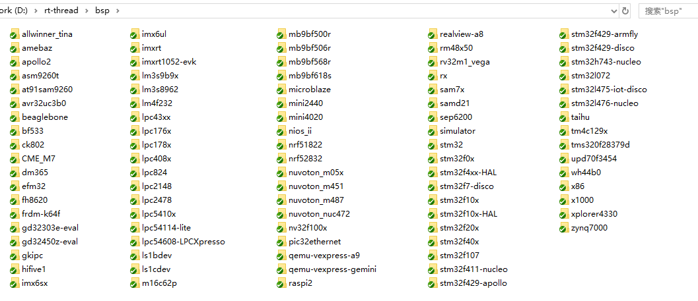
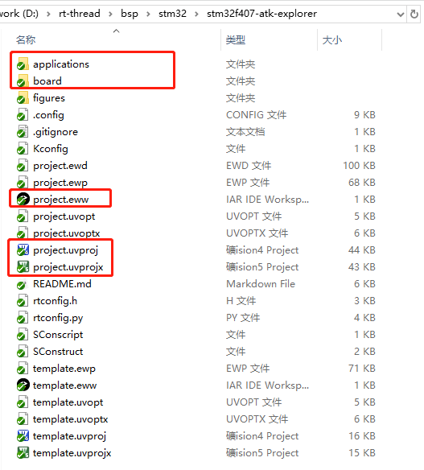

## rt-thread 源码的目录文件说明

### rt-thread 目录

下图是打开 rt-thread 源码的目录，下表是该目录的简单说明。

| 目录名      |   描述  |
|---         |   --- |
|bsp| Board support package，RT-Thread 板级支持包  （IAR/MDK 工程在 BSP 目录下的具体的 BSP 中） |
|components| RT-Thread 的各个组件目录 |
| documentation | 一些说明文件，如代码风格说明 |
|include   | RT-Thread 内核的头文件 |
|libcpu    | 各类芯片的移植代码，此处包含了 STM32 的移植文件 |
|src       | RT-Thread 内核的源文件 |
|tools     | RT-Thread 命令构建工具的脚本文件 |

### BSP 目录

打开 BSP 目录，里面包含 RT-Thread 已经支持的所有 bsp

### 打开一个 bsp

如打开bsp stm32f407-atk-explorer，下表是该目录的简单说明。

| 目录名      |   描述  |
|---         |   --- |
|applications| RT-Thread 应用程序 |
|    board    | 与开发板相关的配置文件 |
|  project.eww project.uvproj project.uvprojx  |iar 的工程文件  keil4 工程文件  keil5 工程文件 |

