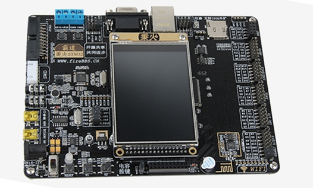
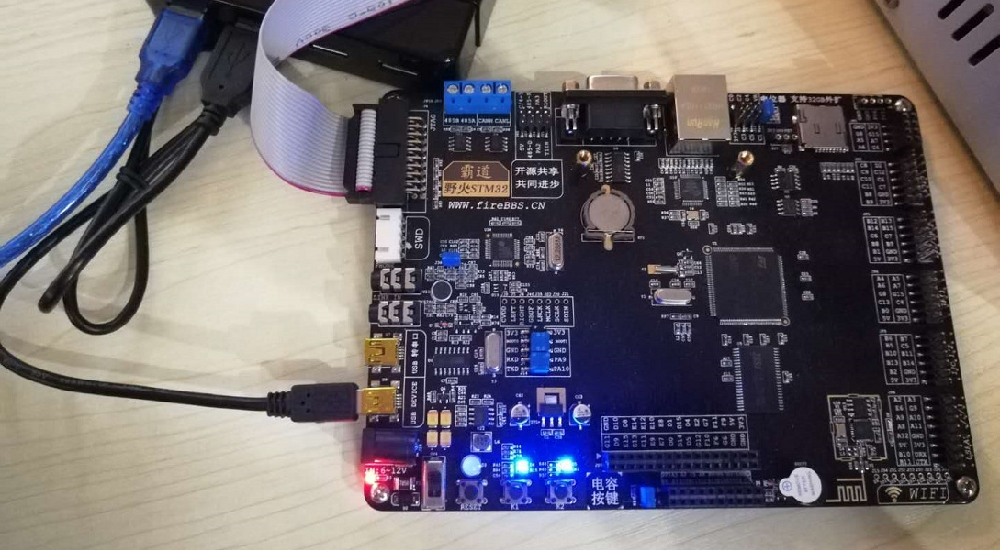
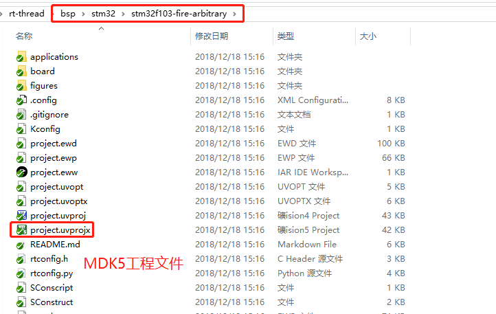
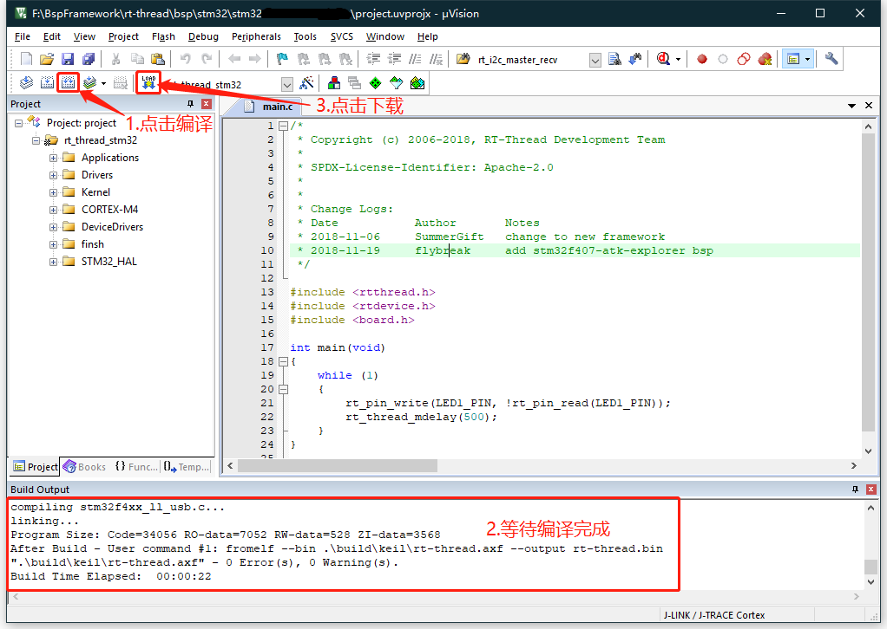
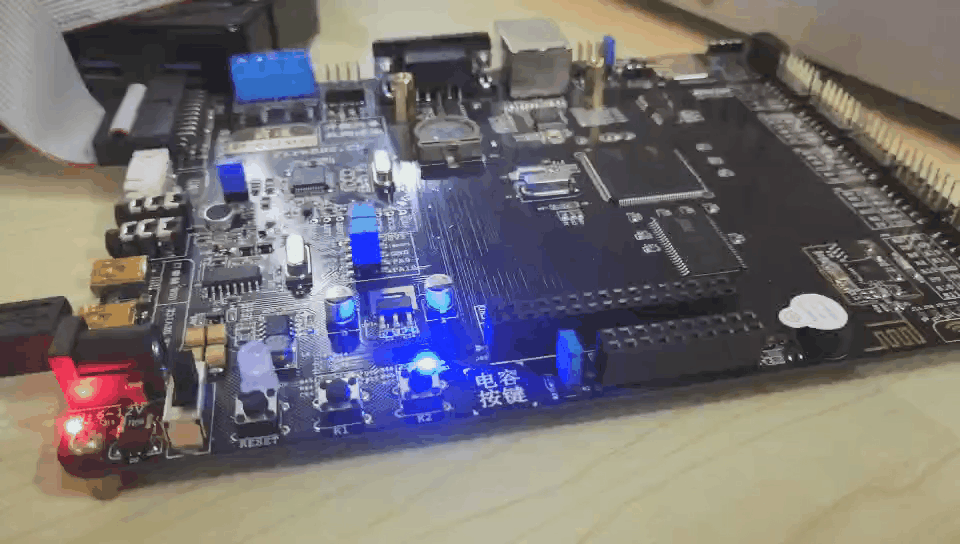

# 野火霸道 STM32F103 上手指南

## 简介

霸道 STM32F103 是野火推出的一款基于 ARM Cortex-M3 内核的开发板，最高主频为 72Mhz，该开发板具有丰富的板载资源，可以充分发挥 STM32F103 的芯片性能。

开发板外观如下图所示：




该开发板常用 **板载资源** 如下：

- MCU：STM32F103ZET6，主频 72MHz，512KB FLASH ，64KB RAM
- 外部 RAM：IS62WV51216BLL（SRAM，1MB）
- 外部 FLASH：W25Q64（SPI，8MB）
- 常用外设
    * LED：1个RGB灯；2个普通LED，D4（蓝色，PF7），D5（蓝色，PF8）
    * 按键：2个，K1（兼具唤醒功能，PA0），K2（PC13）
- 常用接口：USB 转串口、SD 卡接口、以太网接口、LCD 接口
- 调试接口，标准 JTAG/SWD

开发板更多详细信息请参考 [野火官方淘宝店铺宝贝介绍](https://fire-stm32.taobao.com/index.htm)。

## 准备工作

野火霸道 STM32F103 板级支持包提供 MDK4、MDK5 和 IAR 工程，并且支持 GCC 开发环境，下面以 MDK5 开发环境为例，介绍如何将示例程序运行起来。运行示例程序前需要做如下准备工作：

 1. MDK 开发环境

     需要安装 MDK-ARM 5.24 (正式版或评估版，5.14 版本及以上版本均可)，这个版本也是当前比较新的版本，它能够提供相对比较完善的调试功能。安装方法可以参考 [Keil MDK安装](../keil/keil.md)。

 2. 源码获取

     <https://github.com/RT-Thread/rt-thread/>

     [源码目录说明](../src_code_introduction/rtthread_dir.md)

 3. 使用 USB 线连接开发板的 USB 转串口 到 PC 机。

     

## 运行第一个示例程序

### 编译下载

进入到 `rt-thread\bsp\stm32\stm32f103-fire-arbitrary` 文件夹中，双击 project.uvprojx 文件，打开 MDK5 工程。



执行编译，编译完成后，点击下载按钮将固件下载至开发板，下载完成后，程序会自动开始运行，观察程序运行状况。

> 提示：工程默认配置使用 JLink 下载程序，在通过 JLink 连接开发板的基础上，点击下载按钮即可下载程序到开发板



### 运行

如没有自动运行，按下复位按键重启开发板，观察开发板上 LED 的实际效果。正常运行后，LED 灯会周期性闪烁，如下图所示：



连接开发板对应串口到 PC , 在串口工具里打开相应的串口(115200-8-1-N) ，复位设备后，可以看到 RT-Thread 的输出信息:

> 提示：注：野火一键下载电路和终端工具冲突，在使用终端工具如：PuTTy、XShell 时，会出现系统不能启动的问题，推荐使用串口调试助手如：sscom

```bash
 \ | /
- RT -     Thread Operating System
 / | \     3.1.1 build Nov 19 2018
 2006 - 2018 Copyright by rt-thread team
msh >
```

## 继续学习

已完成 RT-Thread 快速上手！点击这里进行 [内核学习](../../kernel/kernel-video.md) 。
