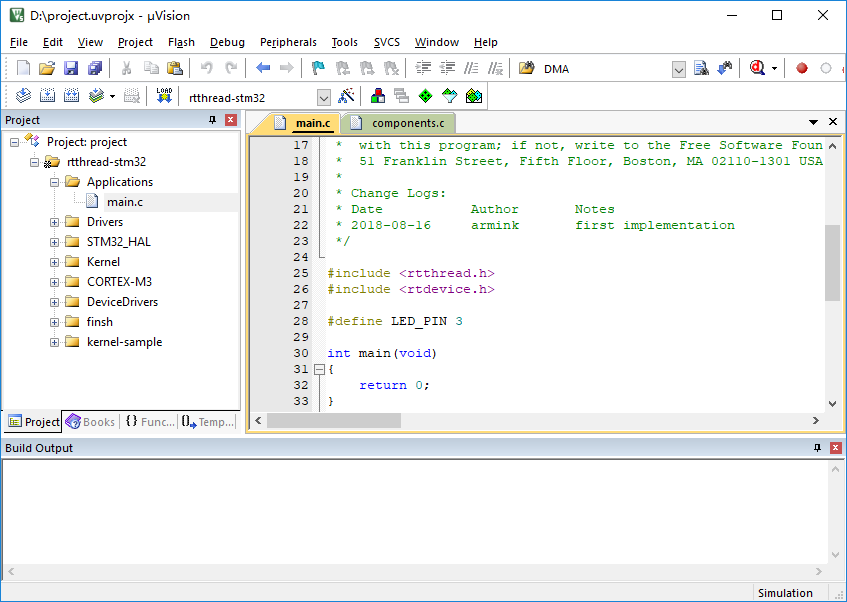

# Keil 模拟器 STM32F103 上手指南

一般嵌入式操作系统因为它的特殊性，往往和硬件平台密切相关连，具体的嵌入式操作系统往往只能在特定的硬件上运行。对于刚接触 RT-Thread 操作系统的读者并不容易马上就获得一个和 RT-Thread 操作系统相配套的硬件模块，但随着计算机技术的发展，我们可以采用软件方式来模拟一个能够运行 RT-Thread 操作系统的硬件模块，这就是 ARM 公司的 MDK-ARM 仿真模拟环境。

MDK-ARM（MDK-ARM Microcontroller Development Kit）软件是一套完整的集成开发环境（IDE），它出自 ARM 公司，包括了针对 ARM 芯片（ARM7，ARM9，Cortex-M 系列，Cortex-R 系列等）的高效 C/C++ 编译器；针对各类 ARM 设备、评估板的工程向导，工程管理；用于软件模拟运行硬件平台的模拟器；以及与市面上常见的如 ST-Link，JLink 等在线仿真器相连接以配合调试目标板的调试器。MDK-ARM 软件中的软件仿真模拟器，采用完全软件模拟方式解释执行 ARM 的机器指令，并实现外围的一些外设逻辑，从而构成一套完整的虚拟硬件环境，使得用户能够不借助真实的硬件平台就能够在电脑上执行相应的目标程序。

MDK-ARM 集成开发环境因为其完全的 STM32F103 软件仿真环境，也让我们有机会在不使用真实硬件环境的情况下直接在电脑上运行目标代码。这套软件仿真模拟器能够完整地虚拟出 ARM Cortex-M3 的各种运行模式、外设，如中断异常，时钟定时器，串口等，这几乎和真实的硬件环境完全一致。实践也证明，本文使用到的这份 RT-Thread 入门例程，在编译成二进制代码后，不仅能够在模拟器上软件模拟运行，也能够不需要修改地在真实硬件平台上正常运行。

下面我们将选择 MDK-ARM 集成开发环境作为目标硬件平台来观察 RT-Thread 操作系统是如何运行的。

## 准备工作

MDK 开发环境：需要安装 MDK-ARM 5.24 (正式版或评估版，5.14 版本及以上版本均可)，这个版本也是当前比较新的版本，它能够提供相对比较完善的调试功能。安装方法可以参考 [Keil MDK安装](../keil/keil.md)。

使用 STM32F103 软件仿真 ，还需要下载安装 STM32F103 pack 文件，如果在 MDK 中下载较慢，也可以[点击此处下载](https://pan.baidu.com/s/1MKzo24RTxiJGcjTJBHxcqA)，下载后双击安装即可。

## 初识 RT-Thread

作为一个操作系统，RT-Thread 的代码规模怎么样呢？在弄清楚这些之前，我们先要做的就是获得与本文相对应的 RT-Thread 的例子，这份例子可以从以下链接获得：

[RT-Thread Simulator 例程](https://gitee.com/rtthread/docs-online/raw/master/rt-thread-version/rt-thread-standard/tutorial/quick-start/stm32f103-simulator/rtthread_simulator_v0.1.0.7z)

这个例子是一个压缩包文件，将它解压，我们这里解压到 D:/。解压完成后的目录结构如下图所示：


各个目录所包含的文件类型的描述如下表所示：

| 目录名       |   描述 |
| ---         |   --- |
| applications|   RT-Thread 应用程序。|
| rt-thread   | RT-Thread 的源文件。 |
| - components| RT-Thread 的各个组件目录。|
| - include   | RT-Thread 内核的头文件。|
| - libcpu    | 各类芯片的移植代码，此处包含了 STM32 的移植文件。|
| - src       | RT-Thread 内核的源文件。|
| - tools     | RT-Thread 命令构建工具的脚本文件。|
| drivers     | RT-Thread 的驱动，不同平台的底层驱动具体实现。|
| Libraries   | ST 的 STM32 固件库文件。|
| kernel-sample-0.1.0    | RT-Thread 的内核例程。|

在目录下，有一个 project.uvprojx 文件，它是本文内容所引述的例程中的一个 MDK5 工程文件，双击 “project.uvprojx” 图标，打开此工程文件：



在工程主窗口的左侧 `Project` 栏里可以看到该工程的文件列表，这些文件被分别存放到如下几个组内，分别是：

| 目录组        | 描述                                                         |
| ------------- | ------------------------------------------------------------ |
| Applications  | 对应的目录为 rtthread_simulator_v0.1.0/applications，它用于存放用户应用代码。 |
| Drivers       | 对应的目录为 rtthread_simulator_v0.1.0/drivers，它用于存放 RT-Thread 底层的驱动代码。 |
| STM32_HAL     | 对应的目录为 rtthread_simulator_v0.1.0/Libraries/CMSIS/Device/ST/STM32F1xx，它用于存放 STM32 的固件库文件。 |
| kernel-sample | 对应的目录为 rtthread_simulator_v0.1.0/kernel-sample-0.1.0，它用于存放 RT-Thread 的内核例程。 |
| Kernel        | 对应的目录为 rtthread_simulator_v0.1.0/rt-thread/src，它用于存放 RT-Thread 内核核心代码。 |
| CORTEX-M3     | 对应的目录为 rtthread_simulator_v0.1.0/rt-thread/libcpu，它用于存放 ARM Cortex-M3 移植代码。 |
| DeviceDrivers | 对应的目录为 rtthread_simulator_v0.1.0/rt-thread/components/drivers，它用于存放 RT-Thread 驱动框架源码。 |
| finsh         | 对应的目录为 rtthread_simulator_v0.1.0/rt-thread/components/finsh，它用于存放 RT-Thread 命令行 finsh 命令行组件。 |

现在我们点击一下窗口上方工具栏中的按钮，对该工程进行编译，如图所示：


编译的结果显示在窗口下方的 “Build” 栏中，没什么意外的话，最后一行会显示“0 Error(s), * Warning(s).”，即无任何错误和警告。

注：由于工程中包含的内核例程代码较多，若使用的是 MDK 试用版本，则会有 16KB 限制，此时可以只保留某个目标例程的代码（例如内核例程只保留一个 thread_sample.c 参与编译），将其他不用的例程先从工程中移除，然后编译。

在编译完 RT-Thread/STM32 后，我们可以通过 MDK-ARM 的模拟器来仿真运行 RT-Thread。点击窗口右上方的按钮或直接按 “Ctrl+F5” 进入仿真界面，再按 F5 开始运行，然后点击该图工具栏中的按钮或者选择菜单栏中的 “View→Serial Windows→UART#1”，打开串口 1 窗口，可以看到串口的输出只显示了 RT-Thread 的 LOGO，这是因为用户代码是空的，其模拟运行的结果如图所示：


> 提示：我们可以通过输入Tab键或者 `help + 回车 ` 输出当前系统所支持的所有命令，如下图所示。


## 系统启动代码

一般了解一份代码大多从启动部分开始，同样这里也采用这种方式，先寻找启动的源头。以 MDK-ARM 为例，MDK-ARM 的用户程序入口为 main() 函数，位于 main.c 文件中。系统启动后先从汇编代码 startup_stm32f103xe.s 开始运行，然后跳转到 C 代码，进行 RT-Thread 系统功能初始化，最后进入用户程序入口 main()。

下面我们来看看在 components.c 中定义的这段代码：

```c
//components.c 中定义
/* re-define main function */
int $Sub$$main(void)
{
    rt_hw_interrupt_disable();
    rtthread_startup();
    return 0;
}
```

在这里 `$Sub$$main` 函数仅仅调用了 `rtthread_startup()` 函数。RT-Thread 支持多种平台和多种编译器，而 `rtthread_startup()` 函数是 RT-Thread 规定的统一入口点，所以 `$Sub$$main` 函数只需调用 `rtthread_startup()` 函数即可。例如采用 `GNU` `GCC` 编译器编译的 `RT-Thread`，就是直接从汇编启动代码部分跳转到 `rtthread_startup()` 函数中，并开始第一个 C 代码的执行的。在 `components.c` 的代码中找到 `rtthread_startup()` 函数，我们将可以看到 RT-Thread 的启动流程：

```c
int rtthread_startup(void)
{
    rt_hw_interrupt_disable();

    /* board level initalization
     * NOTE: please initialize heap inside board initialization.
     */
    rt_hw_board_init();

    /* show RT-Thread version */
    rt_show_version();

    /* timer system initialization */
    rt_system_timer_init();

    /* scheduler system initialization */
    rt_system_scheduler_init();

#ifdef RT_USING_SIGNALS
    /* signal system initialization */
    rt_system_signal_init();
#endif

    /* create init_thread */
    rt_application_init();

    /* timer thread initialization */
    rt_system_timer_thread_init();

    /* idle thread initialization */
    rt_thread_idle_init();

    /* start scheduler */
    rt_system_scheduler_start();

    /* never reach here */
    return 0;
}
```

**这部分启动代码，大致可以分为四个部分**：

- 初始化与系统相关的硬件；

- 初始化系统内核对象，例如定时器，调度器；

- 初始化系统设备，这个主要是为 RT-Thread 的设备框架做的初始化；

- 初始化各个应用线程，并启动调度器。

## 用户入口代码

上面的启动代码基本上可以说都是和 RT-Thread 系统相关的，那么用户如何加入自己的应用程序的初始化代码呢？RT-Thread 将 main 函数作为了用户代码入口，只需要在 main 函数里添加自己的代码即可。

```c
int main(void)
{
  /* user app entry */
  return 0;
}
```

<font color=gray size=4>提示:</br>
    为了在进入 main 程序之前，完成系统功能初始化，可以使用 `$sub$$` 和 `$super$$` 函数标识符在进入主程序之前调用另外一个例程，这样可以让用户不用去管 main() 之前的系统初始化操作。详见[ARM® Compiler v5.06 for µVision® armlink User Guide](http://infocenter.arm.com/help/index.jsp?topic=/com.arm.doc.dui0377g/pge1362065967698.html)
</font>

## 跑马灯的例子

对于从事电子方面开发的技术工程师来说，跑马灯大概是最简单的例子，就类似于每种编程语言中程序员接触的第一个程序 Hello World 一样，所以这个例子就从跑马灯开始。让它定时地对 LED 进行更新（亮或灭）。

我们 UART#1 中输入 msh 命令：led 然后回车就可以运行起来了，如图所示：


**跑马灯例子**

```c
/*
 * 程序清单：跑马灯例程
 *
 * 跑马灯大概是最简单的例子，就类似于每种编程语言中程序员接触的第一个程序
 * Hello World 一样，所以这个例子就从跑马灯开始。创建一个线程，让它定时地对
 * LED 进行更新（亮或灭）
 */

int led(void)
{
    rt_uint8_t count;

    rt_pin_mode(LED_PIN, PIN_MODE_OUTPUT);

    for(count = 0 ; count < 10 ;count++)
    {
        rt_pin_write(LED_PIN, PIN_HIGH);
        rt_kprintf("led on, count : %d\r\n", count);
        rt_thread_mdelay(500);

        rt_pin_write(LED_PIN, PIN_LOW);
        rt_kprintf("led off\r\n");
        rt_thread_mdelay(500);
    }
    return 0;
}
MSH_CMD_EXPORT(led, RT-Thread first led sample);
```

## 其他例子

其他更多的内核示例可以从 kernel-sample-0.1.0 目录下找到。


## 常见问题

* 出现如下编译错误

```
rt-thread\src\kservice.c(823): error: #929: incorrect use of vaarg fieldwidth = aarg(args, int);
rt-thread\src\kservice.c(842): error: #929: incorrect use of vaarg precision = aarg(args, int);
………
```

原因：这类问题基本上都是因为安装了 ADS 导致，ADS 与 keil共存，va_start 所在的头文件指向了 ADS 的文件夹。

解决办法：

* 删除 ADS 环境变量
* 卸载 ADS 和 keil，重启电脑，重装keil

## 第三方 RTOS 兼容层

为方便之前有其他 RTOS 使用经验的用户快速上手 RT-Thread，以及将基于其他 RTOS 的 API 编写的应用层代码快速移植到 RT-Thread 上，RT-Thread 社区编写了第三方 RTOS 兼容层。目前支持以下第三方 RTOS 的 API 无感移植：

- [uCOS-II操作系统兼容层](https://github.com/mysterywolf/RT-Thread-wrapper-of-uCOS-II)
- [uCOS-III操作系统兼容层](https://github.com/mysterywolf/RT-Thread-wrapper-of-uCOS-III)

以上第三方 RTOS 兼容层均提供本章所述的STM32F103 Keil 软件模拟工程，以供入门者可以不依托开发板评估兼容层。
