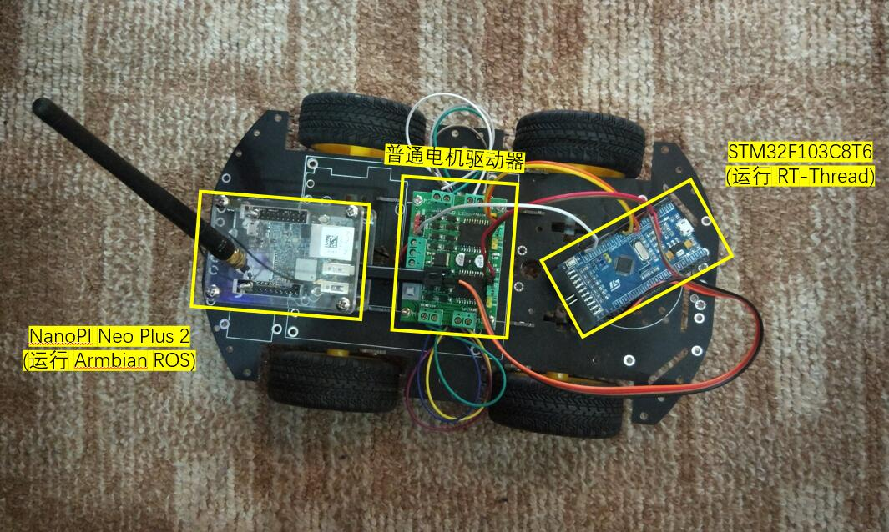

# 智能车连载教程简介

本连载教程一辆能够用 ROS 控制的带摄像头的小车，用 ROS 发布图像数据，对获取到的图像进行处理，例如目标检测。

智能车系统框图如下：

实物图：

## 教程目录

1、[RT-Thread 卷积神经网络(CNN) 手写体识别 (MNIST)](cnn-mnist/cnn-mnist.md)

​   神经网络理论：神经网络图像相关理论

​   训练卷积神经网络模型：用 Keras 训练手写体识别模型

​   运行卷积神经网络模型：RT-Thread 解析并加载 onnx 模型（protobuf格式）

2、 [Darknet 训练目标检测模型](darknet-yolov2/darknet-yolov2.md) ：Darknet 训练一个小黄人检测模型

3、 [RT-Thread 连接 ROS](ros-connect/ros-connect.md) ：RT-Thread 的 rosserial 软件包和 ROS 建立连接

4、 [RT-Thread 连接 ROS 控制摄像头小车](ros-camera-car/ros-camera-car.md) ：ROS 发布图像信息

5、 [RT-Thread 连接 RPLidar A1 激光雷达](rplidar-connect/rplidar-connect.md) ：使用 RT-Thread 的 RPLidar 软件包

6、[RT-Thread 搭配 ROS 实现目标检测小车](object-detection/object-detection.md) ：Darknet ROS 利用 ROS 小车发布的图像信息运行 Yolo 神经网络做目标检测

## 效果

下面这张图有两个视频流，左边的是没有处理的实时图像，右边是运行了目标检测的结果：

