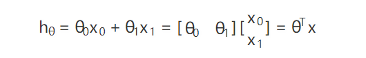
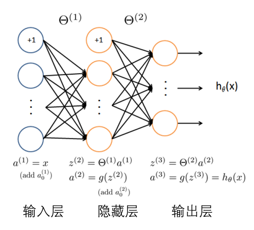
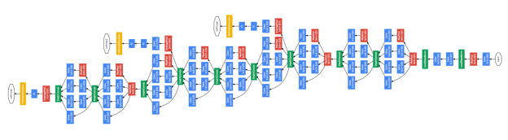
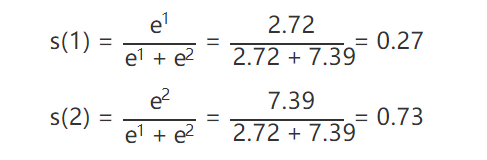

# RT-Thread 卷积神经网络(CNN) 手写体识别 (MNIST)

## 引言

这一部分会说明这个文档会包含哪些内容，以及不会包含哪些内容，因为人工智能，机器学习，监督学习，神经网络，无论哪一个都是非常大的话题都，覆盖到可能就成一本书了，所以这篇文档只会包含与 RT-Thread 上面加载 MNIST 手写体识别模型相关的部分。

当然，在每一部分的最后我也会给出参考文献，参考文献是个非常重要的部分，一方面它可以补充我没有介绍到的部分，另一方面也可以提供一些支撑，因为现在网上文档太多了，但是并不是每一篇文档都没有任何错误，比如大家觉得我列出的一些公式结论来的有些突兀的话，可以在参考文献里找到更详细的推导证明。

这篇文档可能还是会非常长，因为机器学习并不是纯软件开发，简单地调用库函数 API，需要有一定的理论支撑，如果完全不介绍理论部分，可能就不知道为什么模型要这样设计，模型出了问题应该怎样改善。不过文档如果写太长大家可能很难有耐心看完，特别是理论部分会有很多公式，但是机器学习确实又对 **理论基础** 和 **编程能力** 都有一些要求，相信坚持看下去还是会有很多收获的，我也尽可能把理论和应用都介绍清楚。

之后一篇文档就基本是纯实际应用了，不会有太多理论内容了：**用 Darknet 机器学习框架训练一个目标检测模型**。

- 如果对机器学习理论比较清楚，可以直接看第二部分 Keras 训练模型
- 如果对 Keras 机器学习框架也比较熟悉了，可以直接跳转到第三部分 RT-Thread 加载 onnx 模型
- 如果对 RT-Thread 和 onnx 模型都很熟悉了，那我们可以一起交流下如何在嵌入式设备上高效实现机器学习算法

这篇文章假定大家都已经会用 RT-Thread 的 env 工具下载软件包，并且生成项目上传固件到 stm32 上，毕竟这篇文章重点在于加载 onnx 通用机器学习模型，关于 RT-Thread 的教程大家可以在官网上找一找。

------

首先，简单介绍一下上面提到的各个话题的范围 (Domain)，人工智能 (Artifitial Intelligence) 是最大的话题，如果用一张图来说明的话：


然后机器学习 (Machine Learning) 就是这篇文档的主题了，但是 **机器学习** 依旧是一个非常大的话题：


这里简单介绍一下上面提到的三种类型：

**监督学习 (Supervised Learning)**: 这应当是应用最多的领域了，例如人脸识别，我提前先给你大量的图片，然后告诉你当中哪些包含了人脸，哪些不包含，你从我给的照片中总结出人脸的特征，这就是训练过程。最后我再提供一些从来没有见过的图片，如果算法训练得好的话，就能很好的区分一张图片中是否包含人脸。所以监督学习最大的特点就是有训练集，告诉模型什么是对的，什么是错的。

**非监督学习 (Unsupervised Learning)**: 例如网上购物的推荐系统，模型会对我的浏览记录进行分类，然后自动向我推荐相关的商品。非监督学习最大的特点就是没有一个标准答案，比如水杯既可以分类为日用品，也可以分类为礼品，都没有问题。

**强化学习 (Reinforcement Learnong)**: 强化学习应当是机器学习当中最吸引人的一个部分了，例如 [Gym](https://gym.openai.com/) 上就有很多训练电脑自己玩游戏最后拿高分的例子。强化学习主要就是通过试错 (Action)，找到能让自己收益最大的方法，这也是为什么很多都例子都是电脑玩游戏。

所以文档后面介绍的都是关于 **监督学习**，因为手写体识别需要有一些训练集告诉我这些图像实际上应该是什么数字，不过监督学习的方法也有很多，主要有分类和回归两大类：


**分类 (Classification):** 例如手写体识别，这类问题的特点在于最后的结果是离散的，最后分类的数字只能是 0, 1, 2, 3 而不会是 1.414, 1.732 这样的小数。

**回归 (Regression):** 例如经典的房价预测，这类问题得到的结果是连续的，例如房价是会连续变化的，有无限多种可能，不像手写体识别那样只有 0-9 这 10 种类别。

这样看来，接下来介绍的手写体识别是一个 **分类问题**。但是做分类算法也非常多，这篇文章要介绍的是应用非常多也相对成熟的 **神经网络** (Neural Network)。


**人工神经网络 (Artifitial Neural Network)**:这是个比较通用的方法，可以应用在各个领域做数据拟合，但是像图像和语音也有各自更适合的算法。

**卷积神经网络 (Convolutional Neural Network)**:主要应用在图像领域，后面也会详细介绍。

**循环神经网络 (Recurrent Neural Network)**:比较适用于像声音这样的序列输入，因此在语言识别领域应用比较多。

最后总结一下，这篇文档介绍的是**人工智能**下面发展比较快的**机器学习**分支，然后解决的是机器学习**监督学习**下面的**分类问题**，用的是**神经网络**里的**卷积神经网络** (CNN) 方法。

------

## 1 神经网络相关理论

这一部分主要介绍神经网络的整个运行流程，怎么准备训练集，什么是训练，为什么要训练，怎么进行训练，以及训练之后得到了什么。

### 1.1 线性回归 (Linear Regression)

#### 1.1.1 回归模型

要做机器学习训练预测，我们首先得知道自己训练的模型是什么样的，还是以最经典的线性回归模型为例，后面的人工神经网络 (ANN) 其实可以看做多个线性回归组合。那么什么是线性回归模型呢？

比如下面图上这些散点，希望能找到一条直线进行拟合，线性回归拟合的模型就是：


这样如果以后有一个点 x = 3，不在图上这些点覆盖的区域，我们也可以通过训练好的线性回归模型预测出对应的 y。

不过上面的公式通常使用另外一种表示方法，最终的预测值也就是 y 通常用 hθ (hypothesis) 表示，而它的下标 θ 代表不同训练参数也就是 k, b。这样模型就成了：


所以 θ0 对应着 b，θ1 对应着k。但是这样表示模型还不够通用，比如 x 可能不是一个一维向量，例如经典的房价预测，我们要知道房价，可能需要房子大小，房间数等很多因素，因此把上面的用更通用的方法表示：



这就是线性回归的模型了，只要会向量乘法，上面的公式计算起来还是挺轻松的。

顺便一提，θ 需要一个转置 θT，是因为我们通常都习惯使用列向量。上面这个公式和 y=kx+b 其实是一样的，只是换了一种表示方法而已，不过这种表示方法就更加通用，而且也更加简洁优美了：


#### 1.1.2 评价指标

为了让上面的模型能够很好的拟合这些散点，我们的目标就是改变模型参数 θ0 和 θ1，也就是这条直线的斜率和截距，让它能很好的反应散点的趋势，下面的动画就很直观的反应了训练过程。


可以看到，一开始是一条几乎水平的直线，但是慢慢地它的斜率和截距就移动到一个比较好的位置，那么问题来了，我们要怎么评价这条直线当前的位置满不满足我们的需求呢？

一个很直接的想法就是求出所有散点实际值 y 和我们模型的测试值 hθ 相差的绝对值，这个评价指标我们就称为损失函数 J(θ) (cost function)：


函数右边之所以除以了2是为了求倒数的时候更加方便，因为如果右边的公式求导，上面的平方就会得到一个2，刚好和分母里的2抵消了。

这样我们就有了评价指标了，损失函数计算出来的值越小越好，这样就知道当前的模型是不时能很好地满足需求，下一步就是告诉模型该如何往更好的方向优化了，这就是训练 (Training) 过程。

#### 1.1.3 模型训练

为了让模型的参数 θ 能够往更好的方向运动，也就是很自然的想法就是向下坡的方向走，比如上面的损失函数其实是个双曲线，我们只要沿着下坡的方向走总能走到函数的最低点：


那么什么是"下坡"的方向呢？其实就是导数的方向，从上面的动画也可以看出来，黑点一直是沿着切线方向逐渐走到最低点的，如果我们对损失函数求导，也就是对 J(θ) 求导：


我们现在知道 θ 应该往哪个方向走了，那每一次应该走多远呢？就像上面的动画那样，黑点就算知道了运动方向，每一次运动多少也是需要确定的。这个每次运动的多少称之为学习速率 α (learning rate)，这样我们就知道参数每次应该向哪个方向运动多少了：


这种训练方法就是很有名的 **梯度下降法**(Gradient Descent)，当然现在也有很多改进的训练方法例如 Adam，其实原理都差不多，这里就不做过多的介绍了。

#### 1.1.4 总结

机器学习的流程总结出来就是，我们先要设计一个模型，然后定义一个评价指标称之为损失函数，这样我们就知道怎么去判断模型的好坏，接下来就是用一种训练方法，让模型参数能朝着能让损失函数减少的方向运动，当损失函数几乎不再减少的时候，我们就可以认为训练结束了。最终训练得到的就是模型的参数，使用训练好的模型我们就可以对其他的数据进行预测了。

顺便一提，上面的线性回归其实是有标准理论解的，也就是说不需要通过训练过程，一步得到最优权值，我们称之为 **Normal Equation**：


那么，明明有一步到位的理论解，我们为什么还需要一步一步的训练呢？因为上面的公式里有矩阵的逆运算，当矩阵规模比较小时，对矩阵求逆运算量并不大，但是一旦矩阵的规模提升上去，用现有的计算能力求逆是几乎不可能了，所以这个时候就需要用梯度下降这样的训练方法一步一步的逼近最优解。

### 1.2 非线性回归 (Logistic Regression)

我们回到手写体识别的例子，上面介绍的线性回归最后得到的是一个连续的数值，但是手写体识别最后的目标是得到一个离散的数值，也就是 0-9，那么这要怎么做到呢？


这个就是上一部分的模型，其实很简单，只需要在最后的结果再加一个 sigmoid 函数，把最终得到的结果限制在 0-1 就可以了。


就像上面图中的公式那样，sigmoid 函数就是：


如果把它应用到线性回归的模型，我们就得到了一个非线性回归模型，也就是 Logistic Regression：


这样就可以确保我们最后得到的结果肯定是在 0-1 之间了，然后我们可以定义如果最后的结果大于 0.5 就是 1，小于 0.5 就是 0，这样一个连续的输出就被离散了。

### 1.3 人工神经网络 (ANN)

现在我们介绍了连续的线性回归模型 Linear Regression，和离散的非线性回归模型 Logistic Regression，模型都非常简单，写在纸上也就不过几厘米的长度。那么这么简单的模型到底是怎么组合成非常好用的神经网络的呢？

其实上面的模型可以看做是只有一层的神经网络，我们输入 x 经过一次计算就得到输出 hθ 了：


如果我们不那么快得到计算结果，而是在中间再插入一层呢？就得到了有一层隐藏层的神经网络了。



上面这张图里，我们用 a 代表 **激活函数** (activation function) 的输出，激活函数也就是上一部分提到的 sigmoid 函数，为了将输出限制在 0-1，如果不这么做，很有可能经过几层神经网络的计算，输出值就爆炸到一个很大很大的数了。当然除了 **sigmoid** 函数外，激活函数还有很多，例如下一部分在卷积神经网络里非常常用的 **Relu**。

另外，我们用带括号的上标代表神经网络的层数。例如 a(1) 代表第一层神经网络输出。当然，第一层就是输入层，并不需要经过任何计算，所以可以看到图上的 a(1)=x，第一层的激活函数输出直接就是我们的输入 x。但是，θ(1) 不是代表第一层的参数，而是第一层与第二层之间的参数，毕竟参数存在于两层网络之间的计算过程。

于是，我们可以总结一下上面的神经网络结构：


如果我们设置最后的输出层节点是 10 个，那就刚好可以用来表示 0-9 这 10 个数字了。

如果我们再多增加几个隐藏层，是不是看起来就有点像是互相连接的神经元了？


如果我们再深入一点 Go Deeper (论文里作者提到，他做深度学习的灵感其实源自于盗梦空间)


这样我们就得到一个深度神经网络了：



如果你想知道，具体应当选多少层隐藏层，每个隐藏层应该选几个节点，这就跟你从哪里来，要到哪里去一样，是神经网络的终极问题了。

最后，神经网络的训练方法是用的 **反向传播** (Back Propagation)，如果感兴趣可以在[这里](https://mattmazur.com/2015/03/17/a-step-by-step-backpropagation-example/)找到更加详细的介绍。

### 1.4 卷积神经网络 (CNN)

终于到了后面会用到的卷积神经网络了，从前面的介绍可以看到，其实神经网络的模型非常简单，用到的数学知识也不多，只需要知道矩阵乘法，函数求导就可以了，而深度神经网络只不过是反复地进行矩阵乘法和激活函数的运算：


这样重复相同的运算显得有些单调了，下面要介绍的卷积神经网络就引入了更多更有意思的操作，主要有：

- Cov2D
- Maxpooling
- Relu
- Dropout
- Flatten
- Dense
- Softmax

接下来就对这些算子逐一介绍。

#### 1.4.1 Conv2D

首先图像领域的神经网络最大的特点就是引入了卷积操作，虽然这个名字看起来有点神秘，其实卷积运算非常简单。

这里说明一下为什么要引入卷积运算，尽管前面的矩阵乘法其实已经可以解决很多问题了，但是一旦到了图像领域，对一个 1920*1080 的图像做乘法，就是一个 [1, 2,073,600] 的矩阵了，这个运算量已经不算小了，而用卷积操作，计算量就会大大缩减；另一方面，如果把一个二维的图像压缩成一个一维的向量，其实就丢失了像素点在上下左右方向相互关联的信息，例如一个像素点和周围的颜色通常比较相近，这些信息很多时候是很重要的图像信息。

介绍完了卷积操作的优势，那么到底什么是卷积运算呢？其实卷积就是简单的加减乘除，我们需要一幅图像，然后是一个卷积核 (Kernel)：


上面这张图像经过一个 3x3 的卷积核操作，就很好地把图像的边缘提取出来了，下面这个动画就很清晰地介绍了矩阵运算：


上面动画用到的卷积核是一个 3x3 的矩阵：


如果我们把动画暂停一下：


可以看到卷积操作实际上就是把卷积核在图像上按照行列扫描一遍，把对应位置的数字相乘，然后求和，例如上面的左上角的卷积结果 4 是这么计算得到的 (这里用 ∗ 代表卷积)：


当然上面的计算过程用等号连接是不严谨的，不过可以方便地说明卷积的计算过程。可以看到，卷积的计算量相比全连接的神经网络是非常小的，而且保留了图像在二维空间的关联性，所以在图像领域应用地非常多。

卷积操作非常好用，但是卷积后图像大小变小了，例如上面的 5x5 矩阵经过一个 3x3 的卷积核运算最后得到的是一个 3x3 的矩阵，所以有的时候为了保持图像大小不变，会在图像周围一圈用 0 填充，这个操作称之为 **padding**。

但是 padding 也没有办法完全保证图像大小不变，因为上面动画的卷积核每次都只向一个方向运动一格，如果每次运动 2 格，那么 5x5 的图像经过 3x3 的卷积就成了 2x2 的矩阵了，卷积核每次移动的步数我们称之为 **stride**。

下面是一幅图像经过卷积运算后得到的图像大小计算公式：


比如上面图像宽度 W = 5，卷积核大小 F = 3，没有使用 padding 所以 P = 0，每次移动步数 S = 1：


这里说明一下，上面的计算都是针对一个卷积核而言的，实际上一层卷积层可能有多个卷积核，而且实际上很多 CNN 模型也是卷积核随着层数往后，越来越多的。

#### 1.4.2 Maxpooling

上面提到卷积可以通过 padding 保持图像大小不变，但是很多时候我们希望能随着模型的推进，逐渐减小图像大小，因为最后的输出例如手写体识别，实际上只有 0-9 这 10 个数字，但是图像的输入却是 1920x1080，所以 maxpooling 就是为了减少图像尺寸的。

其实这个计算比卷积要简单多了：


比如左边 4x4 的输入，经过 2x2 的 maxpooling，其实就是把左上角 2x2 的方块取最大值：


所以这样一个 4x4 的矩阵经过 2x2 的 maxpooling 一下尺寸就缩小了一半，这也就是 maxpooling 的目的了

#### 1.4.3 Relu

之前介绍 sigmoid 函数的时候，提到过它是激活函数的一种，而 Relu 就是另一种在图像领域更为常用的激活函数， Relu 相比 sigmoid 就非常简单了：


其实就是当数字小于0的时候取0，大于0的时候保持不变。就这么简单。

#### 1.4.4 Dropout

到这里一共介绍了3个算子，conv2d， maxpooling，relu，每一个的运算都非常简单，但是 Dropout 甚至更简单，连计算都没有，于是在这个部分一个公式都没有。

之前没有提到模型过拟合的问题，因为神经网络模型在训练过程中，很有可能出现模型对自己提供的训练集拟合非常好，但是一旦碰到没有见过的数据，就完全预测不出正确的结果了，这种时候就是出现了过拟合。

那么，怎么解决过拟合问题呢？Dropout 就是一种非常简单粗暴的方法，从已经训练好的参数当中，随机挑一些出来丢弃掉重置为 0，这也是为什么它的名字叫 Dropout，就是随机丢掉一些参数。

这是个简单到不可思议的方法，但是却意外地好用，例如仅仅是在 maxpooling 后随机丢弃掉 60% 训练好的参数，就可以很好地解决过拟合问题。

#### 1.4.5 Flatten

依旧是卷积神经网络的简单风格，这里也不会有公式。

Flatten 就是像字面意思那样，把一个2维的矩阵压平，比如这样一个矩阵：


就是这么简单 。

#### 1.4.6 Dense

Dense 其实前面已经介绍过了，就是矩阵的乘法，然后加法：


所以卷积部分其实确实不需要知道太多的数学运算。

#### 1.4.7 Softmax

这一个就是最后一个算子了，比如我们要做手写体识别，那么最后的输出就会是 0-9，这将是一个 1x10 的矩阵，例如下面的预测结果 (实际上是一行，为了方便显示写成两行了)：


上面的 1x10 的矩阵可以看到第 7 个数 0.753 远远大于其他几个数 (下标我们从 0 开始)，所以我们可以知道当前预测结果是 7。 **所以 softmax 会作为模型的输出层输出 10 个数字，每个数字分别代表图片是 0-9 的概率，我们取最大的一个概率就是预测结果了**。

另一方面，上面 10 个数相加刚好是 1，所以其实每个数就代表一个概率，模型认为这个数是1个概率是 0.000498，是 2 的概率是 0.000027，以此类推，这么直观方便的结果就是用 softmax 计算得到的。


比如有两个数 [1, 2] 经过 softmax 运算：



最后得到的两个数字就是 [0.269, 0.731]。

到这里第一部分卷积神经网络相关的算子就终于介绍完了，第二部分部分就会介绍实际如何用 Keras (Tensorflow) 机器学框架训练一个手写体识别模型，最后第三部分就是介绍如何利用把生成的模型导入到 stm32 上面运行。

### 1.5 参考文献

- [斯坦福经典机器学习入门视频](https://www.coursera.org/learn/machine-learning)
- [线性回归](https://towardsdatascience.com/introduction-to-linear-regression-and-polynomial-regression-f8adc96f31cb)
- [反向传播](https://mattmazur.com/2015/03/17/a-step-by-step-backpropagation-example/)
- [卷积运算](https://ujjwalkarn.me/2016/08/11/intuitive-explanation-convnets/)

------

## 2 训练卷积神经网络模型

这里会介绍如何训练图像领域应用非常广的卷积神经网络 (Convolutional Neural Network)

这一部分应当不会涉及到很多理论了，其实用 Keras 训练模型写起代码来非常简单，如果发现不太清楚代码为什么要这么写，可以看看上一部分对应的算子。

### 2.1 MNIST 手写体训练集

首先我们需要介绍一下训练集，毕竟在训练之前我们得先看看训练集长什么样子。

这就是手写体识别数据库的[官网](http://yann.lecun.com/exdb/mnist/)了，风格比较跨世纪：


这个图上就是全球各地大家用不同方法做手写体识别得到的准确率汇总，可以看到我用红圈画出来的部分，用前面介绍的 Logistic Regression (Linear Classifier) 做手写体识别效果是最差的，所以我们之后要使用的是卷积神经网络 CNN (之后我就都用 CNN 简写了)。

在网站的下面给出了训练集的二进制格式定义：


当然，这是指自己从网站下载原始训练集，从当中提取图片才需要了解的，**我们使用 tensorflow 不需要自己解析数据集**。

### 2.2 开发环境搭建

首先介绍一下机器学习的开发环境，现在主流开发环境都是 **Python**，但是我们也不是一个裸 Python 打开记事本就直接开始写代码了，实际上数据科学家用的最多的开发环境是 **Anaconda**，里面集成了 **Python** 和 **R** 开发环境。

我们从官网下载 Anaconda 安装包 <https://www.anaconda.com/distribution/> 根据自己的操作系统选择就可以了，因为安装过程基本就是单纯地下一步、下一步，所以这里就不介绍了。

安装好之后，我们打开 **Anaconda Prompt**：

Anaconda 其实是有图形界面的，叫 **Anaconda Navigator**，但是这里以控制台为主，因为图形界面其实用起来反而比较麻烦，因为控制台一行命令就解决了更加快速方便。


然后我们输入：

```
# 如果你是用的 CPU
conda create -n tensorflow-cpu tensorflow

# 如果你是用的 GPU (NVIDIA 显卡会自动安装显卡驱动，CUDA，cudnn，简直方便)
conda create -n tensorflow-gpu tensorflow-gpu
```

这样开发环境就搭好了，我们激活一下当前的开发环境：

```
# 如果你是用的 CPU
conda activate tensorflow-cpu

# 如果你是用的 GPU
conda activate tensorflow-gpu
```

这里 **激活** 开发环境是指，在 Anaconda 下我们可以有多个开发环境，比如如果你想对比一下 CPU 和 GPU 计算速度的差距，可以同时安装 2 个开发环境，然后根据需要切换到 CPU 开发环境，或者 GPU 开发环境，非常方便。如果不用 Anaconda 而是一个 Python 裸奔的话，要么使用 **VirtualEnv**，要么就只能反复安装卸载不同的开发环境了。

接下来就可以启动我们写代码的位置了：

```
# 这里的软件包 anaconda 可能已经都装好了，以防万一再确认一遍
pip install numpy scipy sklearn pandas pillow matplotlib keras onnx jupyter -i https://pypi.tuna.tsinghua.edu.cn/simple

# 启动编辑器
jupyter notebook
```

这样就会自动打开浏览器，看到我们的开发环境了，在这里新建一个 notebook：


可以把它重命名为 mnist-keras：


接下来就可以开始训练模型了。

### 2.3 Keras 训练模型

#### 2.3.1 导入库函数

我们首先导入需要的库函数，在 In[1] 后面的方框内写入代码：

```
#coding:utf-8
from tensorflow.examples.tutorials.mnist import input_data

import numpy as np
np.set_printoptions(suppress=True)

import matplotlib.pyplot as plt
%matplotlib inline
```

这些代码写进去之后就是这个样子，后面我就不一一截图了。


如果你对上面 **导入库** 这一个注释比较感兴趣，可以在一个把光标移到到一个输入框，按下 Esc 再按下 m，这个输入框就从 **代码段** 变成 **注释段** 了，Anaconda 也是代码、注释、输出可以同时保存所以用起来体验非常好。更多的快捷键可以在菜单栏的 Help --> Keyboard Shortcuts 找到。

把光标移动到刚刚输入的代码块，按下键盘的 Shift + Enter 就自动执行了，并且会自动在下面增加一行代码输入框，导入库根据电脑的配置可能需要一些时间，耐心等待一下。

#### 2.3.2 下载 MNIST 训练集

在代码块输入一行代码：

```
mnist = input_data.read_data_sets("MNIST_data/", one_hot=True) #MNIST数据输入
```

这样就会自动下载数据集了，国内可能下载速度比较慢，可以从这个地址下载 [MNIST数据集](https://wuhanshare-1252843818.cos.ap-guangzhou.myqcloud.com/MNIST_data.zip) 然后解压到 Anaconda Prompt 启动 Jupyter Notebook 的位置就不用等它慢慢下载了，默认是 C:/Users/你的用户名/


#### 2.3.3 看一看 MNIST 数据

我们把下载下来的数据集分成训练集和测试集，训练集用来训练模型，测试集用来检测最后模型预测的正确率：

```
X_train = mnist.train.images
y_train = mnist.train.labels
X_test = mnist.test.images
y_test = mnist.test.labels

# 输入图像大小是 28x28 大小
X_train = X_train.reshape([-1, 28, 28, 1])
X_test = X_test.reshape([-1, 28, 28, 1])
```

如果比较好奇这是一个怎样的图片，可以看看它长什么样子，比如我们看看训练集的第一张图片

```
plt.imshow(X_train[0].reshape((28, 28)), cmap='gray')
```


也可以看看第二张图片：

```
plt.imshow(X_train[1].reshape((28, 28)), cmap='gray')
```


下面就正式开始建立训练模型了。

#### 2.3.4 构建模型

同样先导入一下 Keras 库：

```
# Importing the Keras libraries and packages
# Importing the Keras libraries and packages
from keras.models import Sequential
from keras.layers import Dense
from keras.layers import Conv2D
from keras.layers import MaxPooling2D
from keras.layers import Dropout
from keras.layers import Flatten
```

接下来就可以建模了，可以看到这里的模型和上一部分介绍的 CNN 算子是一模一样的，熟悉的 conv2d, maxpooling, dropout, flatten, dense, softmax, adam, 如果忘了它们是什么意思，随时可以切换到上一个部分回忆一下。

```
def build_classifier():

    classifier = Sequential()

    # 第一层 Conv2D，激活函数 Relu
    classifier.add(Conv2D(filters = 2, kernel_size = 3, strides = 1, padding = "SAME", activation = "relu", input_shape = (28, 28, 1)))

    # 第二层 Maxpooling, 使用保持图像大小的 padding
    classifier.add(MaxPooling2D(pool_size=(2, 2),  padding='SAME'))

    # 第三层 Dropout
    classifier.add(Dropout(0.5))

    # 第四层 Conv2D，激活函数 Relu
    classifier.add(Conv2D(filters = 2, kernel_size = 3, strides = 1, padding = "SAME", activation = "relu"))

    # 第五层 Maxpoling，使用保持图像大小的 padding
    classifier.add(MaxPooling2D(pool_size=(2, 2),  padding='SAME'))

    # 第六层 Dropout
    classifier.add(Dropout(0.5))

    # 第七层 Flatten
    classifier.add(Flatten())

    # 第八层 Dense
    classifier.add(Dense(kernel_initializer="uniform", units = 4))

    # 第九层 softmax 输出
    classifier.add(Dense(kernel_initializer="uniform", units = 10, activation="softmax"))

    #  使用 adam 训练
    classifier.compile(optimizer = 'adam', loss = 'categorical_crossentropy', metrics=['accuracy'])

    return classifier
```

这样模型就建完了。

代码真的就是一层只要一行，但是一定要知道自己的模型为什么要这么建，比如为什么 maxpooling 要放在 con2d 之后，为什么要加 dropout，最后的 softmax 到底是在干什么，可不可以不要？

我们可以看看自己建立的模型长什么样：

```
classifier = build_classifier()
classifier.summary()
```

可以看到确实是和上一部分的理论是一一对应的。

```
_________________________________________________________________
Layer (type)                 Output Shape              Param #
=================================================================
conv2d_1 (Conv2D)            (None, 28, 28, 2)         20
_________________________________________________________________
max_pooling2d_1 (MaxPooling2 (None, 14, 14, 2)         0
_________________________________________________________________
dropout_1 (Dropout)          (None, 14, 14, 2)         0
_________________________________________________________________
conv2d_2 (Conv2D)            (None, 14, 14, 2)         38
_________________________________________________________________
max_pooling2d_2 (MaxPooling2 (None, 7, 7, 2)           0
_________________________________________________________________
dropout_2 (Dropout)          (None, 7, 7, 2)           0
_________________________________________________________________
flatten_1 (Flatten)          (None, 98)                0
_________________________________________________________________
dense_1 (Dense)              (None, 4)                 396
_________________________________________________________________
dense_2 (Dense)              (None, 10)                50
=================================================================
Total params: 504
Trainable params: 504
Non-trainable params: 0
_________________________________________________________________
```

#### 2.3.5 训练模型

接下来我们就可以开始训练模型了：

```
from keras.callbacks import ModelCheckpoint
checkpointer = ModelCheckpoint(filepath='minions.hdf5', verbose=1, save_best_only=True, monitor='val_loss',mode='min')

history = classifier.fit(X_train, y_train, epochs = 50, batch_size = 50, validation_data=(X_test, y_test), callbacks=[checkpointer])
```

这个模型非常小，不过我用 CPU 训练才迭代 50 步，也差不多花了 10 分钟，所以 **能用 GPU 我们是坚决不用 CPU 的**。

我们可以看看刚刚的训练过程：

```
def plot_history(history) :
    SMALL_SIZE = 20
    MEDIUM_SIZE = 22
    BIGGER_SIZE = 24

    plt.rc('font', size=SMALL_SIZE)          # controls default text sizes
    plt.rc('axes', titlesize=SMALL_SIZE)     # fontsize of the axes title
    plt.rc('axes', labelsize=MEDIUM_SIZE)    # fontsize of the x and y labels
    plt.rc('xtick', labelsize=SMALL_SIZE)    # fontsize of the tick labels
    plt.rc('ytick', labelsize=SMALL_SIZE)    # fontsize of the tick labels
    plt.rc('legend', fontsize=SMALL_SIZE)    # legend fontsize
    plt.rc('figure', titlesize=BIGGER_SIZE)  # fontsize of the figure title

    fig = plt.figure()
    fig.set_size_inches(15,10)
    plt.plot(history['loss'])
    plt.plot(history['val_loss'])
    plt.title('Model Loss')
    plt.xlabel('epoch')
    plt.ylabel('loss')
    plt.legend(['train', 'test'],loc='upper left')
    plt.show()
```

用图片显示一下训练过程：

```
plot_history(history.history)
```


可以看到，模型在训练集和测试集的 cost function 计算出来的 loss 都在减小，很神奇的是模型在测试集上的表现竟然比训练集还要好，不过模型精度不算太高才 60% 多一点的准确率，大家可以试着优化一下，在尝试改进模型的过程中，就会加深对模型的理解，如果我在这里直接就给出一个表现非常好的模型，可能对大家帮助反而不是那么大。

### 2.4 保存模型为 onnx

我们可以把模型保存为原生的 Keras 模型：

```
classifier.save("mnist.h5")
```

当然，为了在 stm32 上面加载，我们更想保存为通用机器学习模型 onnx 的格式：

```
import onnx
import keras2onnx

onnx_model = keras2onnx.convert_keras(classifier, 'mnist')
onnx.save_model(onnx_model, 'mnist.onnx')
```

这样在 Anaconda Prompt 默认目录下 **C:/Users/你的用户名** 可以看到 mnist.h5 和 mnist.onnx 两个文件，这就是训练好的模型。

这样我们模型也训练好了，也保存好了，下一步就是怎么使用训练好的模型了。

(大家可以试试把 Dropout 的概率从 0.5 改为 0.3，训练集准确度就会从 60% 提升到 80%，测试集则有 90% 以上，为什么呢？)

### 2.5 参考文献

- [MNIST 训练集](http://yann.lecun.com/exdb/mnist/)
- [Anaconda GPU 环境](https://www.anaconda.com/tensorflow-in-anaconda/)

------

## 3 运行卷积神经网络模型

这一部分会介绍模型训练好之后要如何使用，也就是模型的推断过程 (Inference)

### 3.1 python 导入模型并运行

我们先用 python 加载模型，看看用刚刚训练好的模型能不能进行很好的预测，下面的代码就是导入了刚刚训练完保存的 mnist.onnx 模型。

```
import onnxruntime as rt
sess = rt.InferenceSession("mnist.onnx")
```

为了运行模型，我们需要先得到模型的输出和输入层，输出层上一部分提到了，应当是 softmax：

```
input_name = sess.get_inputs()[0].name
output_name = sess.get_outputs()[0].name
```

接下来就是用测试集对模型进行预测了：

```
res = np.array(sess.run([output_name], {input_name: X_test}))
```

我们可以看看模型的测试集是个什么数字，然后看看模型计算得到了什么结果：

```
plt.imshow(X_test[0].reshape((28, 28)), cmap='gray')
print(res[0][0])
```


可以看到模型最后一层 softmax 输出了 10 个数字，其中第 7 个数字 0.99688894 (下标从 0 开始) 明显远大于其他的数，这说明这张图片里的数字是 7 的概率是 99% 以上，这张图片也确实就是 7。

这样看来，刚刚训练得到的模型还是可以正常预测的，当然，并不能保证有 100% 的正确率，如果大家感兴趣也可以改变一下上面代码里 X_test[0] 的序号，看看其他的测试集预测效果怎么样

到这里为止，我们就不需要在 Anaconda 的 Jupyter Notebook 里写任何 Python 代码了，完整的代码可以在这里看到。

<https://github.com/wuhanstudio/onnx-backend/blob/master/examples/model/mnist-keras.ipynb>

### 3.2 Google Protobuf

#### 3.2.1 Protobuf 简介

从这里开始，我们的目的就是在 stm32 上面加载训练好的 onnx 模型了，那么为什么这里突然提到 Google Protobuf 呢？因为 onnx 的模型结构是用 Google Protobuf 的格式保存的。

之前我们提到，模型训练的目的就是为了得到变量的权值，只不过是纯数字罢了，但是我们也不能就这样把这些数字一个一个地写入文件，因为在要保存的模型文件里，不光要保存权值，也要告诉之后用这个模型的人，模型结构是怎么样的，所以需要合理地设计保存文件的格式。不同的机器学习框架都有自己的模型保存格式，例如 Keras 的模型格式是 h5，而 Tensorflow 和 onnx 的保存格式就是 protobuf。

那么到底什么是 protobuf? 为什么 protobuf 这么受欢迎？

其实 protobuf 使用起来非常简单方便，就是自己先定义一个数据保存格式，然后用 protoc 自动生成各个语言的解析代码，现在支持 C, C++, C#, Java, Javascript, Objective-C, PHP, Python, Ruby。

举个例子，我们创建这么个文件 amessage.proto

```
syntax = "proto3";

message AMessage {
  int32 a=1;
  int32 b=2;
}
```

那么我们就定义了一种二进制的数据存储格式，里面包含 2 个数字，其中 a = 1，代表 id 为 1 的数据是个 int32 类型，它的名字是 a，**并不是代表 a 这个变量数值是 1**，同样的道理，id 为 2 的数据是个 int32 类型，它的名字是 b。这里 **id 是不能重复的**。

所以使用 protobuf 需要先定义一个数据格式，然后自动生成 **编码** 和 **解码** 的代码，供不同语言使用，因为能自动生成代码，所以 protobuf 简单好用，非常受欢迎，**建议大家使用 protov3**。

#### 3.2.2 RT-Thread 使用 Protobuf

在 RT-Thread 也是有 protobuf 的库的，可以帮助我们用 C 语言解析和保存 protobuf 文件，毕竟我们之后要解析的 onnx 模型就是 protobuf 协议保存的。

protobuf 软件包地址： <http://packages.rt-thread.org/itemDetail.html?package=protobuf-c>

虽然在文章的开头已经假定大家熟练使用 RT-Thread 软件包了，还是提醒一下 **menuconfig** 之前记得 **pkgs --upgrade** 一下才能看到最新的软件包。

可以看到这个软件包下有 2 个例程，一个直接创建一个 protobuf 格式的数据，然后直接解码；另一个例程则是先把数据编码保存到文件，再从二进制文件读取数据并解码。


关于 protobuf 这里就不做更多的介绍了，因为 onnx 的模型格式已经定义好了，我们只需要直接拿来用就可以了。

### 3.3 onnx 模型解析

现在我们已经有了 RT-Thread 支持的 protobuf 软件包，下一步就是弄清楚 onnx 模型的格式到底是怎么定义的了，关于 onnx 数据格式的完整定义可以在这里看到。

onnx 数据格式定义： <https://github.com/onnx/onnx/blob/master/onnx/onnx.proto3>

为了帮助我们更加直观的看到模型结构，这里推荐一个工具 [protobuf editor](https://sourceforge.net/projects/protobufeditor/)，可以很方便地解析 protobuf 文件。

软件下载下来后，按照下面的流程就可以解析之前我们生产的 mnist.onnx 文件了，图上面提到的 onnx.proto3 文件之前提到过可以在 [这里](https://github.com/onnx/onnx/blob/master/onnx/onnx.proto3) 下载。


然后我们就可以在弹出来的界面看到之前训练生成的模型里到底有哪些数据了。


可以看到里面有模型的版本信息、模型结构、模型权值、模型输入和模型输出，这也就是我们需要的信息了。

这里大家看到的权值不一定和我完全一样，因为每个人训练得到的模型都是略有差异的。

### 3.4 RT-Thread 导入模型并运行

在介绍了神经网络的基本理论，如何用 Python 训练 MNIST 手写体识别模型，以及 onnx 模型的 protobuf 文件格式后，终于到了最后一步，从 stm32 上加载这个模型并运行了。

到这里你应该准备好了：

- 训练好的模型 mnist.onnx
- 一个带 SD 卡的 stm32 开发板，毕竟我们要把模型保存进去才能加载

项目源码：

- RT-Thread 加载模型: <https://github.com/wuhanstudio/onnx-backend>
- 直接在上电脑上体验: <https://github.com/wuhanstudio/onnx-parser>

首先，我们需要在 env 里通过 menuconfig 选中软件包：

```
RT-Thread online packages → IoT - internet of things → onnx-backend
```

这里忍不住再提醒大家一下，记得先在 env 里：

```
pkgs --upgrade
```


可以看到这里一共有三个例程，下面就对这三个例程分别介绍，在看下面的源码解析之前也可以直接下载代码到板子上体验一下，不过**记得打开文件系统，并且复制模型到 SD 卡里面，如果希望得到相同的输出，请使用 examples/mnist-sm.onnx 这个模型**。

#### 3.4.1 纯手动构建模型和参数

第一个例程是纯手动构建模型和参数，这样可以帮助我们理解模型结构和参数的位置，后面自动加载权值和模型结构就显得很自然简单了。

既然是纯手动构建模型，我们肯定得先知道模型长什么样子，这里再推荐另外一个 onnx 模型可视化根据 [netron](https://github.com/lutzroeder/Netron)，下面的图就是 **netron** 根据我们之前训练生成的 mnist.onnx 模型生成的，非常漂亮：


可以看到我们的模型大致是这么个流程，中间重复的层我就没有写 2 次了，但是我们手动建模的时候自然是要加进去的。

```
Conv2D -> Relu -> Maxpool -> Dense ->Softmax
```

这里解释一下为什么训练时候用到的 Dropout 这里看不到，因为 Dropout 只是为了防止过拟合，在训练的时候随机将训练好的参数丢弃置 0，所以一旦模型训练好，我们就不再需要 Dropout 操作了。

那么，接下来就要手动构建上面这个模型了。

模型的权值可以在 mnist.h 这个头文件里看到，其实这里面的权值就是我从 Protocol Buffer Editor 里面复制过来的，大家训练好的模型权值不一定和我完全一样。

```
static const float W3[] = {-0.3233681, -0.4261553, -0.6519891, 0.79061985, -0.2210753, 0.037107922, 0.3984157, 0.22128074, 0.7975414, 0.2549885, 0.3076058, 0.62500215, -0.58958095, 0.20375429, -0.06477713, -1.566038, -0.37670124, -0.6443057};
static const float B3[] = {-0.829373, -0.14096421};

static const float W2[] = {0.0070440695, 0.23192555, 0.036849476, -0.14687373, -0.15593372, 0.0044246824, 0.27322513, -0.027562773, 0.23404223, -0.6354651, -0.55645454, -0.77057034, 0.15603222, 0.71015775, 0.23954256, 1.8201442, -0.018377468, 1.5745461, 1.7230825, -0.59662616, 1.3997843, 0.33511618, 0.56846994, 0.3797911, 0.035079807, -0.18287429, -0.032232445, 0.006910181, -0.0026898328, -0.0057844054, 0.29354542, 0.13796881, 0.3558416, 0.0022847173, 0.0025906325, -0.022641085};
static const float B2[] = {-0.11655525, -0.0036503011};

static const float W1[] = {0.15791991, -0.22649878, 0.021204736, 0.025593571, 0.008755621, -0.775102, -0.41594088, -0.12580238, -0.3963741, 0.33545518, -0.631953, -0.028754484, -0.50668705, -0.3574023, -3.7807872, -0.8261617, 0.102246165, 0.571127, -0.6256297, 0.06698781, 0.55969477, 0.25374785, -3.075965, -0.6959133, 0.2531965, 0.31739804, -0.8664238, 0.12750633, 0.83136076, 0.2666574, -2.5865922, -0.572031, 0.29743987, 0.16238026, -0.99154145, 0.077973805, 0.8913329, 0.16854058, -2.5247803, -0.5639109, 0.41671264, -0.10801031, -1.0229865, 0.2062031, 0.39889312, -0.16026731, -1.9185526, -0.48375717, 0.057339806, -1.2573057, -0.23117211, 1.051854, -0.7981992, -1.6263007, -0.26003376, -0.07649365, -0.4646075, 0.755821, 0.13187818, 0.24743222, -1.5276812, 0.1636555, -0.075465426, -0.058517877, -0.33852127, 1.3052516, 0.14443535, 0.44080895, -0.31031442, 0.15416017, 0.0053661224, -0.03175326, -0.15991405, 0.66121936, 0.0832211, 0.2651985, -0.038445678, 0.18054117, -0.0073251156, 0.054193687, -0.014296916, 0.30657783, 0.006181963, 0.22319937, 0.030315898, 0.12695274, -0.028179673, 0.11189027, 0.035358384, 0.046855893, -0.026528472, 0.26450494, 0.069981076, 0.107152134, -0.030371506, 0.09524366, 0.24802336, -0.36496836, -0.102762334, 0.49609017, 0.04002767, 0.020934932, -0.054773595, 0.05412083, -0.071876526, -1.5381132, -0.2356421, 1.5890793, -0.023087852, -0.24933836, 0.018771818, 0.08040064, 0.051946845, 0.6141782, 0.15780787, 0.12887044, -0.8691056, 1.3761537, 0.43058, 0.13476849, -0.14973496, 0.4542634, 0.13077497, 0.23117822, 0.003657386, 0.42742714, 0.23396699, 0.09209521, -0.060258932, 0.4642852, 0.10395402, 0.25047097, -0.05326261, 0.21466804, 0.11694269, 0.22402634, 0.12639907, 0.23495848, 0.12770525, 0.3324459, 0.0140223345, 0.106348366, 0.10877733, 0.30522102, 0.31412345, -0.07164018, 0.13483422, 0.45414954, 0.054698735, 0.07451815, 0.097312905, 0.27480683, 0.4866108, -0.43636885, -0.13586079, 0.5724732, 0.13595985, -0.0074526076, 0.11859829, 0.24481037, -0.37537888, -0.46877658, -0.5648533, 0.86578417, 0.3407381, -0.17214134, 0.040683553, 0.3630519, 0.089548275, -0.4989473, 0.47688767, 0.021731026, 0.2856471, 0.6174715, 0.7059148, -0.30635756, -0.5705427, -0.20692639, 0.041900065, 0.23040071, -0.1790487, -0.023751246, 0.14114629, 0.02345284, -0.64177734, -0.069909826, -0.08587972, 0.16460821, -0.53466517, -0.10163383, -0.13119817, 0.14908728, -0.63503706, -0.098961875, -0.23248474, 0.15406314, -0.48586813, -0.1904713, -0.20466608, 0.10629631, -0.5291871, -0.17358926, -0.36273107, 0.12225631, -0.38659447, -0.24787207, -0.25225234, 0.102635615, -0.14507034, -0.10110793, 0.043757595, -0.17158166, -0.031343404, -0.30139172, -0.09401665, 0.06986169, -0.54915506, 0.66843456, 0.14574362, -0.737502, 0.7700305, -0.4125441, 0.10115133, 0.05281194, 0.25467375, 0.22757779, -0.030224197, -0.0832025, -0.66385627, 0.51225215, -0.121023245, -0.3340579, -0.07505331, -0.09820366, -0.016041134, -0.03187605, -0.43589246, 0.094394326, -0.04983066, -0.0777906, -0.12822862, -0.089667186, -0.07014707, -0.010794195, -0.29095307, -0.01319235, -0.039757702, -0.023403417, -0.15530063, -0.052093383, -0.1477549, -0.07557954, -0.2686017, -0.035220042, -0.095615104, -0.015471024, -0.03906604, 0.024237331, -0.19604297, -0.19998372, -0.20302829, -0.04267139, -0.18774728, -0.045169186, -0.010131819, 0.14829905, -0.117015064, -0.4180649, -0.20680964, -0.024034742, -0.15787442, -0.055698488, -0.09037726, 0.40253848, -0.35745984, -0.786149, -0.0799551, 0.16205557, -0.14461482, -0.2749642, 0.2683253, 0.6881363, -0.064145364, 0.11361358, 0.59981894, 1.2947721, -1.2500908, 0.6082035, 0.12344158, 0.15808935, -0.17505693, 0.03425684, 0.39107767, 0.23190938, -0.7568858, 0.20042256, 0.079169095, 0.014275463, -0.12135842, 0.008516737, 0.26897284, 0.05706199, -0.52615446, 0.12489152, 0.08065737, -0.038548164, -0.08894516, 7.250979E-4, 0.28635752, -0.010820533, -0.39301336, 0.11144395, 0.06563818, -0.033744805, -0.07450528, -0.027328406, 0.3002447, 0.0029921278, -0.47954947, -0.04527057, -0.010289918, 0.039380465, -0.09236952, -0.1924659, 0.15401903, 0.21237805, -0.38984418, -0.37384143, -0.20648403, 0.29201767, -0.1299253, -0.36048025, -0.5544466, 0.45723814, -0.35266167, -0.94797707, -1.2481197, 0.88701195, 0.33620682, 0.0035414647, -0.22769359, 1.4563162, 0.54950374, 0.38396382, -0.41196275, 0.3758704, 0.17687413, 0.038129736, 0.16358295, 0.70515764, 0.055063568, 0.6445265, -0.2072113, 0.14618243, 0.10311305, 0.1971523, 0.174206, 0.36578146, -0.09782787, 0.5229244, -0.18459272, -0.0013945608, 0.08863555, 0.24184574, 0.15541393, 0.1722381, -0.10531331, 0.38215113, -0.30659106, -0.16298945, 0.11549875, 0.30750987, 0.1586183, -0.017728966, -0.050216004, 0.26232007, -1.2994286, -0.22700997, 0.108534105, 0.7447398, -0.39803517, 0.016863048, 0.10067235, -0.16355589, -0.64953077, -0.5674107, 0.017935256, 0.98968256, -1.395801, 0.44127485, 0.16644385, -0.19195901};
static const float B1[] = {1.2019119, -1.1770505, 2.1698284, -1.9615222};

static const float W[] = {0.55808353, 0.78707385, -0.040990848, -0.122510895, -0.41261443, -0.036044, 0.1691557, -0.14711425, -0.016407091, -0.28058195, 0.018765535, 0.062936015, 0.49562064, 0.33931744, -0.47547337, -0.1405672, -0.88271654, 0.18359914, 0.020887045, -0.13782434, -0.052250575, 0.67922074, -0.28022966, -0.31278887, 0.44416663, -0.26106882, -0.32219923, 1.0321393, -0.1444394, 0.5221766, 0.057590708, -0.96547794, -0.3051688, 0.16859075, -0.5320585, 0.42684716, -0.5434046, 0.014693736, 0.26795483, 0.15921915};
static const float B[] = {0.041442648, 1.461427, 0.07154641, -1.2774754, 0.80927604, -1.6933714, -0.29740578, -0.11774022, 0.3292682, 0.6596958};
```

接下来就是利用这些权值进行计算了，也就是把这些权值带入到理论部分介绍的各个运算里面，其中各个算子都可以在源代码的目录下看到，一个算子对应一个 c 文件：

```
conv2d.c     maxpool.c    softmax.c    transpose.c
matmul.c     add.c        dense.c      relu.c
```

这些算子的代码如果对应理论部分的公式，就很好理解了，这里就不再重复介绍每个算子对应的含义了，在 mnist.c 里也可以看到，其实就只是输入图像，经过各个算子的运算，加上一些内存的释放操作，最后就得到了 softmax 的输出，**如果我把内存部分的操作隐藏掉**：

```
    // 1. Conv2D
    float* W3_t = transpose(W3, shapeW3, dimW3, permW3_t);
    conv2D(img[img_index], 28, 28, 1, W3, 2, 3, 3, 1, 1, 1, 1, B3, conv1, 28, 28);

    // 2. Relu
    relu(conv1, 28*28*2, relu1);

    // 3. Maxpool
    maxpool(relu1, 28, 28, 2, 2, 2, 0, 0, 2, 2, 14, 14, maxpool1);

    // 4. Conv2D
    float* W2_t = transpose(W2, shapeW2, dimW2, perm_t);
    conv2D(maxpool1, 14, 14, 2, W2_t, 2, 3, 3, 1, 1, 1, 1, B2, conv2, 14, 14);

    // 5. Relu
    relu(conv2, 14*14*2, relu2);

    // 6. Maxpool
    maxpool(relu2, 14, 14, 2, 2, 2, 0, 0, 2, 2, 7, 7, maxpool2);

    // Flatten NOT REQUIRED

    // 7. Dense
    float* W1_t = transpose(W1, shapeW1, dimW1, permW1_t);
    dense(maxpool2, W1_t, 98, 4, B1, dense1);

    // 8. Dense
    float* W_t = transpose(W, shapeW, dimW, permW_t);
    dense(dense1, W_t, 4, 10, B, dense2);

    // 9. Softmax
    softmax(dense2, 10, output);
```

可以看到，这些操作和前面图片里的模型是一一对应的，所以理解了理论部分模型为什么这么建立之后，再看代码就有一种恍然大悟的感觉，只不过相比 Python 而言, C 需要手动把权值和输入保存的数组里，并合理地管理内存的分配和释放。

如果我们把 mnist.c 编译上传到板子里，就可以看到成功地输出了预测结果：

```
msh />onnx_mnist 1
@@@@@@@@@@@@@@@@@@@@@@@@@@@@@@@@@@@@@@@@@@@@@@@@@@@@@@@@
@@@@@@@@@@@@@@@@@@@@@@@@@@@@@@@@@@@@@@@@@@@@@@@@@@@@@@@@
@@@@@@@@@@@@@@@@@@@@@@@@@@@@@@@@@@@@@@@@@@@@@@@@@@@@@@@@
@@@@@@@@@@@@@@@@@@@@@@@@@@@@@@@@@@@@@@@@@@@@@@@@@@@@@@@@
@@@@@@@@@@@@@@@@@@@@@@@@@@@@@@@@@@@@@@@@@@@@@@@@@@@@@@@@
@@@@@@@@@@@@@@@@@@@@@@@@@@@@@@        @@@@@@@@@@@@@@@@@@
@@@@@@@@@@@@@@@@@@@@@@@@@@              @@@@@@@@@@@@@@@@
@@@@@@@@@@@@@@@@@@@@@@                    @@@@@@@@@@@@@@
@@@@@@@@@@@@@@@@@@@@          @@@@@@@@    @@@@@@@@@@@@@@
@@@@@@@@@@@@@@@@@@@@        @@@@@@@@@@    @@@@@@@@@@@@@@
@@@@@@@@@@@@@@@@@@@@@@@@@@@@@@  @@@@@@    @@@@@@@@@@@@@@
@@@@@@@@@@@@@@@@@@@@@@@@@@@@@@  @@@@      @@@@@@@@@@@@@@
@@@@@@@@@@@@@@@@@@@@@@@@@@@@@@          @@@@@@@@@@@@@@@@
@@@@@@@@@@@@@@@@@@@@@@@@              @@@@@@@@@@@@@@@@@@
@@@@@@@@@@@@@@@@@@@@@@@@            @@@@@@@@@@@@@@@@@@@@
@@@@@@@@@@@@@@@@@@@@@@@@          @@@@@@@@@@@@@@@@@@@@@@
@@@@@@@@@@@@@@@@@@@@@@@@@@@@@@      @@@@@@@@@@@@@@@@@@@@
@@@@@@@@@@@@@@@@@@@@@@@@@@@@@@@@    @@@@@@@@@@@@@@@@@@@@
@@@@@@@@@@@@    @@@@@@@@@@@@@@@@@@  @@@@@@@@@@@@@@@@@@@@
@@@@@@@@@@    @@@@@@@@@@@@@@@@@@    @@@@@@@@@@@@@@@@@@@@
@@@@@@@@@@  @@@@@@@@@@@@@@@@@@      @@@@@@@@@@@@@@@@@@@@
@@@@@@@@@@    @@@@@@@@@@@@        @@@@@@@@@@@@@@@@@@@@@@
@@@@@@@@@@                      @@@@@@@@@@@@@@@@@@@@@@@@
@@@@@@@@@@@@                  @@@@@@@@@@@@@@@@@@@@@@@@@@
@@@@@@@@@@@@@@@@@@    @@@@@@@@@@@@@@@@@@@@@@@@@@@@@@@@@@
@@@@@@@@@@@@@@@@@@@@@@@@@@@@@@@@@@@@@@@@@@@@@@@@@@@@@@@@
@@@@@@@@@@@@@@@@@@@@@@@@@@@@@@@@@@@@@@@@@@@@@@@@@@@@@@@@
@@@@@@@@@@@@@@@@@@@@@@@@@@@@@@@@@@@@@@@@@@@@@@@@@@@@@@@@

Predictions:
0.007383 0.000000 0.057510 0.570970 0.000000 0.105505 0.000000 0.000039 0.257576 0.001016

The number is 3
```

由于这个模型是完全手动构建的，所以内存消耗非常少，大约在 16KB 左右，下面的例子由于需要从文件系统加载模型，所以内存消耗会增大许多。

这里需要说明的是，大家可能听说过机器学习的模型在 MCU 上运行需要做量化 (Quantization)，而这里为了说明方便是没有做量化的，所以当前是以浮点数进行计算，速度会比做了量化之后要慢，不过因为这个模型比较小，几乎还是瞬间就能看到结果的。

这里可以看到跟多关于 **模型量化** 的介绍。

#### 3.4.2 手动构建模型自动加载参数

之前我们是手动构建模型，并且从 Protocol Buffer Editor 里手动复制权值到 mnist.h 里面，这样非常辛苦，所以这个例子就是会根据当前计算的模型的名称，自动加载权值。

比如我们在 Protocol Buffer Editor 软件里可以看到：


如果我们想计算 “dense_5” 这一层模型，那么我们需要权值 W1，接下来就会根据 “W1” 这个名字取寻找对应的权值：


所以这个例程只是多了自动寻找权值这个功能，因此我们传入的参数只需要是模型各层的名字就可以了，如果去掉内存释放相关的代码，每一层的计算还是非常清晰的。

```
    // 2. Conv2D
    float* conv1 = conv2D_layer(model->graph, img[MNIST_TEST_IMAGE], shapeInput, shapeOutput, "conv2d_5");

    // 3. Relu
    float* relu1 = relu_layer(model->graph, conv1, shapeInput, shapeOutput, "Relu1");

    // 4. Maxpool
    float* maxpool1 = maxpool_layer(model->graph, relu1, shapeInput, shapeOutput, "max_pooling2d_5");

    // 5. Conv2D
    float* conv2 = conv2D_layer(model->graph, maxpool1, shapeInput, shapeOutput, "conv2d_6");

    // 6. Relu
    float* relu2 = relu_layer(model->graph, conv2, shapeInput, shapeOutput, "Relu");

    // 7. Maxpool
    float* maxpool2 = maxpool_layer(model->graph, relu2, shapeInput, shapeOutput, "max_pooling2d_6");

    // 8. Transpose

    // 9. Flatten

    // 10. Dense
    float* matmul1 = matmul_layer(model->graph, maxpool2, shapeInput, shapeOutput, "dense_5");

    // 11. Add
    float* dense1 = add_layer(model->graph, matmul1, shapeInput, shapeOutput, "Add1");

    // 12. Dense
    float* matmul2 = matmul_layer(model->graph, dense1, shapeInput, shapeOutput, "dense_6");

    // 13. Add
    float* dense2 = add_layer(model->graph, matmul2, shapeInput, shapeOutput, "Add");

    // 14. Softmax
    float* output = softmax_layer(model->graph, dense2, shapeInput, shapeOutput, "Softmax");
```

如果大家对上面这些算子的名字有些陌生了，可以再回忆一下第一部分理论介绍。

#### 3.4.3 自动构建模型并加载参数

这三个例程越往下是越简单的，可以看到最后一个例程几乎就这两行代码了，加载模型，然后运行模型。

只需要指定模型的输入就可以了，毕竟后面模型各层的输入输出是完全可以自动计算出来的。

```
// 加载模型
Onnx__ModelProto* model = onnx_load_model(ONNX_MODEL_NAME);

// 计算模型
float* output = onnx_model_run(model, input, shapeInput);
```

这个例子使用 valgrind 测试发现大约需要 64KB 内存，所以大家记得检查一下自己的开发板内存够不够。

这里还有最后一点前面没有提到，对于图像而言数据顺序是非常重要的，比如 NWHC 和 NCWH 这两就略有不同，其中 N 代表输入图像数量, W 代表图像宽度, H 代表图像高度，C 代表图像的通道数，比如彩色图像就有 RGB 三个通道。所以 NWHC 和 NCWH 的区别就在于到底应该把通道 C 放在前面还是放在后面呢？

关于这个问题，有一篇论文做了一些研究，在 CPU 和 GPU 上通常选择 NCWH 效率更高，这也是为什么大部分机器学习框架都是默认 NCWH 的格式，但是在 MCU 上例如 Cortex-M 系列使用 NWHC 计算效率就更高了。

论文地址：

<https://arxiv.org/abs/1801.06601>

### 3.5 参考文献

- [完整 Jupyter Notebook 源码](https://github.com/wuhanstudio/onnx-backend/blob/master/examples/model/mnist-keras.ipynb)
- [protobuf editor 解析工具](https://sourceforge.net/projects/protobufeditor/)
- [onnx 数据格式定义](https://github.com/onnx/onnx/blob/master/onnx/onnx.proto3)
- [onnx 模型可视化](https://github.com/lutzroeder/Netron)
- [模型量化](https://nervanasystems.github.io/distiller/quantization.html)
- [NWHC 还是 NCWH](https://arxiv.org/abs/1801.06601)
- [RT-Thread Protobuf 软件包](https://github.com/wuhanstudio/protobuf-c)
- [RT-Thread Protobuf 软件包](https://github.com/wuhanstudio/rt-onnx-parser)
- [RT-Thread Protobuf 软件包](https://github.com/wuhanstudio/onnx-backend)

------

## 4 总结

不知不觉这个文档已经写得这么长了，不知道大家有没有耐心看到最后，相信静下心来看得话还是有很多收获的，这里最后总结一下这篇文档介绍了哪些内容。

- 机器学习算法分类
- Linear Regression (损失函数，梯度下降)
- Logistic Regression (sigmoid 函数)
- ANN (反向传播)
- CNN (conv2d, maxpooling, relu, dropout, flatten, dense, softmax)
- Protobuf (**RT-Thread 软件包 protobuf-c**)
- onnx 模型结构 (**RT-Thread 软件包 onnx-parser**)
- RTT 加载 onnx 模型并运行 (**RT-Thread 软件包 onnx-backend**)

理论部分这里基本介绍完了，主要就是 darknet 框架的使用，甚至都不怎么需要写代码。最后，如果大家对在 MCU 上运行机器学习模型感兴趣，希望这篇文档还是能有所帮助。
