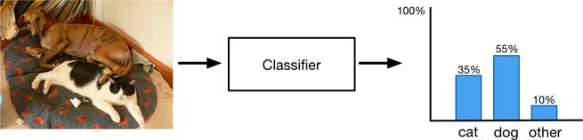
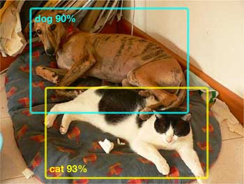
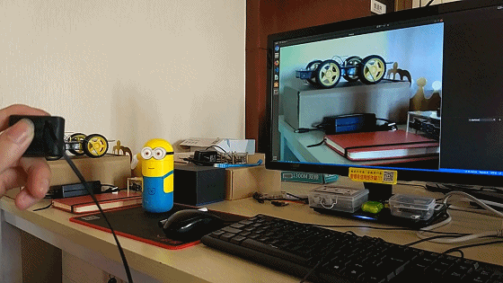
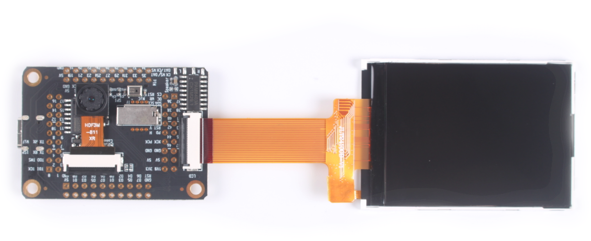
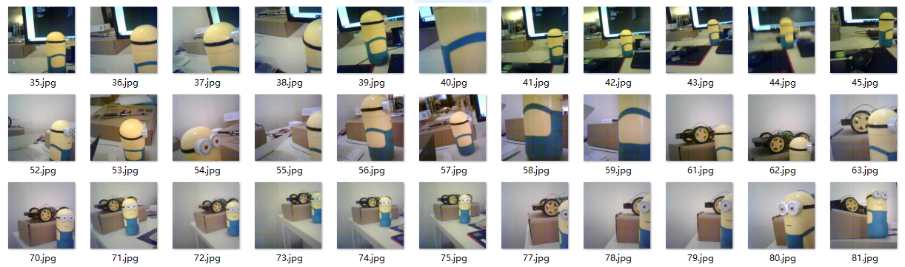
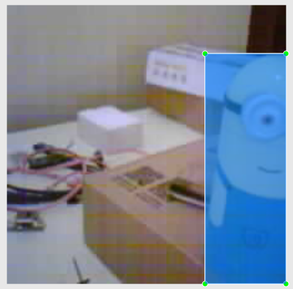
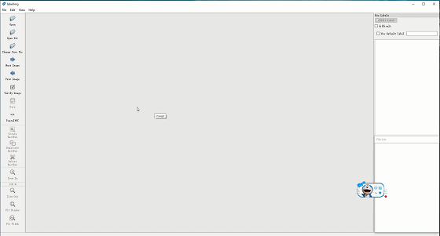
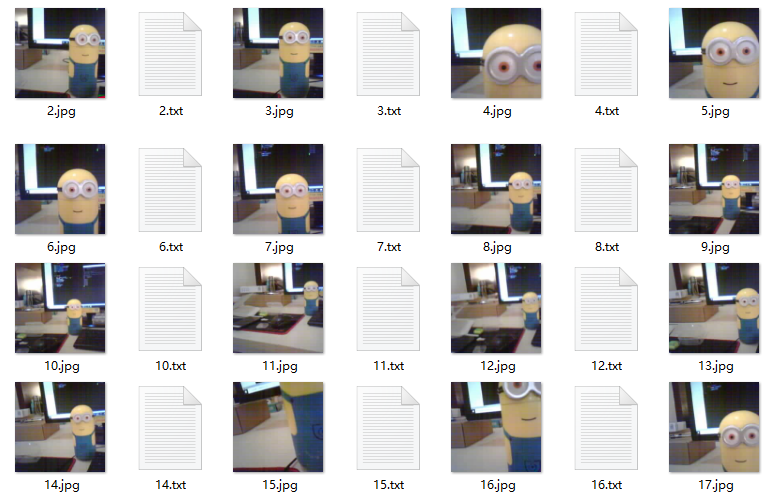
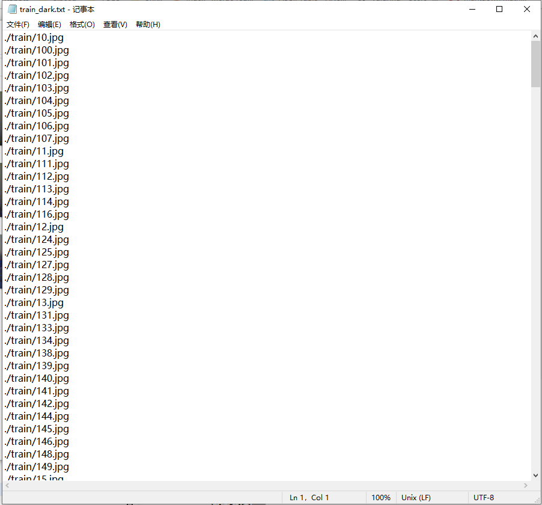
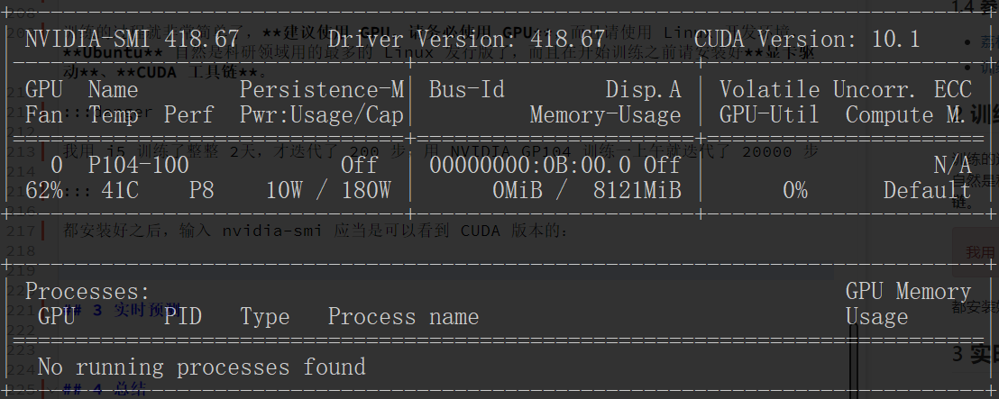

# Darknet 训练目标检测模型

## 引言

这篇文档会介绍如何用 darknet 训练一个 YOLOv2 目标检测模型，看完这篇文档会发现：模型训练和预测都非常简单，最花时间的精力的往往是训练集的数据预处理。

这里先简单介绍一下 **目标分类** (Classification) 和 **目标检测** (Detection) 的区别？什么是 **YOLO**？以及什么是 **darknet**？

下面这张图很清晰地说明了目标分类：



一张图片作为输入，然后模型就会告诉我这张图片里有猫的概率是多少，有狗的概率是多少，但是并不会告诉我有几只猫，几只狗，也不会告诉我猫和狗在图片里的具体位置。

目标检测则不一样：



目标检测的模型输出会告诉我图片中猫和狗分别在什么位置，以及是猫的概率是多少，所以目标检测模型提供的信息更加丰富，但是因此对模型的要求也更高了。

这里非常推荐这篇文章，对目标检测解释地非常直观详细：

<http://machinethink.net/blog/object-detection/>

现在目标检测算法也有很多，这篇文章用到的就是非常有名的 YOLO (You only look once)，就和字面意思一样, YOLO 可以一步 (one-stage) 得到结果所以非常快 (R-CNN 就需要两步 two-stage)，而 darknet 就是论文作者对自己算法的开源实现，既然是作者本人的实现，自然会有很多人愿意看一看。

darknet 是用 C 语言实现的，在 github 上也能找到开源的 [**源码**](https://github.com/pjreddie/darknet)，用 darknet 既可以训练新的模型，也可以用现有的模型做预测。

接下来就会介绍如何用 darknet 训练一个小黄人目标检测模型。



### 参考文献

- [darknet](https://pjreddie.com/darknet/)
- [目标检测]()

## 1 准备训练集

### 1.1 拍摄照片

首先当然是要拍照了，照片用什么摄像头都是可以的，不过如果采集数据用的摄像头和最后实时预测用的是一样的，效果当然会更好了，不过我这里拍照用的是 K210 上面的摄像头，上面的动画里预测是用的 USB 摄像头，效果也还可以 。



其实拍照就是拍一些里面包含你想要识别的物体的照片就好了，从各个角度、各个距离拍，这很重要！！！比如如果你想识别只有一半的小黄人，那拍的照片里就得有这样的例子才行，下面就是我拍的 300 张照片：



通常做机器学习的图像识别，训练集很多时候都是 10GB+，但是我是用的 K210 摄像头拍的，每张照片就 320x240 差不多 3KB 大小，最后 300 张照片加在一起还没有 3MB，不过最后的训练结果却还挺不错的 。

如果碰巧你也有 K210 可以参照下面的 micropython 代码每隔 1-2s 自动拍一张照片保存到 SD 卡，**用手机摄像头当然也是完全没有问题的**：

```
# Untitled - By: RT-Thread - 周五 7月 19 2019

import sensor, image, time, lcd
from fpioa_manager import *
from Maix import GPIO
import os

def getMax():
    maxnum = 0;
    files = os.listdir('/sd')
    for file in files:
        name = file.split(".")
        if(len(name)>1 and name[1] == "jpg"):
            if(int(name[0])>maxnum):
                maxnum = int(name[0])
    return maxnum

fm.register(board_info.LED_R, fm.fpioa.GPIO0)
led_r=GPIO(GPIO.GPIO0,GPIO.OUT)

lcd.init(freq=15000000)

sensor.reset()
sensor.set_pixformat(sensor.RGB565) # Set pixel format to RGB565 (or GRAYSCALE)
sensor.set_framesize(sensor.QVGA)   # Set frame size to QVGA (320x240)
sensor.skip_frames(time = 2000)     # Wait for settings take effect.
sensor.set_hmirror(0)
sensor.set_windowing((224,224))
clock = time.clock()                # Create a clock object to track the FPS.

i = getMax() + 1

def capture():
    global i
    img = sensor.snapshot()
    filename = '/sd/' + str(i) + '.jpg'
    print(filename)
    img.save(filename)
    img.draw_string(2,2, ("%2.1f" %(i)), color=(0,128,0), scale=2)
    lcd.display(img)
    i = i + 1;

print("Start from %d" % i)

while True:
    led_r.value(0)
    time.sleep(1)
    led_r.value(1)
    capture()
```

这里千万不要把图片保存为中文名，建议像图中那样用数字按顺序标注，到这里我们应该有几百张包含我们要检测的物体的图片了。

### 1.2 标注图片

这一步应当是最累的了，上面只是拍好了 300 张照片，这一步就要为这些图片一一的做标注了，看起来就是这样：



这里推荐用软件 [LabelImg](https://github.com/tzutalin/labelImg) 来标注：



软件用起来还是非常简单的，打开拍摄的图片文件夹，选择要保存的文件夹，然后一张一张地标注就可以了，最后可以看到每一张图片都生成了对应的 txt 文件：



如果我们打开一个 txt 文件就可以看到类似下面的内容：

```
0     0.671875    0.575893   0.352679    0.848214
```

其中每个数字代表的含义是：

```
物体类别   物体中心位置 x    物体中心位置 y   物体宽度 x   物体高度y
```

因为我们只有一个类别，所以第一个数字始终是 0，代表是第一个类别。

到这里我们应该每一张拍摄的图片都有一个对应的 txt 文件，里面包含上面提到的内容。

### 1.3 划分训练集和测试集

在开始训练之前，我们还需要把上面排到的图片分为训练集和测试集，这样我们才知道模型训练效果怎么样。

这里有个 python 脚本可以自动生成训练集和测试集，其实最终的目的就是生成两个文件，train.txt 和 test.txt，里面分别包含了训练图像，和测试图像的名字。

```
import glob, os

# Current directory
current_dir = os.path.dirname(os.path.abspath(__file__))

# Directory where the data will reside, relative to 'darknet.exe'
# 修改为你自己的目录
path_data = './train/'

# Percentage of images to be used for the test set
percentage_test = 10;

# Create and/or truncate train.txt and test.txt
file_train = open('train.txt', 'w')
file_test = open('test.txt', 'w')

# Populate train.txt and test.txt
counter = 1
index_test = round(100 / percentage_test)
for pathAndFilename in glob.iglob(os.path.join(current_dir, "*.jpg")):
    title, ext = os.path.splitext(os.path.basename(pathAndFilename))

    if counter == index_test:
        counter = 1
        file_test.write(path_data + title + '.jpg' + "\n")
    else:
        file_train.write(path_data + title + '.jpg' + "\n")
        counter = counter + 1
```

最后 train.txt 和 test.txt 看起来是这样的：



到这里应该有拍好的照片，每张照片对应一个 txt 标明了小黄人的位置，大小，另外还有一个 train.txt 和 test.txt 汇总了当前训练集和测试集的文件名。

### 1.4 参考文献

- [荔枝丹 Dan Dock (K210)](https://wiki.sipeed.com/en/maix/board/dock.html)
- [训练自己的 Darknet Yolov2 模型](https://timebutt.github.io/static/how-to-train-yolov2-to-detect-custom-objects/)

## 2 训练模型

### 2.1 开发环境

训练的过程就非常简单了，**建议使用 GPU，请务必使用 GPU**，而且请使用 Linux 开发环境，**Ubuntu**自然是科研领域用的最多的 Linux 发行版了，而且在开始训练之前请安装好**显卡驱动**、**CUDA 工具链**、**cuDNN 库**。

我用 i5 训练了整整 2天，才迭代了 200 步，用 NVIDIA GP104 训练一上午就迭代了 20000 步

都安装好之后，输入 nvidia-smi 应当是可以看到 CUDA 版本的：



### 2.2 编译 darknet

如果到这里开发环境安装没有问题，我们就可以开始训练了，其实训练过程非常简单，首先下载源码：

```
git clone https://github.com/pjreddie/darknet
```

为了使用 GPU 训练，我们需要修改一下 Makefile：

```
GPU=1
CUDNN=1
OPENCV=0
OPENMP=0
DEBUG=0
```

然后编译：

```
make
```

编译好 darknet 后就可以在源码根目录看到一个 darknet 可执行文件了。

### 2.3 配置文件

下面我们在 cfg 目录下添加一个 obj.names 文件，里面定义了我们的物体类别：

```
minions
```

当然，我们只有一个类别，接下来还需要在 cfg 目录下添加一个 obj.data 文件，里面第一行定义了我们的物体类别数，我们只有一个类别，已经我们前面生成的 train.txt，test.txt，obj.names 这 3 个文件在哪里，最后的 backup 是指训练的模型保存的位置。

```
classes= 1
train  = /home/wuhan/darknet/data/train.txt
valid  = /home/wuhan/darknet/data/test.txt
names = /home/wuhan/darknet/cfg/obj.names
backup = backup/
```

最后因为我们训练的模型只有 1 类，但是 yolo 模型默认并不是只有 1 类，所以我们需要修改 cfg/yolov2.cfg，需要修改的部分我都标注出来了，我把这个配置文件保存成了 minionsv2.cfg：

```
[net]
# Testing
batch=16
subdivisions=1
# Training
# batch=64
# subdivisions=2
width=214     # 修改图像宽度
height=214    # 修改图像高度
channels=3
momentum=0.9
decay=0.0005
angle=0
saturation = 1.5
exposure = 1.5
hue=.1

learning_rate=0.001
burn_in=1000
max_batches = 500200
policy=steps
steps=400000,450000
scales=.1,.1

[convolutional]
batch_normalize=1
filters=16
size=3
stride=1
pad=1
activation=leaky

[maxpool]
size=2
stride=2

[convolutional]
batch_normalize=1
filters=32
size=3
stride=1
pad=1
activation=leaky

[maxpool]
size=2
stride=2

[convolutional]
batch_normalize=1
filters=64
size=3
stride=1
pad=1
activation=leaky

[maxpool]
size=2
stride=2

[convolutional]
batch_normalize=1
filters=128
size=3
stride=1
pad=1
activation=leaky

[maxpool]
size=2
stride=2

[convolutional]
batch_normalize=1
filters=256
size=3
stride=1
pad=1
activation=leaky

[maxpool]
size=2
stride=2

[convolutional]
batch_normalize=1
filters=512
size=3
stride=1
pad=1
activation=leaky

[maxpool]
size=2
stride=1

[convolutional]
batch_normalize=1
filters=1024
size=3
stride=1
pad=1
activation=leaky

###########

[convolutional]
batch_normalize=1
size=3
stride=1
pad=1
filters=512
activation=leaky

[convolutional]
size=1
stride=1
pad=1
filters=30         # filters = (classes + 5) * 5
activation=linear

[region]
anchors =  0.57273, 0.677385, 1.87446, 2.06253, 3.33843, 5.47434, 7.88282, 3.52778, 9.77052, 9.16828
bias_match=1
classes=1         # 只有 1 类
coords=4
num=5
softmax=1
jitter=.2
rescore=0

object_scale=5
noobject_scale=1
class_scale=1
coord_scale=1

absolute=1
thresh = .6
random=1
```

### 2.4 开始训练

终于可以开始训练了：

```
./darknet detector train cfg/obj.data cfg/minionsv2.cfg darknet19_448.conv.23
```

记得把上面的配置文件改成自己的配置文件，上面命令里提前训练好的模型可以从这里下载 [darknet19_448.conv.23 (78MB)](https://wuhanshare-1252843818.cos.ap-guangzhou.myqcloud.com/darknet19_448.conv.23)，可以加快训练速度。

前面提到，训练好的模型可以在 backup 目录找到，这是我训练了 20000 步之后自动保存的模型文件：

```
minionsv2_10000.weights
minionsv2_100.weights
minionsv2_20000.weights
minionsv2_200.weights
minionsv2_300.weights
minionsv2_400.weights
minionsv2_500.weights
minionsv2_600.weights
minionsv2_700.weights
minionsv2_800.weights
minionsv2_900.weights
minionsv2.backup
```

## 3 实时预测

如果我们想从摄像头实时看到检测结果，需要先重新编译 darknet，因为访问摄像头需要 OpenCV 库支持，修改 Makefile：

```
GPU=1
CUDNN=1
OPENCV=1
OPENMP=0
DEBUG=0
```

重新 make 得到 darknet 可执行文件，输入下面的命令就可以看到试试检测结果了。

```
./darknet detector demo cfg/obj.data cfg/minionsv2.cfg /home/wuhan/darknet/backup/minionsv2_10000.weights
```

记得把上面的文件路径改为自己的实际文件路径。


## 4 总结

这里总结一下，用 darknet 训练目标检测模型其实就这几步：

1. 拍摄照片
2. 用 labelimg 在照片上标注出自己想识别的物体的位置
3. 把拍摄的照片划分为测试集和训练集，生成 train.txt 和 test.txt
4. 编译 darknet，配置好 CUDA，cuDNN
5. 添加配置文件 cfg/obj.names 和 cfg/obj.data
6. 修改 yolov2 模型为单类别 cfg/yolov2.cfg，并下载 darknet19_448.conv.23
7. 用 GPU 开始训练，模型会自动保存
