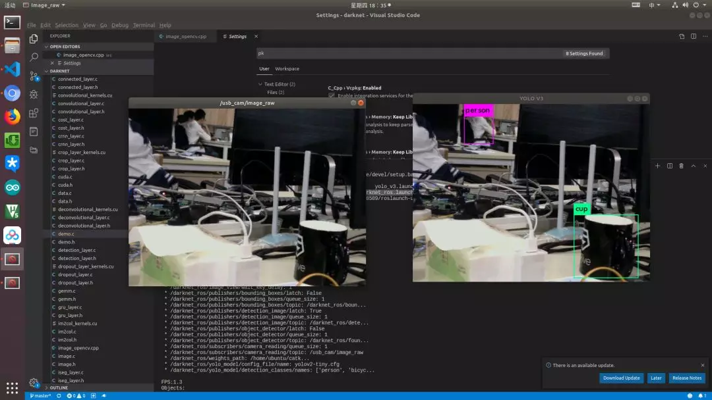
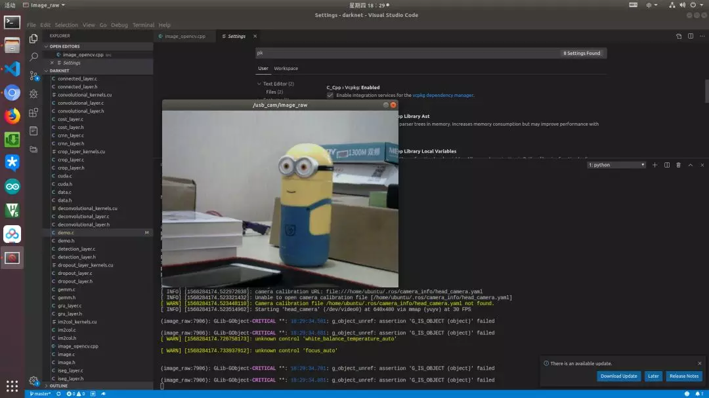

# RT-Thread 搭配 ROS 实现目标检测小车

## 引言

这应当是 RT-Thread 搭配 ROS 做摄像头小车的最后一篇文档了，这篇文档会把之前的内容汇聚起来，实现一个能目标检测的小车。



这篇文档几乎涉及了之前所有文档的内容，所以建议在看这篇文档之前先熟悉一下之前提到的内容。如果对之前的内容比较熟悉了，就会发现这篇文档很简短，但是却是建立在之前已有的基础上。

现在应当已经熟悉的内容：

- 了解 CNN 的工作原理；
- 能使用 Darknet 训练自己的目标检测模型
- 能用 rosserial 建立 RT-Thread 和 ROS 的连接
- 能用 ROS 发布图像信息

下面就会介绍如何用 ROS 发布的图像信息和 Darknet 连接做目标检测。

## 1.Darknet ROS

### 1.1 获取源码

其实下面要用到的是一个 ROS 软件包，这个软件包现在也是开源的：

```
# 初始化工作环境
$ mkdir catkin_workspace
$ cd catkin_workspace/src
$ catkin_init_workspace

## 下载源码
$ git clone --recursive http://github.com/leggedrobotics/darknet_ros.git
```

除了源码，我们还要下载一些训练好的神经网络权值，放在下面这个目录：

```
$ catkin_workspace/src/darknet_ros/darknet_ros/yolo_network_config/weights/
```

如果觉得国外下载速度太慢的话，这里我有个国内的 CDN 加速镜像：

- yolov2-tiny.weights：https://wuhanshare-1252843818.cos.ap-guangzhou.myqcloud.com/yolov2-tiny.weights
- yolov2.weights：https://wuhanshare-1252843818.cos.ap-guangzhou.myqcloud.com/yolov2.weights
- yolov3.weights：https://wuhanshare-1252843818.cos.ap-guangzhou.myqcloud.com/yolov3.weights

如果源码和权值都下载好了，我们就可以准备编译了。

### 1.2 编译源码

为了保证 Darknet 能够获取到摄像头的数据，我们需要先告诉它摄像头的信息发布在哪里，修改这个文件：

```
$ catkin_workspace/src/darknet_ros/darknet_ros/config/ros.yaml
```

把下面的 topic 修改为自己图像发布的位置，例如我这里发布在 /usb_cam/image_raw

```
camera_reading:
    topic: /usb_cam/image_raw
    queue_size: 1
```

然后就可以编译软件包了，在 catkin_workspace 目录下：

```
$ catkin_make
```

一切正常的话，编译就完成了，其实不需要做太多的工作，编译完记得更新一下环境变量，这样后面才能正常启动这个软件包。

```
$ sorce devel/setup.bash
```

### 1.3 目标检测

在进行目标检测前，我们先启动 ROS 节点：

```
$ roscore
```

然后启动一个摄像头节点：

```
roslaunch usb_cam usb_cam-test.launch
```

这样就可以实时看到摄像头的数据了，摄像头在哪里其实不重要，既可以在小车上，也可以在电脑上，这也是 ROS 的优美之处，只要节点发布了摄像头消息，不管摄像头在哪， ROS 都能拿到处理：



接下来我们启动 Darknet 的节点：

```
$ roslaunch darknet_ros darknet_ros.launch
```

下面这张图就可以看到有两个视频流，左边的是没有处理的实时图像，右边是运行了目标检测的结果：


## 2.总结

RT-Thread 作为实时操作系统负责控制，Linux 则负责提供丰富的软件包运行算法，两者相结合，互相取长补短还是配合地挺好的。

## 3.参考文献

Darknet ROS：https://github.com/leggedrobotics/darknet_ros
