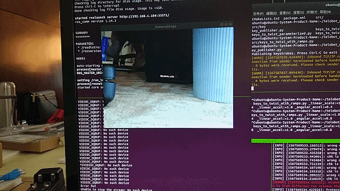
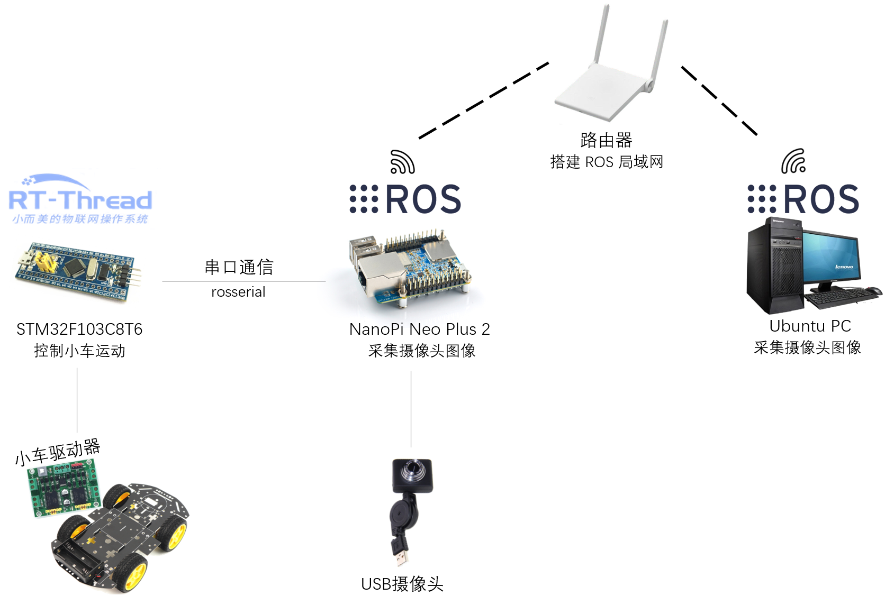
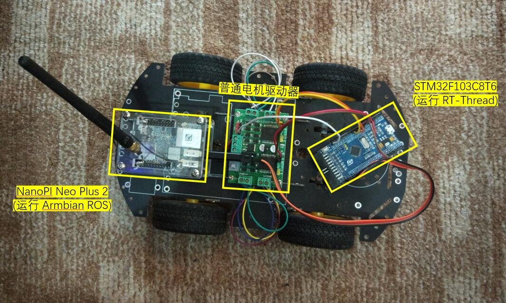
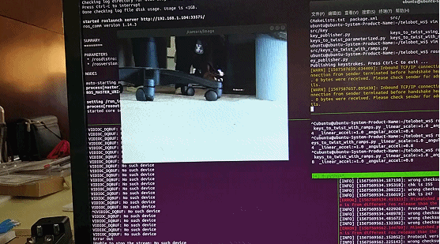

# RT-Thread 连接 ROS 控制小车

## 1 引言

这篇文档会介绍如何用 RT-Thread 和 ROS 连接实现一个带摄像头的远程控制小车。



不过其实 RT-Thread 部分的代码已经在这篇文档里面介绍了：[RT-Thread 连接 ROS 控制小车](http://123.207.116.104/ros)，在这个基础上，我们只需要修改 ROS 的代码就可以了。

这里先把整个系统框图画出来，这样如果想要自己做一辆这样的小车也可以动手试一试：



实物图看起来就是这样：



## 2 ROS 平滑运动

### 2.1 ROS 工作环境

下面的代码都是在安装了 ROS 的电脑上操作的

ROS 的安装之前已经介绍过了，这里就不重复了，我们先新建一个工作区间：

```
$ mkdir  telebot_ws  && cd telebot_ws
$ catkin_init_workspace
```

我们再新建一个 ROS 软件包：

```
$ cd src
$ catkin_create_pkg telebot rospy
```

这样我们就可以开始 ROS 的开发了，在 telebot_ws 目录下：

```
$ catkin_make
$ source devel/setup.bash
```

### 2.2 按键触发

我们先建立一个节点用来监听键盘的按键，并且将收到的按键发布到 /keys 这个话题 (ROS 节点间的通信就是靠发布和订阅话题实现的)，我们在 telebot_ws/src/telebot/src 目录下新建一个文件 key_publisher.py

```
#!/usr/bin/python

# 导入软件包
import sys, select, tty, termios
import rospy
from std_msgs.msg import String

if __name__ == '__main__':
    # 初始化节点
    key_pub = rospy.Publisher('keys', String, queue_size=1)
    rospy.init_node("keyboard_driver")
    rate = rospy.Rate(100)

    # 设置终端输入模式
    old_attr = termios.tcgetattr(sys.stdin)
    tty.setcbreak(sys.stdin.fileno())
    print("Publishing keystrokes. Press Ctrl-C to exit ...")

    # 循环监听键盘事件
    while not rospy.is_shutdown():
        if select.select([sys.stdin], [], [], 0)[0] == [sys.stdin]:
            # 发布监听到的按键
            key_pub.publish(sys.stdin.read(1))
        rate.sleep()

    # 恢复终端设置
    termios.tcsetattr(sys.stdin, termios.TCSADRAIN, old_attr)
```

上面的代码不到 20 行，我也添加了一些注释，就不详细介绍了，我们为这个文件添加可执行权限：

```
$ chmod u+x key_publisher.py
```

就可以启动节点了：

```
$ rosrun telebot key_publisher.py
```

这样我们就可以看到有一个 /keys 的话题会不断输出键盘按键：

```
$ rostopic echo /keys
data: "w"
---
data: "a"
---
data: "s"
---
```

### 2.3 按键解析

现在已经有一个节点在发布我们的按键消息了，接下来就是把按键消息转换为小车的运动指令了，也就是发布到 /cmd_vel，我们在 telebot_ws/src/telebot/src 目录下新建一个文件 keys_to_twist_with_ramps.py：

```
#!/usr/bin/python

# 导入软件包
import rospy
import math
from std_msgs.msg import String
from geometry_msgs.msg import Twist

# 键盘和速度映设 w a s d
key_mapping = { 'w': [ 0, 1], 'x': [ 0, -1],
                'a': [ -1, 0], 'd': [1,  0],
                's': [ 0, 0] }
g_twist_pub = None
g_target_twist = None
g_last_twist = None
g_last_send_time = None
g_vel_scales = [0.1, 0.1] # default to very slow
g_vel_ramps = [1, 1] # units: meters per second^2

# 防止速度突变
def ramped_vel(v_prev, v_target, t_prev, t_now, ramp_rate):
  # compute maximum velocity step
  step = ramp_rate * (t_now - t_prev).to_sec()
  sign = 1.0 if (v_target > v_prev) else -1.0
  error = math.fabs(v_target - v_prev)
  if error < step: # we can get there within this timestep. we're done.
    return v_target
  else:
    return v_prev + sign * step  # take a step towards the target

def ramped_twist(prev, target, t_prev, t_now, ramps):
  tw = Twist()
  tw.angular.z = ramped_vel(prev.angular.z, target.angular.z, t_prev,
                            t_now, ramps[0])
  tw.linear.x = ramped_vel(prev.linear.x, target.linear.x, t_prev,
                           t_now, ramps[1])
  return tw

# 发布控制指令到 /cmd_vel
def send_twist():
  global g_last_twist_send_time, g_target_twist, g_last_twist,\
         g_vel_scales, g_vel_ramps, g_twist_pub
  t_now = rospy.Time.now()
  g_last_twist = ramped_twist(g_last_twist, g_target_twist,
                              g_last_twist_send_time, t_now, g_vel_ramps)
  g_last_twist_send_time = t_now
  g_twist_pub.publish(g_last_twist)

# 订阅 /keys 的回调函数
def keys_cb(msg):
  global g_target_twist, g_last_twist, g_vel_scales
  if len(msg.data) == 0 or not key_mapping.has_key(msg.data[0]):
    return # unknown key.
  vels = key_mapping[msg.data[0]]
  g_target_twist.angular.z = vels[0] * g_vel_scales[0]
  g_target_twist.linear.x  = vels[1] * g_vel_scales[1]

# 获取传递进来的速度加速度比例
def fetch_param(name, default):
  if rospy.has_param(name):
    return rospy.get_param(name)
  else:
    print "parameter [%s] not defined. Defaulting to %.3f" % (name, default)
    return default

if __name__ == '__main__':
  rospy.init_node('keys_to_twist')
  g_last_twist_send_time = rospy.Time.now()
  g_twist_pub = rospy.Publisher('cmd_vel', Twist, queue_size=1)
  rospy.Subscriber('keys', String, keys_cb)
  g_target_twist = Twist() # initializes to zero
  g_last_twist = Twist()
  g_vel_scales[0] = fetch_param('~angular_scale', 0.1)
  g_vel_scales[1] = fetch_param('~linear_scale', 0.1)
  g_vel_ramps[0] = fetch_param('~angular_accel', 1.0)
  g_vel_ramps[1] = fetch_param('~linear_accel', 1.0)

  rate = rospy.Rate(20)
  while not rospy.is_shutdown():
    send_twist()
    rate.sleep()
```

同样的，我们为这个文件添加可执行权限：

```
$ chmod u+x keys_to_twist_with_ramps.py
```

就可以启动节点了：

```
$ rosrun telebot keys_to_twist_with_ramps.py _linear_scale:=1.0 _angular_scale:=0.8  _linear_accel:=1.0 _angular_accel:=0.8
```

上面传入的参数是我们希望的小车运动速度和加速度比例，这样我们就可以看到有一个 /cmd_vel 的话题会输出期望的小车速度：

```
$ rostopic echo /cmd_vel
linear:
  x: 1.0
  y: 0.0
  z: 0.0
angular:
  x: 0.0
  y: 0.0
  z: 0.0
---
```

现在小车已经可以按照我们的指令慢慢启动，停下，转弯了，下一步就是给它加上远程摄像头。

## 3 ROS 摄像头

在和小车的摄像头连接之前，有一点非常重要，之前的操作都是在电脑上执行的，接下来我们要把自己的 ARM 开发板作为 ROS 主节点，所以需要设置环境变量，需要**把下面的 IP 地址替换为小车上 ARM 板的实际 ip 地址**：

```
$ export ROS_MASTER_URI=http://your.armbian_ros.ip.address:11311
```

下面的代码都是在安装了 ROS 的小车上 ARM 开发板上操作的

我们先新建一个工作区间：

```
$ mkdir  telebot_ws  && cd telebot_ws
$ catkin_init_workspace
```

我们再新建一个 ROS 软件包：

```
$ cd src
$ catkin_create_pkg telebot_image roscpp
```

这样我们就可以开始 ROS 的开发了，在 telebot_ws 目录下：

```
$ catkin_make
$ source devel/setup.bash
```

### 3.1 发布摄像头消息

其实发布摄像头消息的代码也就 30 行左右，我们在 telebot_ws/src/telebot_image/src 目录下新建 my_publisher.cpp

```
#include <ros/ros.h>
#include <image_transport/image_transport.h>
#include <opencv2/opencv.hpp>
#include <cv_bridge/cv_bridge.h>

int main(int argc, char** argv)
{
  ros::init(argc, argv, "video_transp");
  ros::NodeHandle nh;
  image_transport::ImageTransport it(nh);
  image_transport::Publisher pub = it.advertise("camera/image", 1);

  cv::VideoCapture cap(0);
  cv::Mat frame;
  sensor_msgs::ImagePtr frame_msg;

  ros::Rate rate(10);

  while(ros::ok())
  {
    cap >> frame;
    if (!frame.empty())
    {
      frame_msg = cv_bridge::CvImage(std_msgs::Header(), "bgr8", frame).toImageMsg();
      pub.publish(frame_msg);
      cv::waitKey(1);
    }
    ros::spinOnce();
    rate.sleep();
  }
  return 0;
}
```

在编译之前**需要先安装好 OpenCV 的开发环境**，因为我们是用 OpenCV 的库函数获取到摄像头数据，然后用 ROS 的库函数发布出去的，这是 telebot_ws/src/telebot_image 目录下的 CMakeLists.txt

```
cmake_minimum_required(VERSION 2.8.3)
project(telebot_image)

find_package(catkin REQUIRED COMPONENTS
  cv_bridge
  image_transport
)

catkin_package(
#  INCLUDE_DIRS include
#  LIBRARIES my_image_transport
#  CATKIN_DEPENDS cv_bridge image_transport
#  DEPENDS system_lib
)

include_directories(
  ${catkin_INCLUDE_DIRS}
)

find_package(OpenCV)
include_directories(include ${OpenCV_INCLUDE_DIRS})
#build my_publisher and my_subscriber
add_executable(my_publisher src/my_publisher.cpp)
target_link_libraries(my_publisher ${catkin_LIBRARIES} ${OpenCV_LIBS})
```

我们在 telebot_ws 目录下编译项目：

```
$ catkin_make
```

这样就可以发布摄像头消息了，图像消息发布在 camera/image：

```
$rosrun telebot_image my_publisher
```

### 3.2 订阅摄像头消息

下面的代码都是在安装了 ROS 的电脑上操作的

要订阅并看到摄像头消息其实非常简单：

```
$ rosrun image_view image_view image:=/camera/image
```

就可以再电脑上看到小车摄像头的图片了。



## 4 总结

如果已经有一辆能够用 ROS 控制的小车，其实只需要写第 3 部分图像发布 30 行左右的代码，就可以用 OpenCV 库获取摄像头信息，然后用 ROS 库发布出去了。

当然，如果只是为了在电脑上看到小车的摄像头，其实还有其他很多甚至不用写代码的办法，用 ROS 发布图像数据的好处在于我们可以对获取到的图像进行处理，例如目标检测，这会在之后的文档里进一步介绍。

## 参考文献

- [ROS 机器人编程实践](https://github.com/osrf/rosbook)
- [rosserial 软件包](https://github.com/wuhanstudio/rt-rosserial)
