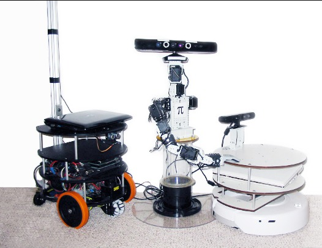
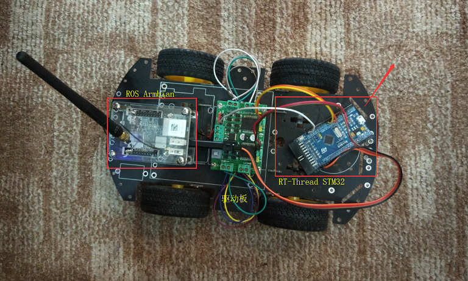
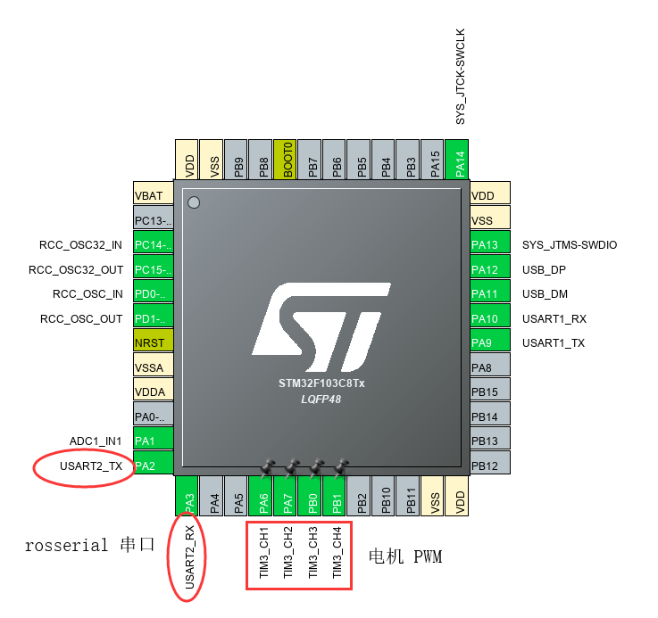
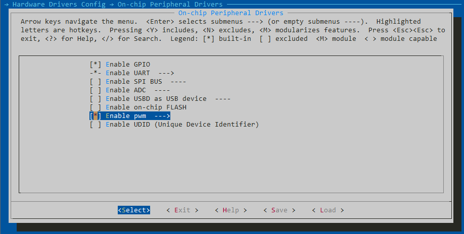
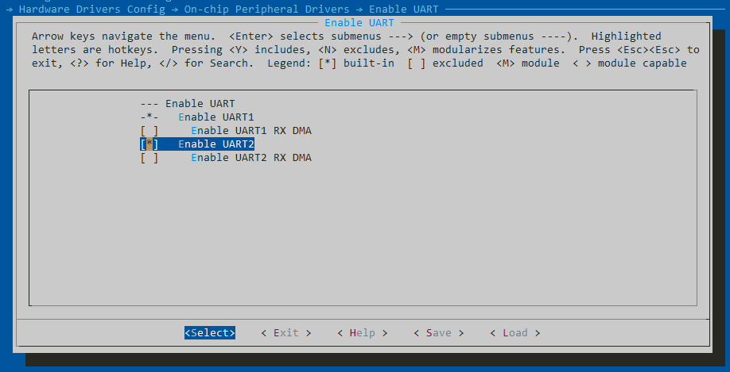
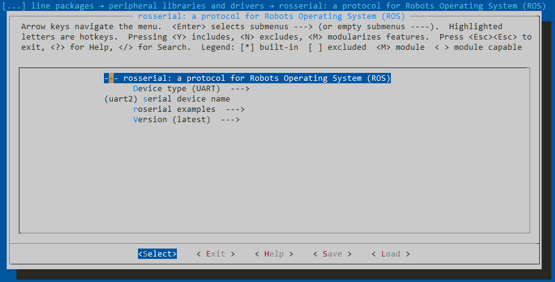
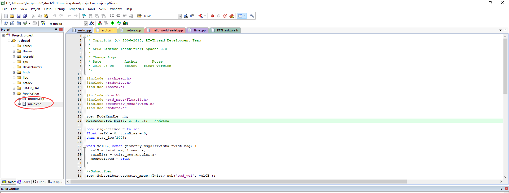
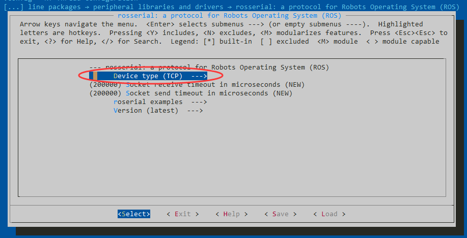

#  RT-Thread 连接 ROS

## 引言

这篇文档主要介绍 RT-Thread 如何使用串口或者无线和 ROS 连接，会包含这么些内容：

- 第一部分：ROS 环境搭建
- 第二部分：RT-Thread rosserial 软件包
- 第二部分：RT-Thread 添加 USART2 和 PWM
- 第三部分：RT-Thread 使用 ESP8266 AT 固件联网

这里先介绍一下什么是 ROS？为什么要和 ROS 连接？

**机器人操作系统 ROS** (Robots Operating System) 最早是斯坦福大学的一个软件框架，现在不管是工业机器人，还是娱乐用的机器人都运行着 ROS。



一个机器人通常有很多个部件、传感器，为了保证机器人不会因为某一个传感器故障，导致整个系统瘫痪，所以采用了分布式的节点，利用不同节点之间的通讯收集传感器数据和控制指令，这篇文档后面会使用到的通讯协议就是 **rosserial**。

和 ROS 连接的好处在于，一方面由 ROS 管理各个机器人节点更稳定，另一方面 ROS 现在已经有了非常多成熟的软件包，使用 ROS 就可以非常方便的为自己的机器人添加摄像头图像识别、激光雷达建图导航等高级功能。

不过这篇文档只会涉及 RT-Thread 和 ROS 建立基本的连接，实现小车的运动控制，之后可能会有后续文档介绍如何连接激光雷达建图，并进行全局路径规划。

这篇文章假定大家都已经会用 RT-Thread 的 env 工具下载软件包，生成项目上传固件到 stm32 上，并且熟悉 Ubuntu 的基本使用。

## 1 ROS 简介

### 1.1 ROS 环境搭建

这里的开发环境搭建其实是需要搭建 2 份，一份是小车上的 ARM 开发板 (树莓派，NanoPi 什么的)，另一个则是自己的电脑，因为我们希望把电脑作为 ROS 从节点，连接到小车上的 ROS 主节点，不过开发板和电脑的 ROS 安装是一模一样的。

既然要和 ROS 连接，那么首先就得要有一个正常运行的 ROS。安装 ROS 其实非常简单，这里推荐使用 Ubuntu 18 (开发板推荐系统用 Armbian)，因为官方对 Ubuntu 的支持优先级是最高的，安装教程也可以参照 [官网](http://wiki.ros.org/melodic/Installation/Ubuntu)。

只需要输入下面的 4 行命令，就在 Ubuntu 上装好了 ROS。

```
sudo sh -c 'echo "deb https://mirror.tuna.tsinghua.edu.cn/ros/ubuntu $(lsb_release -sc) main" > /etc/apt/sources.list.d/ros-latest.list'

sudo apt-key adv --keyserver 'hkp://keyserver.ubuntu.com:80' --recv-key C1CF6E31E6BADE8868B172B4F42ED6FBAB17C654

sudo apt update

sudo apt install ros-melodic-ros-base
```

上面我使用了清华大学的镜像源，这样从国内下载 ROS 会快很多，而且我只安装了 ROS 的基本软件包，没有安装图形化软件包 gviz，gazebo 什么的，因为后面也没有用到。

### 1.2 ROS 环境初始化

ROS 安装好之后还需要进行初始化，不过也是只有短短几行命令：

```
sudo rosdep init
rosdep update

echo "source /opt/ros/melodic/setup.bash" >> ~/.bashrc
source ~/.bashrc
```

### 1.3 启动 ROS

启动 ROS 的话我们需要确保它是常驻后台运行的，所以我们可以使用 tmux：

```
roscore
```

在 tmux 里启动了 ROS 主节点后，我们就可以 Ctrl + B D 退出了，而 ROS 主节点依旧在后台运行。

### 1.4 参考文献

- [Armbian](https://www.armbian.com/)
- [ROS Melodic 安装](http://wiki.ros.org/melodic/Installation/Ubuntu)

## 2 RT-Thread 串口连接 ROS

这一部分会介绍如何使用串口将运行着 RT-Thread 的 STM32 开发板和运行着 ROS 的 ARM 开发板连接，看起来差不多就是这样。



这里说明一下不同开发板的分工，STM32 运行着 RT-Thread 负责控制电机，接收传感器信息；ARM 运行着 ROS 负责进行全局控制，例如给小车发出前进的指令。

### 2.1 RT-Thread 配置

首先我们需要打开 usart2，因为 usart1 被 msh 使用了，保留作为调试还是挺方便的。



在 CubeMX 里我打开了 USART2，另外还打开了 4 路 PWM，因为我后面使用了 2 个电机，每个电机需要 2 路 PWM 分别控制前进和后退。

接下来还需要在 menuconfig 里面打开对应的选项，考虑到有的开发板默认的 bsp 可能没有这些选项，可以修改 board/Kconfig 添加下面的内容。

串口的配置：

```
menuconfig BSP_USING_UART
    bool "Enable UART"
    default y
    select RT_USING_SERIAL
    if BSP_USING_UART
        config BSP_USING_UART1
            bool "Enable UART1"
            default y

        config BSP_UART1_RX_USING_DMA
            bool "Enable UART1 RX DMA"
            depends on BSP_USING_UART1 && RT_SERIAL_USING_DMA
            default n

        config BSP_USING_UART2
            bool "Enable UART2"
            default y

        config BSP_UART2_RX_USING_DMA
            bool "Enable UART2 RX DMA"
            depends on BSP_USING_UART2 && RT_SERIAL_USING_DMA
            default n
    endif
```

PWM 的配置：

```
menuconfig BSP_USING_PWM
    bool "Enable pwm"
    default n
    select RT_USING_PWM
    if BSP_USING_PWM
    menuconfig BSP_USING_PWM3
        bool "Enable timer3 output pwm"
        default n
        if BSP_USING_PWM3
            config BSP_USING_PWM3_CH1
                bool "Enable PWM3 channel1"
                default n
            config BSP_USING_PWM3_CH2
                bool "Enable PWM3 channel2"
                default n
            config BSP_USING_PWM3_CH3
                bool "Enable PWM3 channel3"
                default n
            config BSP_USING_PWM3_CH4
                bool "Enable PWM3 channel4"
                default n
        endif
    endif
```

这样我们在 env 下就可以看到有对应的配置了





除此之外，我们还需要选择 rosserial 软件包：



可以看到上面默认的串口就是 USART2，这样我们就可以生成对应的工程了：

```
pkgs --update
scons --target=mdk5 -s
```

如果我们打开 Keil 项目，首先需要把 main.c 修改为 main.cpp，因为 rosserial 很多数据格式的定义都是用 C++ 写的，所以如果要使用 rosserial 库，我们先得把后缀改为 cpp，这样 Keil 就会用 C++ 编译器编译。



下面是 main.cpp 的内容，其实就是初始化了电机，然后发布了 2 个话题 (topic)，一个是 /vel_x 告诉 ROS 当前小车的速度，一个是 /turn_bias 告诉 ROS 当前小车的旋转速度。同时又订阅了一个话题 /cmd_vel，用来接收从 ROS 发出的控制指令。

代码不是特别长，我也添加了一些注释，所以这里就不一行行分析了。

```c
#include <rtthread.h>
#include <rtdevice.h>
#include <board.h>

#include <ros.h>
#include <std_msgs/Float64.h>
#include <geometry_msgs/Twist.h>
#include "motors.h"

ros::NodeHandle  nh;
MotorControl mtr(1, 2, 3, 4);   //Motor

bool msgRecieved = false;
float velX = 0, turnBias = 0;
char stat_log[200];

// 接收到命令时的回调函数
void velCB( const geometry_msgs::Twist& twist_msg)
{
  velX = twist_msg.linear.x;
  turnBias = twist_msg.angular.z;
  msgRecieved = true;
}

//Subscriber
ros::Subscriber<geometry_msgs::Twist> sub("cmd_vel", velCB );

//Publisher
std_msgs::Float64 velX_tmp;
std_msgs::Float64 turnBias_tmp;
ros::Publisher xv("vel_x", &velX_tmp);
ros::Publisher xt("turn_bias", &turnBias_tmp);

static void rosserial_thread_entry(void *parameter)
{
    //Init motors, specif>y the respective motor pins
    mtr.initMotors();

    //Init node>
    nh.initNode();

    // 订阅了一个话题 /cmd_vel 接收控制指令
    nh.subscribe(sub);

    // 发布了一个话题 /vel_x 告诉 ROS 小车速度
    nh.advertise(xv);

    // 发布了一个话题 /turn_bias 告诉 ROS 小车的旋转角速度
    nh.advertise(xt);

    mtr.stopMotors();

    while (1)
    {
      // 如果接收到了控制指令
      if (msgRecieved)
      {
        velX *= mtr.maxSpd;
        mtr.moveBot(velX, turnBias);
        msgRecieved = false;
      }

      velX_tmp.data = velX;
      turnBias_tmp.data = turnBias/mtr.turnFactor;

      // 更新话题内容
      xv.publish( &velX_tmp );
      xt.publish( &turnBias_tmp );

      nh.spinOnce();
    }
}

int main(void)
{
    // 启动一个线程用来和 ROS 通信
    rt_thread_t thread = rt_thread_create("rosserial",     rosserial_thread_entry, RT_NULL, 2048, 8, 10);
    if(thread != RT_NULL)
    {
        rt_thread_startup(thread);
        rt_kprintf("[rosserial] New thread rosserial\n");
    }
    else
    {
        rt_kprintf("[rosserial] Failed to create thread rosserial\n");
    }
    return RT_EOK;
}
```

另外还有对应的电机控制的代码，不过这个大家的小车不同，驱动应当也不一样，我这里由于小车电机上没有编码器，所以全部是开环控制的。

motors.h

```c
#include <rtthread.h>

class MotorControl {
  public:
    //Var
    rt_uint32_t  maxSpd;
    float moveFactor;
    float turnFactor;

    MotorControl(int fl_for, int fl_back,
                 int fr_for, int fr_back);
    void initMotors();
    void rotateBot(int dir, float spd);
    void moveBot(float spd, float bias);
    void stopMotors();
  private:
    struct rt_device_pwm *pwm_dev;
    //The pins
    int fl_for;
    int fl_back;
    int fr_for;
    int fr_back;
    int bl_for;
    int bl_back;
    int br_for;
    int br_back;
};
```

motors.c

```c
#include <rtthread.h>
#include <rtdevice.h>
#include "motors.h"

#define PWM_DEV_NAME "pwm3"

MotorControl::MotorControl(int fl_for, int fl_back,
                           int fr_for, int fr_back)
{
    this->maxSpd = 500000;
    this->moveFactor = 1.0;
    this->turnFactor = 3.0;

    this->fl_for = fl_for;
    this->fl_back = fl_back;

    this->fr_for = fr_for;
    this->fr_back = fr_back;
}

void MotorControl::initMotors() {
    /* 查找设备 */
    this->pwm_dev = (struct rt_device_pwm *)rt_device_find(PWM_DEV_NAME);
    if (pwm_dev == RT_NULL)
    {
        rt_kprintf("pwm sample run failed! can't find %s device!\n", PWM_DEV_NAME);
    }
    rt_kprintf("pwm found %s device!\n", PWM_DEV_NAME);
    rt_pwm_set(pwm_dev, fl_for, maxSpd, 0);
    rt_pwm_enable(pwm_dev, fl_for);

    rt_pwm_set(pwm_dev, fl_back, maxSpd, 0);
    rt_pwm_enable(pwm_dev, fl_back);

    rt_pwm_set(pwm_dev, fr_for, maxSpd, 0);
    rt_pwm_enable(pwm_dev, fr_for);

    rt_pwm_set(pwm_dev, fr_back, maxSpd, 0);
    rt_pwm_enable(pwm_dev, fr_back);
}

// 小车运动
void MotorControl::moveBot(float spd, float bias) {
    float sL = spd * maxSpd;
    float sR = spd * maxSpd;
    int dir = (spd > 0) ? 1 : 0;

    if(bias != 0)
    {
        rotateBot((bias > 0) ? 1 : 0, bias);
        return;
    }

    if( sL < -moveFactor * maxSpd)
    {
        sL = -moveFactor * maxSpd;
    }
    if( sL > moveFactor * maxSpd)
    {
        sL = moveFactor * maxSpd;
    }

    if( sR < -moveFactor * maxSpd)
    {
        sR = -moveFactor * maxSpd;
    }
    if( sR > moveFactor * maxSpd)
    {
        sR = moveFactor * maxSpd;
    }

    if (sL < 0)
    {
        sL *= -1;
    }

    if (sR < 0)
    {
        sR *= -1;
    }

    rt_kprintf("Speed Left: %ld\n", (rt_int32_t)sL);
    rt_kprintf("Speed Right: %ld\n", (rt_int32_t)sR);

    if(dir)
    {
        rt_pwm_set(pwm_dev, fl_for, maxSpd, (rt_int32_t)sL);
        rt_pwm_set(pwm_dev, fl_back, maxSpd, 0);
        rt_pwm_set(pwm_dev, fr_for, maxSpd, (rt_int32_t)sR);
        rt_pwm_set(pwm_dev, fr_back, maxSpd, 0);
    }
    else
    {
        rt_pwm_set(pwm_dev, fl_for, maxSpd, 0);
        rt_pwm_set(pwm_dev, fl_back, maxSpd, (rt_int32_t)sL);
        rt_pwm_set(pwm_dev, fr_for, maxSpd, 0);
        rt_pwm_set(pwm_dev, fr_back, maxSpd, (rt_int32_t)sR);
    }

    rt_thread_mdelay(1);
}


// 小车旋转
void MotorControl::rotateBot(int dir, float spd) {
    float s = spd * maxSpd;
    if (dir < 0)
    {
        s *= -1;
    }
    if(dir)
    {
        // Clockwise
        rt_pwm_set(pwm_dev, fl_for, maxSpd, (rt_int32_t)s);
        rt_pwm_set(pwm_dev, fl_back, maxSpd, 0);
        rt_pwm_set(pwm_dev, fr_for, maxSpd, 0);
        rt_pwm_set(pwm_dev, fr_back, maxSpd, (rt_int32_t)s);
    }
    else
    {
        // Counter Clockwise
        rt_pwm_set(pwm_dev, fl_for, maxSpd, 0);
        rt_pwm_set(pwm_dev, fl_back, maxSpd, (rt_int32_t)s);
        rt_pwm_set(pwm_dev, fr_for, maxSpd, (rt_int32_t)s);
        rt_pwm_set(pwm_dev, fr_back, maxSpd, 0);
    }
    rt_thread_mdelay(1);
}

//Turn off both motors
void MotorControl::stopMotors()
{
    rt_pwm_set(pwm_dev, fl_for, maxSpd, 0);
    rt_pwm_set(pwm_dev, fl_back, maxSpd, 0);
    rt_pwm_set(pwm_dev, fr_for, maxSpd, 0);
    rt_pwm_set(pwm_dev, fr_back, maxSpd, 0);
}
```

一共只需要这么一点代码就可以实现和 ROS 的连接了，所以其实 ROS 也不是那么神秘，它就是因为简单好用所以才这么受欢迎的。

既然 RT-Thread 已经配置好了，下一步就是 ROS 的配置了。

### 2.2 ROS 配置

我们把上面 RT-Thread 的固件传到板子上以后，可以用一个 USB-TTL 一边和 STM32 控制板的 USART2 连接，另一边插到 ARM 控制板的 USB 口，接下来就可以建立连接了，在 ARM 板上输入命令：

```
$ rosrun rosserial_python serial_node.py /dev/ttyUSB0
```

如果看到下面的输出，那就成功建立连接了：

```
tpl@nanopineoplus2:~$ rosrun rosserial_python serial_node.py /dev/ttyUSB0
[INFO] [1567239474.258919]: ROS Serial Python Node
[INFO] [1567239474.288435]: Connecting to /dev/ttyUSB0 at 57600 baud
[INFO] [1567239476.425646]: Requesting topics...
[INFO] [1567239476.464336]: Note: publish buffer size is 512 bytes
[INFO] [1567239476.471349]: Setup publisher on vel_x [std_msgs/Float64]
[INFO] [1567239476.489881]: Setup publisher on turn_bias [std_msgs/Float64]
[INFO] [1567239476.777573]: Note: subscribe buffer size is 512 bytes
[INFO] [1567239476.785032]: Setup subscriber on cmd_vel [geometry_msgs/Twist]
```

### 2.3 ROS 控制小车

既然已经成功建立连接了，下一步就是写小车控制的代码了。

我们先初始化一个工作区间：

```
$ mkdir catkin_workspace && cd catkin_workspace
$ catkin_init_workspace
```

接下来创建一个软件包：

```
$ cd src
$ catkin_create_pkg my_first_pkg rospy
```

这样就会自动在 src 目录创建一个 ROS 软件包了。

我们在 catkin_workspace/src/my_first_pkg/src 目录下新建一个文件 ros_cmd_vel_pub.py：

```
#!/usr/bin/python

import rospy
from geometry_msgs.msg import Twist
from pynput.keyboard import Key, Listener

vel = Twist()
vel.linear.x = 0

def on_press(key):

    try:
        if(key.char == 'w'):
            print("Forward")
            vel.linear.x = 0.8
            vel.angular.z = 0

        if(key.char == 's'):
            print("Backward")
            vel.linear.x = -0.8
            vel.angular.z = 0

        if(key.char == 'a'):
            print("Counter Clockwise")
            vel.linear.x = 0
            vel.angular.z = -0.8

        if(key.char == 'd'):
            print("Clockwise")
            vel.linear.x = 0
            vel.angular.z = 0.8

        return False

    except AttributeError:
        print('special key {0} pressed'.format(key))
        return False

def on_release(key):
    vel.linear.x = 0
    vel.angular.z = 0

    return False

# Init Node
rospy.init_node('my_cmd_vel_publisher')
pub = rospy.Publisher('cmd_vel', Twist, queue_size=10)

# Set rate
rate = rospy.Rate(10)

listener = Listener(on_release=on_release, on_press = on_press)

while not rospy.is_shutdown():
    print(vel.linear.x)
    pub.publish(vel)
    vel.linear.x = 0
    vel.angular.z = 0
    rate.sleep()

    if not listener.running:
        listener = Listener(on_release=on_release, on_press = on_press)
        listener.start()
```

这就是我们的 python 控制程序了，可以使用键盘的 wasd 控制小车前进后退，顺时针、逆时针旋转。我们需要给它添加可执行权限：

```
$ chmod u+x ./ros_cmd_vel_pub.py
```

这样就可以编译软件包了，在 catkin_worspace 目录下。

```
$ catkin_make
$ source devel/setup.bash
```

我们终于就可以启动程序从电脑上控制小车运动了：

```
rosrun my_first_pkg ros_cmd_vel_pub.py
```

可以看到用 ROS 实现小车控制其实代码量并不算多，只需要在自己小车原有的代码上发布一些话题，告诉 ROS 小车当前的状态，并且订阅一个话题接收 ROS 的控制指令就可以了。

### 2.4 参考文献

- [ros-pibot](https://github.com/wuhanstudio/ros-pibot)

## 3 RT-Thread 无线连接 ROS

### 3.1 rosserial 配置

其实无线连接和有线连接几乎是一模一样的，只不过是先用 ESP8266 使自己的控制板能连上网，然后用 tcp 连接和 ROS 通信，关于 RT-Thread 使用 ESP8266 上网的教程可以参照 [官网](https://www.rt-thread.org/document/site/application-note/components/at/an0014-at-client/)，非常详细了，我这里就不重复了。

确保开发板有网络连接后，我们就可以在 rosserial 里面配置为使用 tcp 连接：



我们只需要在上一部分的 main.cpp 里添加一行代码：

```
// 设置 ROS 的 IP 端口号
nh.getHardware()->setConnection("192.168.1.210", 11411);

// 添加在节点初始化之前
nh.initNode();
```

开发板就能通过 tcp 连接和 ROS 通信了，非常方便。

### 3.2 ROS 配置

由于我们使用了 tcp 连接，所以 ROS 上自然也要开启一个服务器了，之前是使用的串口建立连接，现在就是使用 tcp 了：

```
$ rosrun rosserial_python serial_node.py tcp
```

其他的代码完全不需要改变，这样我们就实现了一个 ROS 无线控制的小车了。

### 3.3 参考文献

- [RT-Thread 使用 ESP8266 上网](https://www.rt-thread.org/document/site/application-note/components/at/an0014-at-client/)

## 4 总结

这里再总结一下，其实 RT-Thread 使用 rosserial 软件包和 ROS 建立连接非常简单，只需要在自己小车原有代码的基础上发布一些消息，告诉 ROS 小车当前的状态，以及订阅来自 ROS 的控制指令就可以了。

