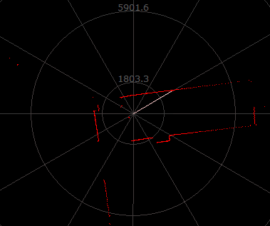
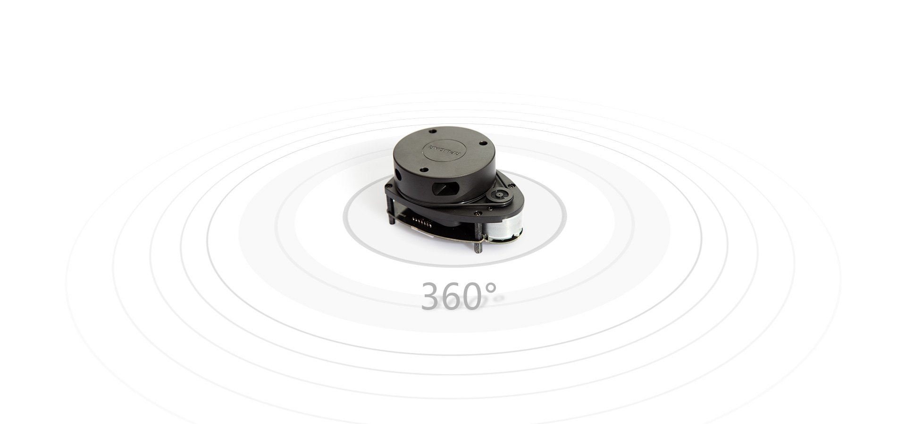
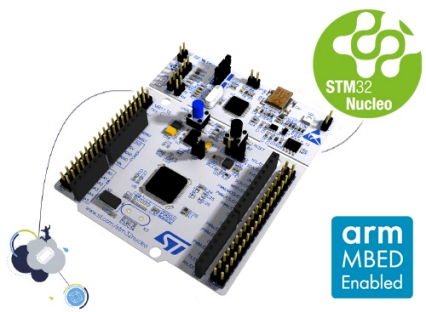
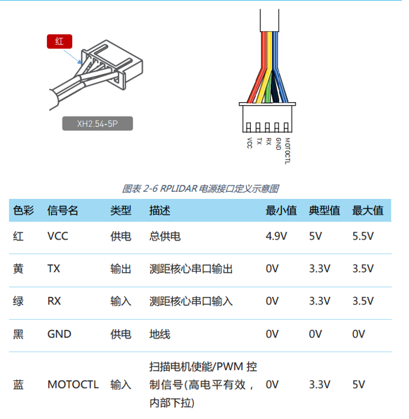
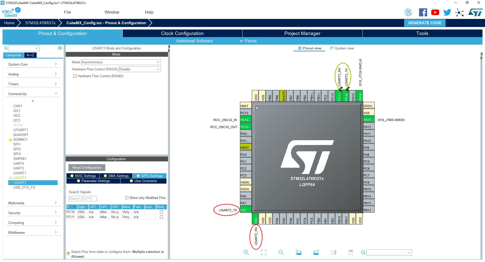
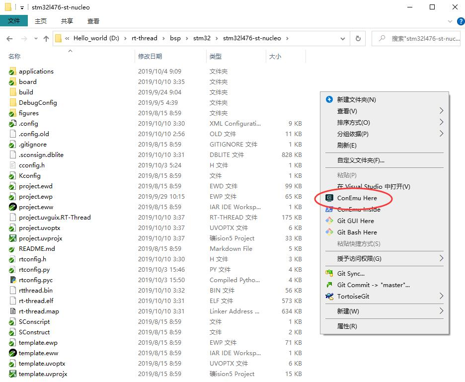
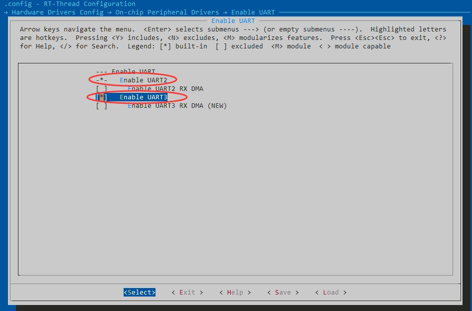
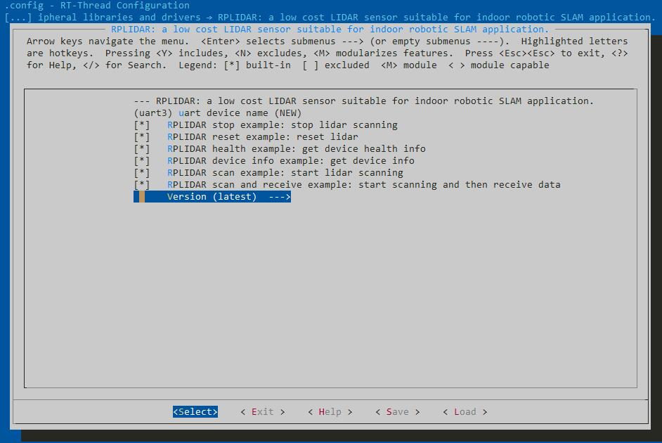
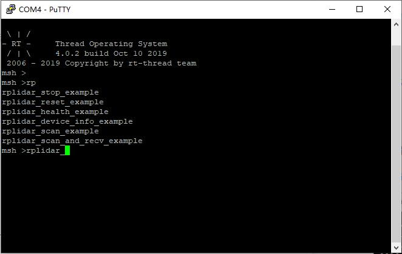
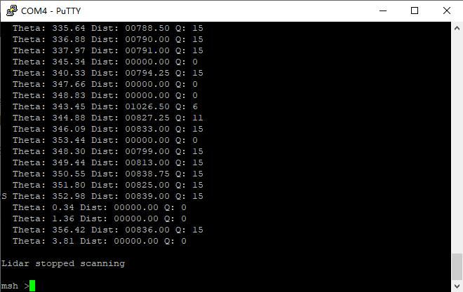

# RT-Thread 连接 RPlidar A1 激光雷达

## 引言

最早一些智能小车可能会有一些超声波模块，用来判断前方的障碍物，并配合舵机的旋转，从而知道各个方向的障碍物分布。但是如果使用激光雷达的话，可以一次性得到360度范围内的障碍物分布。



激光雷达基本上已经成为无人驾驶的必备传感器了，当然，它的成本也并不低，这篇文档将会介绍如何利用 RT-Thread 获取思岚 RPLidar A1 的扫描数据。



其实思岚的激光雷达就是串口发送控制命令，然后激光雷达响应从串口发送扫描结果，根据思岚的[通信协议](https://download.slamtec.com/api/download/rplidar-protocol/2.1.1?lang=zh-cn)进行解析就可以了，后面的文档就不会具体介绍通信协议了，毕竟官方文档已经介绍的很详细了。

在开始介绍之前，需要准备好这些东西：

- 搭建好 RT-Thread 的环境 ([Git](https://git-scm.com/), [Env 工具](https://www.rt-thread.org/page/download.html), [RT-Thread 源码](https://www.rt-thread.org/page/download.html))
- RPLidar A1 (或者其他A系列也可以)
- STM32 (或者其他可以运行 RT-Thread 的开发板，需要有2个串口)

## 1. 硬件接线

在介绍接线之前，先给出[官方资料](http://www.slamtec.com/cn/Support#rplidar-a-series)链接，在这里可以找到[用户手册](https://download.slamtec.com/api/download/rplidarkit-a1m8-usermaunal/1.0?lang=zh-cn)，[ROS软件包](https://github.com/slamtec/rplidar_ros)，[SDK说明](https://download.slamtec.com/api/download/rplidar-sdk-manual/1.0?lang=zh-cn)，[通信协议](https://download.slamtec.com/api/download/rplidar-protocol/2.1.1?lang=zh-cn)等很多重要的资料。

我使用的是 STM32-L746RG Nucleo 开发板，使用其他可以运行 RT-Thread 并有 **2个串口** 的板子当然也是可以的。



STM32 和激光雷达的接线可以参照[这里](https://wiki.slamtec.com/pages/viewpage.action?pageId=13959187)，主要也就是给电机的供电，和串口 RX TX。



这里总结一下接线：

| 激光雷达 | STM32 | 备注                              |
| -------- | ----- | --------------------------------- |
| GND      | GND   |                                   |
| RX       | TX    |                                   |
| TX       | RX    |                                   |
| V5.0     | VCC   |                                   |
| GND      | GND   |                                   |
| VMOTOCTL | VCC   | 也可以接一个 PWM 手动控制电机转速 |
| VMOTO    | VCC   | 电机电源                          |

接好线上电后，应当就可以看到激光雷达开始旋转。

## 2. RPlidar 软件包

### 2.1 串口配置

在下载 RPlidar 软件包之前，需要先配置好开发板的2个串口，一个用于 msh 调试，一个用来连接激光雷达。

以 STM32 为例，下载好 RT-Thread 源码后，根据我手上的板子型号，进入**rt-thread/bsp/stm32/stm32l476-st-nucleo** 目录，在 **board/CubeMX_Config** 下可以找到 CubeMX_Config.ioc 打开。



这里我配置了两个串口 UART2 (MSH) 和 UART3 (激光雷达)，可以根据自己的板子调整，然后 CubeMX 生成代码，把生成的项目里的 main.c 下面的 **SystemClock_Config** 函数，复制到 board.c 里面替换。

接下来我们需要编辑 **board/Kconfig** 在里面添加串口的配置，当然，如果你的 bsp 已经有相关配置就不需要了。

```
menuconfig BSP_USING_UART
    bool "Enable UART"
    default y
    select RT_USING_SERIAL
    if BSP_USING_UART
        config BSP_USING_UART2
            bool "Enable UART2"
            default n

        config BSP_UART2_RX_USING_DMA
            bool "Enable UART2 RX DMA"
            depends on BSP_USING_UART2 && RT_SERIAL_USING_DMA
            default n
    endif
```

### 2.2 下载软件包

接下来我们就可以下载软件包了，右键打开 env 工具。



输入 menuconfig 进入 **Hardware Drivers** 打开两个串口：



再进入 RT-Thread Online Package 选中 RPLidar 软件包：



软件包选中以后，我们保存 KConfig 的配置，就可以下载软件包了，在 env 里面输入：

```
pkgs --update
```

这样我们就下好了 RPLidar 软件包，接下来就可以开始编译获取激光雷达的数据了。

如果在 **Peripheral libraries and drivers** 找不到 RPLidar 这个软件包的话，需要先在 env 下 pkgs --upgrade 一下更新软件包仓库。

### 2.3 编译上传

接线完成，串口配置完成，软件包也下载完了，最后我们就可以编译上传了。

编译的话我们可以用 Keil 也可以用 env 自带的 arm-none-gcc，如果使用 Keil 的话，先生成项目：

```
scons --target=mdk5 -s
```

然后就可以打开 Keil 项目编译了，如果是 arm-none-gcc，直接在 env 下编译就可以了。

```
scons
```

这里简单介绍一下例程代码，以激光雷达复位为例：

```c
#include <rtthread.h>
#include "rplidar.h"

#define RPLIDAR_DEVICE_NAME    "rplidar"    /* 设备名称 */

static int rplidar_stop_example(int argc, char *argv[])
{
    rt_err_t ret;

    // 获取激光雷达设备
    rt_device_t lidar = rp_lidar_create(RPLIDAR_DEVICE_NAME);
    if(lidar == RT_NULL)
    {
        rt_kprintf("Failed to find device %s\n", RPLIDAR_DEVICE_NAME);
        return -1;
    }

    // 雷达初始化
    ret = rp_lidar_init(lidar);
    if(ret != RT_EOK)
    {
        rt_kprintf("Failed to init lidar device\n");
        return -1;
    }

    // 发送停止命令
    ret = rp_lidar_stop(lidar);
    if(ret == RT_EOK)
    {
        rt_kprintf("Lidar stopped scanning\n");
    }
    else
    {
        rt_kprintf("Failed to communicate with lidar device\n");
    }

    return RT_EOK;
}
MSH_CMD_EXPORT(rplidar_stop_example, rplidar stop example);
```

代码非常短我也增加了一些注释就不重复介绍了，主要流程就是：

```
1. 获取雷达设备  rp_lidar_create
2. 雷达初始化    rp_lidar_init
3. 发送控制命令  rp_lidar_scan
4. 获取雷达数据  rp_lidar_get_scan_data
```

### 2.4 获取激光雷达数据

固件编译好上传之后，就可以用串口调试助手打开 msh 了，这里我使用 **putty** 或者 **kitty**，输入 rplidar 然后 Tab 自动补全，可以看到有很多命令：



如果输入 **rplidar_scan_and_recv_example** 就可以看到一圈扫描的结果了：



## 3. 总结

思岚激光雷达可以通过串口和单片机通信，然后单片机发送控制指令，例如扫描(0xA5 0x20)，激光雷达就会从串口不停地发送扫描数据，接下来要做的就是数据的解析了，而这些在 RT-Thread 的 rplidar 软件包里已经完成了，更多的 API 可以参考[这里](https://github.com/wuhanstudio/rplidar/blob/master/src/rplidar.h)。

```c
rt_device_t rp_lidar_create(const char* lidar_name);
rt_err_t rp_lidar_init(rt_device_t lidar);

rt_err_t rp_lidar_scan(rt_device_t lidar, _u32 timeout);
rt_err_t rp_lidar_stop(rt_device_t lidar);
rt_err_t rp_lidar_reset(rt_device_t lidar);

rt_err_t rp_lidar_get_health(rt_device_t lidar, rplidar_response_device_health_t* health, _u32 timeout);
rt_err_t rp_lidar_get_device_info(rt_device_t lidar, rplidar_response_device_info_t* info, _u32 timeout);
rt_err_t rp_lidar_get_scan_data(rt_device_t lidar, rplidar_response_measurement_node_t* node, _u32 timeout);
u_result rp_lidar_wait_scan_data(rt_device_t lidar, rplidar_response_measurement_node_t * node, _u32 timeout);

u_result rp_lidar_wait_resp_header(rt_device_t lidar, rplidar_ans_header_t * header, _u32 timeout);
u_result rp_lidar_recev_data(rt_device_t lidar, _u8* buffer, size_t len, _u32 timeout);
```

顺便一提，因为我手头只有思岚激光雷达 A1，所以 TCP 连接和一些我的设备不支持的命令还没有实现，欢迎大家有更多高级雷达的小伙伴提 PR 完善这个软件包。

## 4. 参考资料

- [思岚科技官方资料](http://www.slamtec.com/cn/Support#rplidar-a-series)
- [RPlidar 软件包](https://github.com/wuhanstudio/rplidar)
