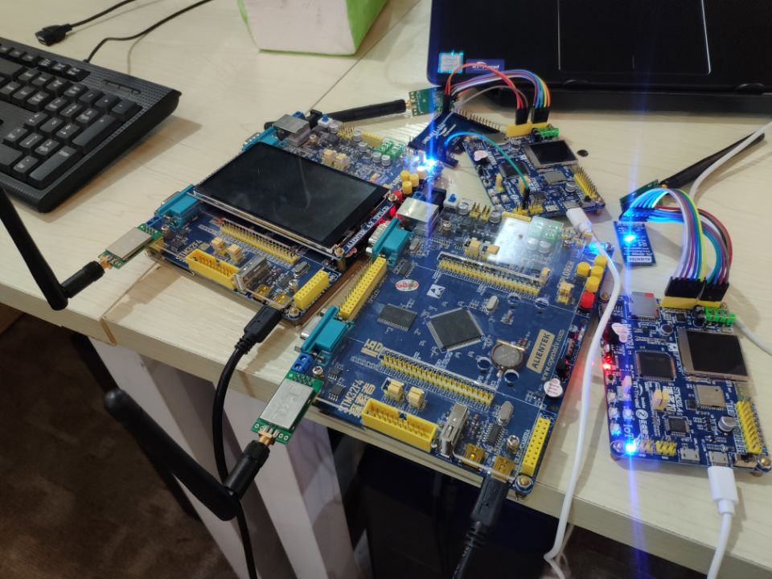

# 分布式温度监控系统

## 简介

这是一篇应用 RT-Thread 实现分布式温度监控系统的教程，共包含 4 节的内容，介绍了由浅入深，一步步实现一个分布式温度监控系统的过程。学完这个课程可以对 RT-Thread 的 Sensor 框架、线程间的同步、线程间的通信、虚拟文件系统、物联网应用有一个更深入的了解，也能增加自己的动手实践能力。

分布式温度监控系统基于 STM32 系类芯片开发，支持采集多达六个分节点的温度数据，网关节点收集分节点的数据并通过 WIFI 上传云端远程实时监视，也可本地连接串口与 PC 端通讯，上位机实时显示分节点数据。该系统适用于家庭、办公室、教室等小面积场所的多点温度监控，无线传输距离可达 100m ~ 500m，具有功耗低，丢包率低，传输距离远等特点，是一个相当实用的 DIY 设计。

## 物料清单

- STM32 开发板三块或以上，开发板最好有板载 SPI Flash 或 SD 卡卡槽。

- DS18B20 数字温度传感器两个或以上。

- NRF24L01 无线射频模块三个或以上。

- ESP8266 WIFI 模块一个。

## 系统实物

系统主控是 STM32 系类芯片，本教程基于 `stm32l475-atk-pandora`、`stm32f407-atk-explorer`、`stm32f103-dofly-M3S` 这三款 BSP 制作。教程中的代码具有良好的硬件无关性和可移植性，大家可以使用自己的开发板制作。

## 实际效果

### PC 端远程监视温度

网关节点连接中国移动的 OneNet 云，PC 上网页登录 OneNet 即可实现远程监视分节点的温度数据，如下图所示。

### 移动端远程监视温度

移动端实现远程监视需要下载 OneNet 的官方 APP，登录账号即可查看设备数据。

### PC 端本地监视节点温度

网关节点通过串口连接 PC，并在上位机中打开串口即可实现本地监视节点数据。

## 教程目录

- [第 1 节：Sensor 设备框架对接实战](sensor.md)（[此章节对应的视频教程](https://www.bilibili.com/video/av63644514)）

- [第 2 节：邮箱与消息队列实战](ipc.md)（[此章节对应的视频教程](https://www.bilibili.com/video/av64282535)）

- [第 3 节：文件系统实战](dfs.md)（[此章节对应的视频教程](https://www.bilibili.com/video/av64296999)）

- [第 4 节：OneNet 连云实战](onenet.md)（[此章节对应的视频教程](https://www.bilibili.com/video/av64441866)）

## 开源代码

- 这个系统的全部代码都是开源到 GitHub 上的，[点击此处跳转](https://github.com/willianchanlovegithub/DIY_projects_base_on_RT-Thread)。也欢迎大家往这个仓库里面提交自己的优秀代码或者是修复 BUG。
- 上位机代码也是开源的，[点击此处跳转](https://github.com/willianchanlovegithub/Upper_computer_of_Multi-point_temperature_monitoring_system)。欢迎大家使用。

> 提示：往这个项目仓库里面提交代码可以参考这篇教程——[向 RT-Thread 贡献代码](../../development-guide/github/github.md)。

## 继续学习

如果想要继续学习 `文件系统` 或 `网络` 相关的课程可以前往 [QEMU网络视频教程](../qemu-network/README.md) 学习。
